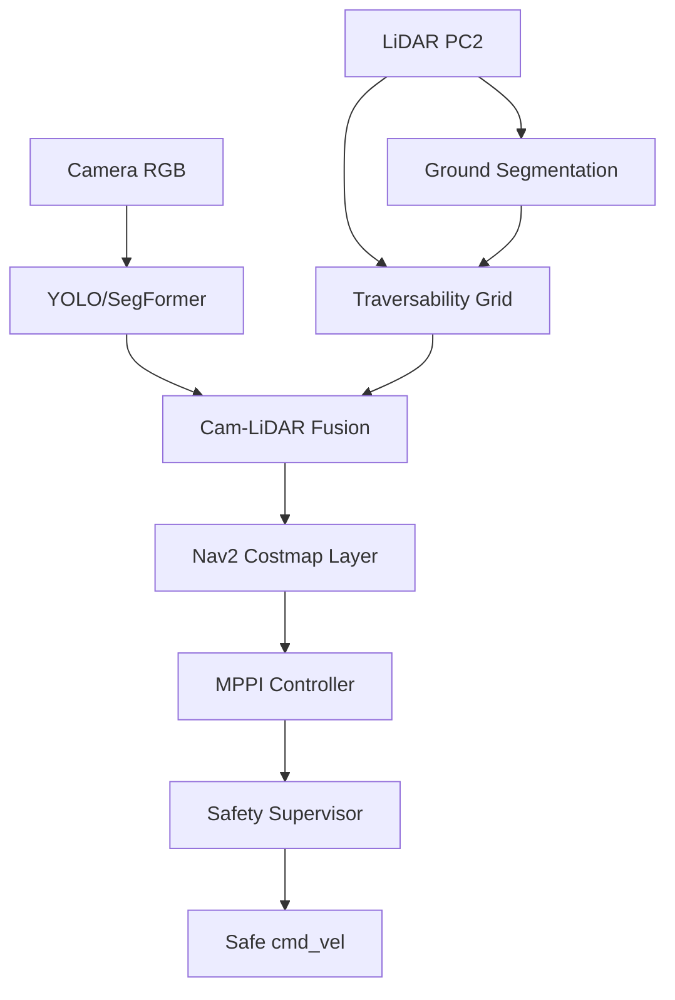

# Terra Perceive — Construction Site Perception Stack

**LiDAR + Camera Fusion | C++ Algorithms from Scratch | ROS2 Nav2 Pipeline**

[Live Project & Documentation](https://nishant-zfyii.github.io/terra-perceive/)

Nishant Pushparaju | NYU MS Mechatronics & Robotics | March 2026

---

## Overview

Terra Perceive is a modular autonomy perception pipeline designed for the unstructured, deforming terrain of construction sites. The stack processes raw LiDAR and camera data from the **[RELLIS-3D Dataset](https://github.com/unmannedlab/RELLIS-3D)** to compute physics-grounded traversability, track dynamic obstacles, and enforce kinematic safety constraints.

The core perception algorithms are implemented **from scratch in C++ with Eigen**, prioritizing mathematical correctness, numerical stability, and real-time performance.

## System Architecture



## Core C++ Implementations

The following components were built from first principles to ensure a deep understanding of the underlying mathematics and to optimize for off-road environments.

| Component | Technical Detail | Key Algorithm |
|-----------|------------------|---------------|
| **Ground Segmentation** | Handling sloped/graded terrain | Sector-based RANSAC + SVD Refinement |
| **Traversability** | Two-layer risk/confidence grid | PCA Surface Normals + Kinematic Scoring |
| **Sensor Fusion** | Rigid body transformations | SE(3) Homogeneous Transforms |
| **State Estimation** | Multi-object tracking | Kalman Filter (Constant Velocity) |
| **Data Association** | Optimal track assignment | Hungarian Algorithm / SORT |
| **Safety Layer** | Kinematic-aware lookahead | Forward-Arc Time-to-Collision (TTC) |

## Quick Start

```bash
# 1. Initialize environment
conda env create -f environment.yml && conda activate terra-perceive

# 2. Build from source
make build

# 3. Execute Smoke Test (Dockerized)
docker-compose up perception
```

## License

MIT
