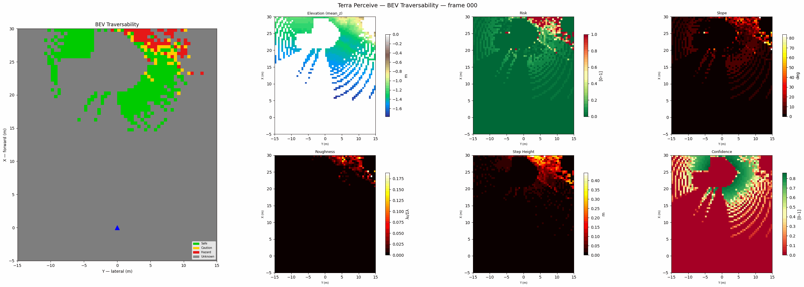
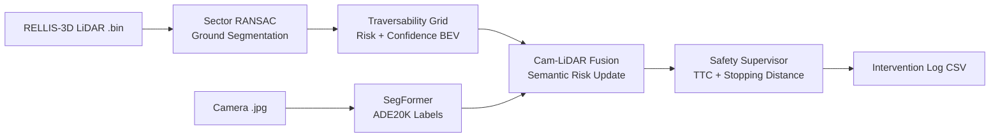

# Terra Perceive

**LiDAR + camera perception pipeline for unstructured terrain — Real-time traversability and worker safety for autonomous construction equipment**




---

## The Problem

Autonomous systems built for highways break on construction sites. The terrain is uneven, deforming, and covered with workers who appear without warning. Standard datasets like KITTI don't capture this. Terra Perceive is an engineering deep-dive into building a perception stack that does — using raw LiDAR and camera data from the [RELLIS-3D](https://github.com/unmannedlab/RELLIS-3D) off-road dataset.

Every core algorithm is implemented from scratch in C++17 with Eigen3. No OpenCV, no PCL for the math.

---

## Quick Start

```bash
# Pull and run — outputs land in ./output/
mkdir -p output
docker pull nishantzfyii/terra-perceive:phase1
docker run --rm \
  -v $(pwd)/output:/ws/src/construction_perception/output \
  nishantzfyii/terra-perceive:phase1
```

After ~45 seconds you'll have:
```
output/
  bev_traversability.png   — color-coded traversability map
  safety_events.csv        — kinematic intervention log
  timing_report.txt        — per-stage latency
```

**No ROS, no CUDA, no data download required.** Sample data is bundled in the image.

> First time? Install Docker: `curl -fsSL https://get.docker.com | sh`

---

## Pipeline



---

## Components

| Component | What it does | Deep dive |
|-----------|-------------|-----------|
| **Sector RANSAC** | Splits point cloud into ground / obstacle per angular sector. Handles sloped terrain by fitting planes with SVD refinement per sector rather than globally. | [M2 blog](docs/m2-ransac.md) |
| **Traversability Grid** | Computes per-cell risk [0,1] and confidence [0,1] from PCA surface normals, slope, roughness, and step height. Unknown cells get confidence=0, not risk=0.5. | [M3 blog](docs/m3-traversability.md) |
| **Cam-LiDAR Fusion** | Projects LiDAR points onto the camera plane via SE(3) transforms, assigns ADE20K semantic labels per BEV cell, and applies per-class risk modifiers. | [M4 blog](docs/m4-fusion.md) |
| **Safety Supervisor** | Physics-based TTC: `d_stop = v²/(2μg) + v·t_react`. Terrain-aware friction from traversability score. Priority interventions: E-Stop → Hard Brake → Proportional Scale → None. | [M5 blog](docs/m5-safety.md) |

---

## Results

**BEV traversability — frame 000 (RELLIS-3D seq 00000)**


**Camera-LiDAR semantic fusion**


**Smoke test timing (local, CPU only)**

| Stage | Time |
|-------|------|
| Sector RANSAC + Traversability | ~7s |
| BEV Visualisation | ~3s |
| Cam-LiDAR Fusion (SegFormer) | ~16s (weights cached) |
| Safety Supervisor | <1s |
| **Total** | **~27s** |

**Tests: 52/52 passing**

```
test_loader        3 / 3
test_ransac       17 / 17
test_traversability 13 / 13
test_projection    3 / 3
test_safety       10 / 10
test_kalman        3 / 3
test_hungarian     3 / 3
```

---

## Repo Structure

```
terra-perceive/
├── src/                  # C++ implementations
│   ├── ransac_ground_seg.cpp
│   ├── traversability.cpp
│   ├── cam_lidar_projection.cpp
│   ├── safety_supervisor.cpp
│   └── safety_runner.cpp
├── include/              # Headers
├── tests/cpp/            # GTest unit tests (52 total)
├── scripts/              # Pipeline orchestration
│   ├── run_pipeline.sh   # End-to-end runner
│   └── smoke_test.sh     # CI smoke test
├── python/               # SegFormer inference
├── data/sample/          # Bundled RELLIS-3D frames (25MB)
│   ├── lidar/            # 8 × KITTI .bin frames
│   ├── camera/           # 8 × matching .jpg frames
│   └── calib/            # Extrinsics + intrinsics
└── docker/
    ├── Dockerfile.perception
    └── docker-compose.yml
```

---

## Running Locally

**Build:**
```bash
conda activate terra-perceive
colcon build --packages-select construction_perception
```

**Test:**
```bash
colcon test --packages-select construction_perception
colcon test-result --verbose
```

**Full pipeline on your own data:**
```bash
bash scripts/run_pipeline.sh <path/to/frame.bin> <path/to/frame.jpg>
```

---

## Stack

- **C++17 + Eigen3** — all perception math, no OpenCV/PCL for core algorithms
- **ROS2 Humble + colcon** — build system and test harness
- **Python + HuggingFace Transformers** — SegFormer inference (nvidia/segformer-b0-finetuned-ade-512-512)
- **Docker** — zero-dependency deployment
- **Dataset** — RELLIS-3D (Ouster OS1-64 LiDAR + Basler camera, off-road)

---

*Nishant Pushparaju — NYU MS Mechatronics & Robotics — 2026*
*[Project blog](https://nishant-zfyii.github.io/terra-perceive/)*
