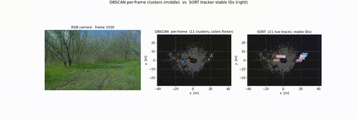
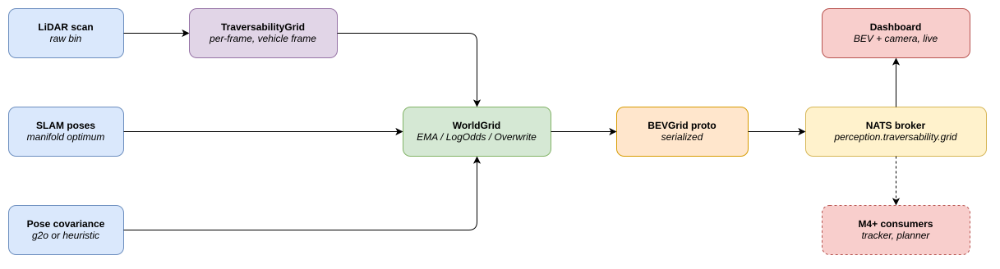
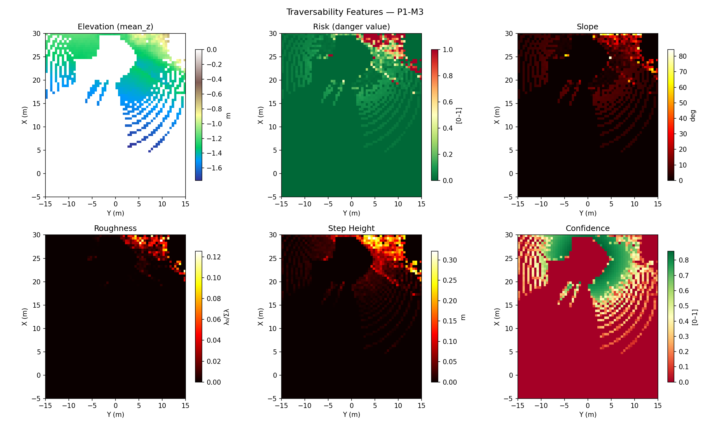
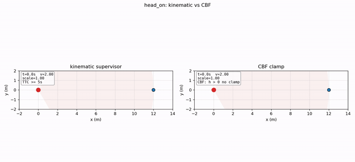

<div align="center">



# terra-perceive

**LiDAR + camera perception for autonomous construction equipment** — sector-based ground segmentation, BEV traversability, LiDAR-inertial SLAM, multi-object tracking, and physics-grounded safety, all built from scratch in C++17 / Eigen3 on the RELLIS-3D off-road dataset.

[](https://en.cppreference.com/)
[](https://docs.ros.org/en/humble/)
[](https://hub.docker.com/r/nishantzfyii/terra-perceive)
[](tests/)
[](LICENSE)
[](https://nishant-zfyii.github.io/terra-perceive/)

</div>

---

## What this is

Autonomous perception breaks at the asphalt's edge. KITTI and the highway-AV stack assume a flat ground plane and pre-mapped lanes; construction sites and unstructured off-road environments grant neither. **terra-perceive** is a from-scratch C++ perception pipeline I built to handle exactly that — sloped terrain, vegetation, occluded workers, and the LiDAR / camera failure modes that come with them. The codebase ships as a Docker image; the [project blog](https://nishant-zfyii.github.io/terra-perceive/) walks through every algorithmic decision with math, ablations, and the failure modes I hit on the way.

The dataset is [RELLIS-3D](https://github.com/unmannedlab/RELLIS-3D) (Ouster OS1-64 + Basler RGB on a Warthog UGV in Texas A&M's off-road test environments). Construction-site data has the same perceptual challenges — uneven terrain, vegetation occlusion, dynamic workers — and the algorithms generalise the same way.

---

## Highlights

- **From-scratch C++17 / Eigen3 perception stack.** Sector RANSAC ground segmentation that handles the sloped terrain global RANSAC misses (`src/ransac_ground_seg.cpp:180`), 2.5D PCA traversability grid with slope / roughness / step-height fusion (`src/traversability.cpp`), camera-LiDAR projection via SE(3) (`src/cam_lidar_projection.cpp`), kinematic safety supervisor implementing `d_stop = v²/(2μg) + v · t_react` with terrain-aware friction (`src/safety_supervisor.cpp`).
- **From-scratch LiDAR-inertial SLAM.** SO(3) Lie groups, on-manifold IMU preintegration, Scan Context loop closure, factor-graph optimisation with Levenberg-Marquardt and sparse Cholesky (`src/pose_graph_slam.cpp`). Benchmarked against Google Cartographer; 0.577 m ATE on RELLIS-3D Seq 00. Documented in [M8](https://nishant-zfyii.github.io/terra-perceive/m8-slam).
- **Probabilistic traversability with calibrated uncertainty.** Range-dependent LiDAR noise σ(r) propagated through per-cell PCA gives confidence with no artifact cliff at the LiDAR's nominal range. Full-sequence ablation on RELLIS-3D (2 849 frames) matches the analytical prediction within 2 %. Documented in [M12](https://nishant-zfyii.github.io/terra-perceive/m12-probabilistic-traversability).
- **1D Control Barrier Function safety with formal guarantees.** Smooth clamp on commanded acceleration replaces the kinematic TTC step rule. 6-scenario ablation: 9–12× lower bang-bang acceleration on occluded / multi-worker scenarios; tight `d_safe_min` of 0.51 m on head-on (vs 1.76 m kinematic); zero false positives on lateral passes. Documented in [M13](https://nishant-zfyii.github.io/terra-perceive/m13-cbf-safety).
- **162 C++ unit tests + 31 Python tests passing**, across 18 + 9 test suites (`tests/cpp/`, `tests/python/`). One-command reproducibility: `docker pull nishantzfyii/terra-perceive:phase1 && docker run …` produces a BEV map, safety event log, and per-stage timing report in roughly 45 seconds with no ROS, no CUDA, and no data download.

---

## Architecture

<div align="center">

</div>

A single C++ codebase organised into four production layers, each exposed as a standalone CLI runner today and (in progress) as a ROS 2 node for live deployment.

**Sensing & odometry.** RELLIS-3D Ouster OS1-64 LiDAR and Basler RGB camera feed into the pipeline. Three independent pose estimators run side-by-side: GNSS/IMU extracted from the VectorNav VN-300 in the rosbag, KISS-ICP scan-to-scan registration, and Google Cartographer as a production SLAM benchmark. ATE / RPE comparison across all three is documented in [M7](https://nishant-zfyii.github.io/terra-perceive/m7-odometry); the from-scratch pose-graph backend in [M8](https://nishant-zfyii.github.io/terra-perceive/m8-slam) closes the gap with Cartographer using its own Scan Context loop closure.

**Perception.** Sector RANSAC produces ground / obstacle splits with SVD refinement per angular sector. The traversability grid (0.5 m × 0.5 m, 70 × 60 cells) computes per-cell risk and confidence from PCA surface normals, with separate paths for the legacy heuristic confidence and the M12 probabilistic confidence behind a config flag. Camera-LiDAR projection assigns SegFormer (ADE20K) semantic labels per BEV cell and applies per-class risk modifiers.

**Mapping, tracking & safety.** Accumulated BEV world map (M9) projects ground-plane occupancy from multi-source odometry into a global frame; NATS pub/sub carries the streams. SORT tracker with Kalman + Hungarian + DBSCAN detection (M10), augmented with IMM filter, Deep SORT cascade, and Mahalanobis gating; a Phase-4 K-frame DBSCAN ablation maps the structural ceiling that the detector layer (not the tracker) imposes on identity stability. Safety supervisor enforces priority interventions (E-Stop → Hard Brake → Proportional Scale → None) using either the kinematic TTC rule (legacy) or the M13 CBF clamp.

---

## Phase Roadmap

| Phase | Status | Headline | Detail |
|---|---|---|---|
| Phase 1 — Core perception (M1–M7) | Shipped | `docker run` produces BEV + safety log in ~45 s | [Phase 1 milestones](https://nishant-zfyii.github.io/terra-perceive/) |
| Phase 2 — Odometry, SLAM, tracking, safety refinements (M7–M13) | In progress | LiDAR-inertial SLAM 0.577 m ATE; CBF reduces bang-bang 9–12× | [Phase 2 milestones](https://nishant-zfyii.github.io/terra-perceive/) |
| Phase 3 — Stretch goals | Planned | Open list, no timeline | [Stretch directions](https://nishant-zfyii.github.io/terra-perceive/) |

---

## Results

<div align="center">

</div>

*Phase 1 capability — six-panel BEV showing ground/obstacle, per-cell slope, roughness, step height, fused risk score, and confidence on a single RELLIS-3D frame. Source: `src/traversability.cpp` + `scripts/run_pipeline.sh`.*

<div align="center">

</div>

*Phase 2 odometry — GPS/IMU, KISS-ICP, and Cartographer trajectories on RELLIS-3D Seq 00. ATE / RPE comparison and the analysis of where each estimator drifts is in [M7](https://nishant-zfyii.github.io/terra-perceive/m7-odometry).*

<div align="center">

</div>

*M13 CBF safety — head-on scenario. The CBF-clamped supervisor stops with 0.51 m of headroom; the legacy kinematic TTC supervisor stops with 1.76 m on the same trajectory and does so with bang-bang acceleration. 6-scenario ablation in [M13](https://nishant-zfyii.github.io/terra-perceive/m13-cbf-safety).*

---

## Quick Start

```bash
# Pull and run — outputs land in ./output/
mkdir -p output
docker pull nishantzfyii/terra-perceive:phase1
docker run --rm \
  -v $(pwd)/output:/ws/src/construction_perception/output \
  nishantzfyii/terra-perceive:phase1
```

After ~45 seconds you have:

```
output/
  bev_traversability.png   color-coded traversability map
  safety_events.csv        kinematic intervention log
  timing_report.txt        per-stage latency
```

No ROS install, no CUDA, no data download. Sample RELLIS-3D frames are bundled in the image.

The Docker image ships the **Phase 1** pipeline. Phase 2 components (M7 odometry, M8 SLAM, M9 BEV map, M10 tracker, M11 perception loop, M12 / M13 refinements) currently run as standalone CLI executables (`pipeline_runner`, `slam_runner`, `tracker_runner`, `accumulator_runner`) built from source — see [Reproducibility](#reproducibility). The multi-service `docker-compose` build that bakes Phase 2 into the image is part of Phase 2's remaining work.

---

## Repository Structure

<details>
<summary>Click to expand</summary>

```
terra-perceive/
├── src/                        C++ implementations (sector RANSAC, traversability,
│                               projection, safety, Kalman, Hungarian, DBSCAN,
│                               pose graph SLAM, IMU preintegration, SORT, IMM,
│                               appearance encoder, Scan Context, world grid)
├── include/                    Headers
├── tests/
│   ├── cpp/                    GTest unit tests (18 suites, 162 tests)
│   └── python/                 pytest tests (9 suites, 31 tests)
├── ros2_nodes/                 Scaffolded ROS 2 nodes (currently stubs — Phase 2
│                               remaining work; see Honest Status below)
├── launch/                     ROS 2 launch files (full_pipeline.launch.py is a
│                               stub pending node wiring)
├── python/                     SegFormer / YOLOv8 inference, dashboard, fusion
├── transport/                  protobuf schemas (NATS / gRPC)
├── scripts/                    Pipeline orchestration, HPC SLURM, evaluation
├── slurm/                      HPC ablation jobs
├── data/sample/                Bundled RELLIS-3D frames (8 LiDAR + matching JPG)
├── config/                     YAML configs (camera-LiDAR calibration, Nav2)
├── docker/, apptainer/         Containerisation
├── docs/                       Jekyll site published at
│                               nishant-zfyii.github.io/terra-perceive
└── assets/                     Figures referenced by this README
```

</details>

---

## Reproducibility

**Datasets.** RELLIS-3D Sequence 00 (Ouster OS1-64 LiDAR, Basler camera, VectorNav VN-300 IMU/GPS) is the primary evaluation set. nuScenes mini is the second-domain target for the in-progress M14 milestone. Full data inventory and which milestone uses which path is in [`docs/data_reference.md`](docs/data_reference.md).

**Hardware assumed.** Phase 1 Docker runs on any machine with Docker installed (no GPU required). Phase 2 source builds need a Linux host with ROS 2 Humble, Eigen3, and a recent CMake; some ablations (M3 accumulation rules, M8 SLAM ablation) were run on the NYU Torch HPC cluster, others on a local workstation.

**Reproducing the headline results.**

```bash
# Phase 1 smoke test (Docker, ~45 s)
docker run --rm -v $(pwd)/output:/ws/.../output nishantzfyii/terra-perceive:phase1

# Phase 2 from source
colcon build --packages-select construction_perception
colcon test --packages-select construction_perception   # runs C++ tests
pytest tests/python                                       # runs Python tests

# Triple odometry comparison (M7)
python scripts/extract_poses_gps.py --bag <rellis_split_raw_bag>
python scripts/run_kiss_icp.py --bin-dir <rellis_synced_lidar>
docker compose --profile cartographer run cartographer

# LiDAR-inertial SLAM (M8)
./build/slam_runner --sequence data/RELLIS-3D/00000 --output results/slam/

# CBF safety ablation (M13)
python scripts/run_cbf_ablation.py --scenarios all --output results/m13/
```

---

## Honest Status

This section is the inverse of marketing copy: what works, what's stubbed, and what's next, named directly.

**Shipped.** Phase 1 — sector RANSAC, traversability grid, camera-LiDAR projection, safety supervisor, Docker integration — is complete and runs end-to-end from the published image. Most of Phase 2 has shipped: triple odometry comparison (M7), from-scratch LiDAR-inertial SLAM (M8), accumulated BEV world map (M9), SORT tracker with cascade and Mahalanobis gating (M10), tracker-safety perception loop with NATS transport (M11), probabilistic traversability with σ(r) noise model (M12), 1D CBF safety clamp (M13). All 162 C++ tests across 18 suites and 31 Python tests across 9 suites pass on `main`.

**Remaining in Phase 2.**

- **nuScenes integration + MOTA evaluation.** The next active milestone (M14). Cross-domain validation that the same pipeline runs on urban driving data, with MOTA / MOTP / ID-switch metrics on the nuScenes mini split.
- **ROS 2 nodes wired up.** The C++ libraries are tested and complete. The files in `ros2_nodes/*.cpp` (`ground_seg_node`, `traversability_node`, `projection_node`, `safety_node`, `tracker_node`, `traversability_costmap_layer`) are scaffolded stubs — what's missing is the subscriber / publisher glue that wraps the existing libraries as ROS 2 nodes.
- **Full live pipeline end-to-end.** Real-time rosbag → wired ROS 2 graph → RViz2 visualisation. Today the pipeline runs as standalone CLI executables (`pipeline_runner`, `slam_runner`, `tracker_runner`, `accumulator_runner`). The multi-service `docker-compose up` that closes Phase 2 will follow node wiring.

**Phase 3 stretch goals.** No timeline; treated as an open list. Candidate directions in priority order: Nav2 costmap layer plugin (`src/traversability_costmap_layer`), ROS 2 / NATS bridge, Foxglove unified dashboard for the full subject tree, IMU-based LiDAR deskewing, SegFormer fine-tune on RELLIS-3D's native 20-class scheme, full Munkres Hungarian to replace greedy assignment, Jetson deployment with TensorRT optimisation. Each is independent — pick what strengthens the strongest application.

---

## Acknowledgements

- **[RELLIS-3D dataset](https://github.com/unmannedlab/RELLIS-3D)** (unmannedlab, Texas A&M) — primary evaluation data.
- **[KISS-ICP](https://github.com/PRBonn/kiss-icp)** (Vizzo et al., Bonn) — odometry baseline.
- **[Cartographer](https://github.com/cartographer-project/cartographer)** (Google) — production SLAM benchmark.
- **[SegFormer](https://huggingface.co/nvidia/segformer-b0-finetuned-ade-512-512)** (NVIDIA / HuggingFace) — semantic segmentation backbone.
- **[YOLOv8](https://github.com/ultralytics/ultralytics)** (Ultralytics) — 2D detection scaffold.
- **[Eigen3](https://eigen.tuxfamily.org/)** — linear algebra throughout.
- Solo work — no advisor or co-author on this project.

---

## License

MIT — see [`LICENSE`](LICENSE).

---

## Author

**Nishant Pushparaju** · NYU MS Mechatronics & Robotics, 2026
[nishantpushparaju@gmail.com](mailto:nishantpushparaju@gmail.com) · [github.com/Nishant-ZFYII](https://github.com/Nishant-ZFYII) · [project blog](https://nishant-zfyii.github.io/terra-perceive/)

<!-- TODO: swap third link to https://nishantpushparaju.dev once the portfolio launches. -->
