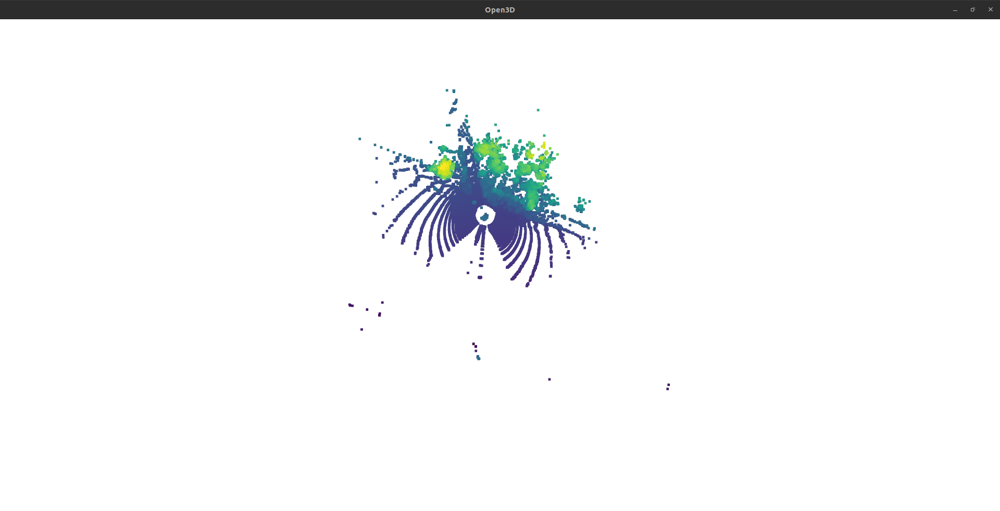

# Milestone 1: Taming Raw LiDAR Data (RELLIS-3D)

*Part of the Terra Perceive series — building a perception pipeline for construction site autonomy.*

## The Problem (What & Why)
**What**: The first step in building an autonomous perception pipeline is data ingestion—specifically, loading raw 3D point cloud data from a LiDAR sensor into a C++ environment.

**Why**: For this project, I chose the **[RELLIS-3D Dataset](https://github.com/unmannedlab/RELLIS-3D)**. While many autonomous driving datasets (like KITTI) focus on structured urban roads, RELLIS-3D is specifically designed for **off-road, unstructured environments** (mud, tall grass, and construction-like terrain). Since the goal of *Terra Perceive* is to handle the "edge cases" of construction sites, RELLIS-3D provides the perfect real-world stress test for our algorithms.

The challenge is foundational: If the loader is slow or the coordinate mapping is incorrect, every downstream component—from RANSAC ground segmentation to the traversability grid—will fail.

## The Math & Format (How)
The data follows the KITTI binary format. Each point is represented by four `float32` values packed contiguously:
`[x, y, z, intensity]`

### The Mathematical Logic of the Loader:
To ensure the loader is $O(N)$ and memory-efficient, we use a simple but critical calculation before reading the file:

1. **Point Size ($P$)**: Each point is $4 \times 4\text{ bytes} = 16\text{ bytes}$.
2. **File Size ($S$)**: We determine the total bytes in the file using `seekg` and `tellg`.
3. **Point Count ($N$)**: 
   $$N = \frac{S}{P}$$
   We validate that $S \pmod P = 0$ to ensure the file isn't corrupted.
4. **Memory Allocation**: We then call `points.reserve(N)`. This ensures that we allocate the exact amount of memory needed upfront, avoiding the $O(N)$ cost of vector reallocations during the read loop.

**Coordinate Frame**: We use the standard ROS-style Right-Handed System where **X** is Forward, **Y** is Left, and **Z** is Up.

## The Working Solution
### 1. C++ Binary I/O
The loader uses `std::ifstream` with `std::ios::binary`. We extract `x, y, z` into an `Eigen::Vector3f` and skip `intensity`. This keeps our memory footprint lean for geometry-focused tasks.

### 2. Python Visualization
Using **Open3D**, I built a sanity-check script to verify the C++ loader. By coloring points by their **Z (height)** value, we can visually confirm that the ground and obstacles are correctly oriented.

## What I tried first and why it failed
I initially used `sys.argv` for the Python script, but it lacked the professional "help" and type-safety of a real CLI. Moving to `argparse` solved this. On the C++ side, I realized that simple `fread` loops are prone to errors if you don't validate the file size against the expected point stride (16 bytes) first.

## Results
The loader successfully processes RELLIS-3D frames:
- **Point Count**: 131,072 points
- **X Range**: [-49.6m, 91.2m]
- **Y Range**: [-58.6m, 58.2m]
- **Z Range**: [-3.4m, 7.3m]

*Figure 1: Initial Open3D visualization. Green/Yellow represents the ground plane, Purple/Blue represents vertical obstacles.*

## What I'd do differently
- **Logging**: Currently, I'm using `std::cerr` for error handling. For a production-grade pipeline, I'm looking to integrate a proper logging library (like `spdlog`) to handle different severity levels (DEBUG, INFO, ERROR).
- **Unit Testing**: I would implement automated checks for point counts and range bounds earlier to catch regressions without needing visual inspection every time.
- **Intensity Layer**: I'm considering making `intensity` an optional layer to support future semantic fusion without bloating the core geometric structures.

---
**Next Step**: Milestone 2: Sector-based RANSAC for sloped terrain.
