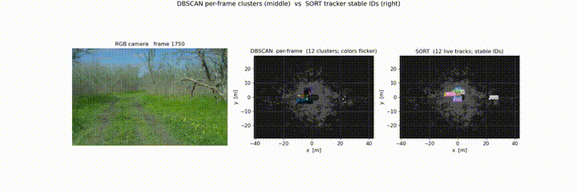
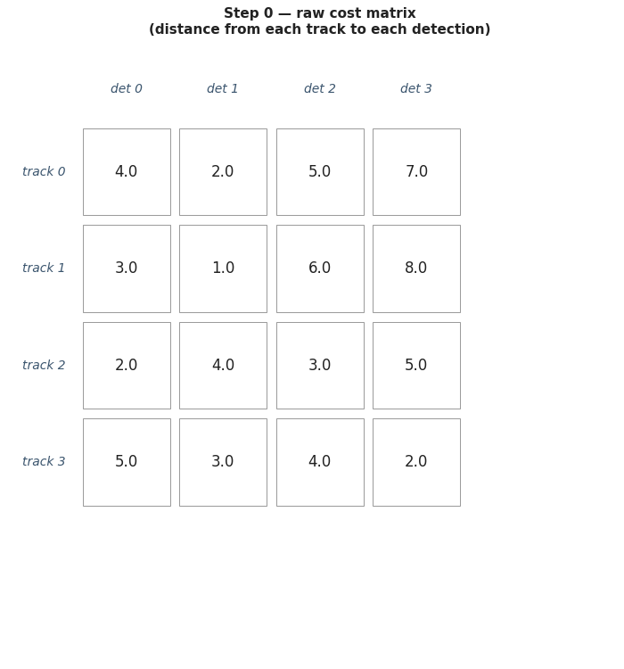
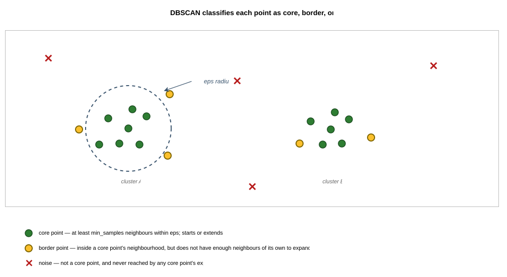

# Building a LiDAR multi-object tracker, and the wall it hits on real off-road data

*Part of the Terra Perceive series.*

Most multi-object tracking tutorials open with a video of cars driving down a highway. Neat colored boxes follow each car. The IDs stay the same across frames. The implicit promise is that the same recipe (a Kalman filter, the Hungarian algorithm, a small amount of glue) gets the same result on any sequence of detections.

It does, on the highway data the tutorial used. On LiDAR returns from a vehicle driving through an off-road forest, it does not. The synthetic tests passed cleanly. The output on five minutes of real RELLIS-3D data was a flickering mess of 979 distinct track IDs for a scene that contains somewhere between forty and fifty physical objects. The clip above shows why. The detector layer (density-based clustering on the LiDAR point cloud) is producing an unstable abstraction of the world. The cluster identity reforms frame to frame, the centroid jitters several meters between sightings, and 96% of consecutive frame pairs see the cluster count change on scenes where nothing is moving.

This post is the long version of figuring that out. I built each piece of the Simple Online and Realtime Tracking pipeline directly: the Kalman filter, the Hungarian assignment, the DBSCAN clusterer, then the cascade re-association from Deep SORT, an interacting multiple model filter, a learned appearance encoder, an ego-motion-compensated track anchor, a Mahalanobis gate, and finally a multi-frame point-cloud accumulation step that pushes the detector's noise floor down. Each addition responded to a specific failure visible in the previous result. Each shifted the trade-off curve in a measurable way. None broke through the structural ceiling that the detector, not the tracker, sets on this regime.

That ceiling is the same one the field hit between 2018 and 2021, and the same reason production self-driving stacks moved from "cluster-and-track" architectures to "learned-3D-detection-and-track" in the same window. I arrived at that conclusion through measurement, which is the part of the work that actually taught me something. The arc is the point of the post. The end state, a structural floor that points squarely at PointPillars or CenterPoint, is the honest hand-off rather than a failure.

If you are new to multi-object tracking, the early sections are a working tour of the components. If you have built one of these in production, the later sections will read as patterns you have lived, with measurements attached. Either way, every claim that follows has an audit behind it that anyone with the repository can re-run.

---

## What this is for, and what got built before it

A self-driving robot needs two kinds of memory.

One is for the static world: road surface, trees, ground type, the building that is not moving. That memory updates over many frames; it is fine if it takes a few seconds to settle. An [earlier post in this series](m9-bev-map) covers the accumulated bird's-eye-view map that does this.

The other memory is for things that move. Workers walking onto a construction site. Vehicles on a road. The deer that just stepped out of the woods. This memory has to update every frame, with a stable identity attached to each moving thing, so a downstream consumer can ask coherent questions like "where will this person be in 800 milliseconds." That is a tracker's job. It is the topic of this post.

The standard reference for this problem is *Simple Online and Realtime Tracking* by Bewley et al. [1], usually written SORT. The paper's argument is Occam's razor in code. Do not try to be clever about appearance, do not add learned components, do not store track histories beyond a Kalman filter's posterior. Predict each track forward to the next frame using a constant-velocity Kalman filter. Build a cost matrix of distances between predicted positions and incoming detections. Solve the assignment problem with the Hungarian algorithm. Update each matched track. Bewley's experiments showed this recipe ran at 260 frames per second and beat the more complex trackers of its competitors on standard benchmarks.

There is a hidden assumption in that word "detection." Bewley's experiments fed Faster R-CNN bounding boxes from camera images into the tracker. Those detections are clean, semantically meaningful (a person, a car), and reasonably consistent frame to frame. I did not have that luxury. The input to my system was a 64-beam LiDAR point cloud, which has to be clustered into per-frame "objects" before anything resembling tracking can begin. The clustering algorithm of choice is [DBSCAN](#turning-points-into-detections-dbscan), and its behavior on real off-road point clouds is exactly the thing I had to measure.

So the plan, written down at the start: build the simplest possible version of every piece. Get it green on synthetic data. Run it on real LiDAR. Iterate until iteration stops paying back. The last step is what most of this post is about.

---

## The simplest tracker that could possibly work

The pipeline above runs once per LiDAR frame. RANSAC was built in an [earlier milestone](m2-ransac); its job is to identify and remove the ground plane, leaving only the points that belong to obstacles. DBSCAN groups those obstacle points into per-frame clusters. The tracker takes the cluster centroids as detections and produces a list of tracked objects with persistent identities.

Inside the tracker, the per-frame loop has three jobs. Predict each existing track's position one timestep into the future. Match each new detection to the predicted position of an existing track if there is a good match, or create a new track if there is not. Delete tracks that have gone too long without a match. Each of those steps has a standard answer (Kalman filter, Hungarian assignment, a simple miss counter), and the work in this section is making each of those answers actually run on real off-road LiDAR data.

### The Kalman filter

The state to estimate is each object's position and velocity. Four numbers per track: $x$, $y$, $v_x$, $v_y$. The dynamics model is constant velocity, which says next-frame position equals current position plus velocity times $dt$. The measurement model is simpler still: the detection is a noisy direct observation of position, with no information about velocity.

A note on choosing two dimensions instead of three. The LiDAR returns are inherently 3D, but the tracker operates on bird's-eye-view position because the downstream consumers (the safety supervisor, the planner) reason in the ground plane and because the regime of interest is dominated by horizontal motion. Trees, persons, and ground vehicles do not have meaningful vertical motion at the timescales the tracker resolves, and the LiDAR is mounted at fixed height so an object's BEV centroid is more stable than its 3D centroid (which can shift several centimeters when scan angles change). The 3D position is preserved as a passthrough on each track for downstream use, but the matching and filtering happen in 2D.

The Kalman filter formalizes the dynamics with two equations per frame. The predict step pushes the state forward and inflates the covariance to reflect the uncertainty added by the unmodeled acceleration. The update step takes a new measurement, computes how much it disagrees with the prediction (the innovation), and shifts the state toward the measurement by an amount controlled by the Kalman gain. The gain itself is a weighted average of the model's confidence and the measurement's confidence: when the prior is tight and the measurement is noisy, the gain is small and the filter trusts the prediction; when the prior is loose and the measurement is clean, the gain is large and the filter trusts the measurement.

Two views of the gain matter for understanding what the filter is doing. The physicist's view reads the update equations as the optimal weighting of evidence given the covariances of the prior and the measurement. Equation 3.42 of *Probabilistic Robotics* [2] writes this as the closed form. The engineer's view, equation 3.44 in the same chapter, expresses the gain directly as $$K = P H^\top S^{-1}$$ where $$S = H P H^\top + R$$ is the innovation covariance. The first form is what to think about when tuning. The second is what goes into a compiler.

The implementation followed the engineer's view, which is where the project hit its first quiet failure.

### What `S.inverse()` does on a too-quiet measurement stream

The literal translation of $$K = P H^\top S^{-1}$$ into C++/Eigen is `K = P * H.transpose() * S.inverse()`. Ten unit tests on synthetic Gaussian noise passed. More synthetic tests passed. A stress test built later replicated a more demanding regime: the filter receiving many consecutive low-noise measurements while the process noise was small. After about two hundred steps, the state contained `NaN`.

The diagnosis took an evening. When $Q$ (process noise) is small and the filter receives many noise-free updates, $P$ shrinks dramatically. The innovation covariance $S = H P H^\top + R$ then approaches singularity because the measurement-noise floor $R$ is the only thing keeping $S$ above floating-point precision. In that regime, computing the inverse explicitly amplifies floating-point error catastrophically, and a single inverted matrix corrupts the entire posterior. This is the kind of conditioning issue that lives in numerical-linear-algebra references and rarely shows up on benign synthetic data, which is why the original tests had not caught it.

The fix is to avoid forming $S^{-1}$ at all. $S$ is symmetric positive-definite by construction (it is a covariance matrix), so the Cholesky decomposition is available. The Cholesky factor is numerically stable in regimes where the explicit inverse is not. Both formulations have the same asymptotic cost, $O(n^3)$ where $n$ is the dimension of the measurement, but the Cholesky version solves a triangular system rather than producing a full inverse. The conditioning behavior under near-singular $S$ is qualitatively different: the inverse blows up; the Cholesky solve degrades gracefully.

The regression test that caught this constructs the pathological scenario explicitly. process_noise of $10^{-10}$, measurement_noise of $10^{-10}$, two hundred zero-residual updates. With the original inverse-based gain, the state norm goes infinite within ten frames. With the Cholesky-based gain it stays finite for the full run. The test is what prevents this regression from coming back silently the next time someone refactors the filter. The deeper lesson is that synthetic tests on benign data say nothing about how the filter behaves at the regime boundary, and that the test that actually mattered was the one that targeted the boundary specifically.

### Tuning the process and measurement noises

The Kalman filter has two parameters chosen at construction time. $Q$ is the process noise covariance, which models how much the constant-velocity assumption fails to capture reality. $R$ is the measurement noise covariance, which models how noisy the detector is.

These are not just tuning knobs. They control the steady-state behavior of the filter directly. A small $Q$ tells the filter to trust the constant-velocity model and smooth aggressively through measurement noise. A large $Q$ tells the filter to trust each measurement and follow noise spikes. $R$ has the inverse effect: small $R$ means trust each measurement, large $R$ means smooth. The two parameters are coupled because the steady-state Kalman gain depends on their ratio.

I swept $Q$ from 0.01 to 10 on a synthetic constant-velocity trajectory with injected measurement noise. Synthetic was the right choice for this sweep because the trajectory's ground truth is known by construction, which means the residual (filter estimate minus truth) is well-defined and plottable. RELLIS does not provide per-object position ground truth, so on real data there is no reference signal to compute a residual against. The Q sweep is one of the few experiments where synthetic data is strictly more informative than real data; later sweeps run on RELLIS because what matters there is the ID-stability metric, which the data itself supplies.

Lower $Q$ keeps the position estimate within $\pm 0.1$ m of the true path; high $Q$ swings $\pm 1$ m chasing the noise. The covariance-trace panel tells the same story in uncertainty terms: low $Q$ produces a confident posterior, high $Q$ stays uncertain by a steady-state value (the value the trace converges to as the filter runs longer; "the asymptote" in the figure caption refers to this converged value) three orders of magnitude higher.

There is no universally correct $Q$. The choice depends on the regime. The value $Q = 2.0$ that ended up shipping for the RELLIS pipeline is much larger than a constant-velocity tracker would normally use, and the reason has to do with ego-vehicle stops. When the robot decelerates from one meter per second to zero, every previously-tracked tree's apparent velocity (measured in the ego frame) also drops to zero. A small $Q$ would treat that drop as an unphysical jump and lag for many frames before adapting; a large $Q$ adapts in two frames. The cost is that more measurement noise gets through. The alternative is tracks dying every time the robot stops, which is the problem this whole post is trying to solve.

### The Hungarian assignment

Once each existing track has a predicted position for the next frame and the new frame's detections have arrived, I have to decide which detection belongs to which track. With $N$ tracks and $M$ detections, the cost matrix $C$ is $N \times M$ with entries equal to the Euclidean distance between each (predicted track, detection) pair. The assignment problem is to pick at most $\min(N, M)$ pairs that minimize total cost subject to the constraint that no track or detection appears in more than one pair.

The Hungarian algorithm solves this in cubic time. The classical reference is Kuhn's 1955 paper [3], which proved correctness via König's theorem on bipartite graph matchings. The practical implementation usually traces back to Munkres' 1957 paper [4], which restated Kuhn's argument as a step-by-step procedure on the cost matrix that is straightforward to translate into code. Munkres' version runs in $O(n^3)$ where Kuhn's original was $O(n^4)$. The repository has both papers in `reference papers/p2m4/`. Think Autonomous has a [readable tutorial walkthrough](https://www.thinkautonomous.ai/blog/hungarian-algorithm/) of the algorithm with a step-by-step animation of how the cost matrix transforms; the figure above will eventually mirror that style.

The Munkres implementation maintains a `mask` matrix marking each zero in the working cost matrix as either "starred" (a tentative assignment) or "primed" (a candidate for the alternating path used to extend the assignment). Two cover arrays track which rows and columns are currently covered by stars. The algorithm cycles through six step functions until all $\min(N, M)$ columns have a starred zero, at which point the starred zeros are the final assignment.

There is a simpler greedy alternative also worth implementing as a baseline: for each column in turn, pick the lowest-cost unmatched row. It runs in $O(NM)$ instead of $O(n^3)$ and is trivially correct on cost matrices where the optimal assignment is obvious. It is wrong on cost matrices where ties matter.

### When greedy fails

A small counterexample makes the failure mode concrete. Consider a 3×3 cost matrix:

$$C = \begin{bmatrix} 1.0 & 1.5 & 4.0 \\ 1.0 & 2.0 & 4.5 \\ 5.0 & 5.0 & 0.5 \end{bmatrix}$$

Munkres returns the optimal assignment: track 0 with detection 1 (cost 1.5), track 1 with detection 0 (cost 1.0), track 2 with detection 2 (cost 0.5). Total: 3.0. Greedy iterates the columns left to right. Column 0 has tracks 0 and 1 tied at cost 1.0; greedy's strict less-than tie-breaking picks track 0 (whichever appears first in iteration order). Track 1 then gets stuck with column 1 at cost 2.0. Track 2 ends with column 2 at cost 0.5. Greedy's total: 3.5. Off by 0.5, which is half a meter at typical RELLIS scales. The miss happens because greedy commits to a locally cheap pairing in column 0 that forecloses a globally cheaper pairing across columns 0 and 1.

The same cost matrix becomes the regression test that justifies keeping the Munkres branch in the codebase. The Think Autonomous tutorial linked in the references [16] is a good follow-up if the algorithm itself is unfamiliar; their step-by-step animation walks through the starring/priming/augmenting-path procedure on a similar small matrix.

Running both solvers across the full RELLIS pipeline tells a more nuanced story than the counterexample suggests. On simple two-track crossings with well-learned velocities, the cost matrix at the crossing frame has a clear diagonal preference and both solvers pick the same answer; greedy's order-dependence does not surface. Greedy's failure mode is most visible in dense scenes where many costs are near-tied, which is exactly the regime DBSCAN produces on the RELLIS forest data later in the post. The full integration produced a measurable difference only on those dense frames; on most of the drive the two solvers were indistinguishable. Munkres ships in production because the cost of running it is invisible compared to the rest of the per-frame work, and the worst-case correctness matters even if the average case does not.

### Turning points into detections: DBSCAN

DBSCAN is the algorithm I picked to turn LiDAR obstacle clouds into per-frame detections. The choice was deliberate. K-means requires you to know the number of clusters in advance, which I do not. Hierarchical clustering produces a dendrogram that I would have to threshold somehow to get clusters. DBSCAN takes two parameters (a neighborhood radius `eps` and a density threshold `min_samples`) and produces a variable number of clusters automatically, with explicit handling of points that do not belong to any cluster (which it labels as noise). Ester et al. published it in 1996 [7] and the algorithm has been the standard density-based clusterer ever since.

The procedure is short. For each unvisited point, look at its neighborhood within radius `eps`. If at least `min_samples` points are inside the neighborhood (counting the point itself), the point is a "core point" and starts a new cluster. The algorithm then breadth-first expands from that core point: every neighbor gets added to the cluster, every neighbor that is itself a core point seeds further expansion. Points that fall inside a cluster's neighborhood but have fewer than `min_samples` neighbors of their own are "border points." Points that never get assigned to any cluster end as "noise."

The implementation has three subtleties that bit me when I first wrote it. First, `region_query` includes the query point itself in the count: a point at distance zero from itself is its own neighbor, so `min_samples = 1` makes every point a core point trivially. This matches the original Ester paper's definition and is the convention I kept. Second, the noise label is provisional, not final. A point that is initially classified as noise can be promoted to a border point later when a different core point's expansion reaches it. Forgetting to handle this in the queue causes the algorithm to leak outward through low-density regions, which is the most common DBSCAN bug in introductory implementations. Third, only core points trigger expansion. A border point gets added to the cluster but its own neighbors are not pushed onto the BFS queue. Mishandling this is the second most common bug.

The neighbor query is brute-force. For a typical RELLIS frame after RANSAC ground removal (between five and ten thousand obstacle points), the cluster step takes well under a second on a single CPU core. KD-tree replacement would help with scale but has nothing to do with the structural ceiling. More about this is discussed later.

### Choosing the parameters

The two DBSCAN parameters matter a lot. I ran a 3×3 sweep on a single demo RELLIS frame.

The story is monotonic. Tightening `eps` fragments real objects: at `eps = 0.3` the top row, individual trees split into multiple sub-clusters because the LiDAR scan pattern leaves gaps inside a single tree's points. Loosening `eps` merges distinct objects: at `eps = 1.0`, two trees standing two meters apart get clustered together. Tightening `min_samples` pushes more points into the noise category: at `min_samples = 20` the rightmost column, sparse outlying clusters disappear entirely. The middle cell, `eps = 0.5` and `min_samples = 10`, is the sweet spot for this scene. Distinct trees, persons, and terrain features each become their own cluster.

The middle cell is the configuration that goes into the rest of the pipeline. The 3×3 grid in the figure is enough to defend the choice for the demo scene; a more rigorous justification (a k-distance plot, the standard heuristic for choosing `eps` based on the distribution of distances to each point's $k$-th nearest neighbor) would tighten the argument but does not change the answer. The structural ceiling that shows up later in the post is caused by a different problem entirely, not by these parameter values being slightly off.

### The tracker, end to end

The full per-frame loop is a state machine. The architecture diagram below describes it .

The state machine matches the description in the SORT paper and many tutorials. Two design choices deviate. The publishable output (what `update()` returns) excludes unconfirmed tracks even though they exist internally, so a downstream consumer never sees a track until it has confirmed itself by surviving a few consecutive matched frames. The track lifecycle uses strict consecutive-hits semantics: a single missed frame resets the hits counter to zero. The looser semantics, where the counter carries over across misses, would let a track confirm faster after intermittent matches but blurs the meaning of the `min_hits` threshold. The strict version makes the threshold easy to reason about and easy to characterize during the parameter sweeps that follow, which is the more useful trade-off in this regime.

---

## The first run on real LiDAR

*Temporary placeholder while the M4 baseline animation renders on HPC; this clip is from a later iteration of the tracker. The number above (979 distinct IDs) refers to the M4 baseline whose final render will replace this slot.*

The full pipeline (RANSAC, then DBSCAN, then the tracker) runs on every frame of a 2849-frame RELLIS sequence: a five-minute drive on dirt trails through woodland. The output renders to a three-panel animation: camera, cluster IDs, track IDs side by side.

The animation is almost a working demo. Visible objects get tracked. The bot's progress along the trail looks correct. Stretches exist where a single tree carries the same track ID across two or three seconds, which is what the algorithm is supposed to do.

Other stretches behave very differently. On segments where the bot is moving steadily, ID changes happen at a manageable rate. On segments where the bot is stopped (RELLIS has several of these, where the operator pauses to survey terrain or wait at a junction), the tracker's output cycles through new IDs every few frames even though the camera shows essentially nothing changing. The clip in the opening of this post is from one of those stationary segments.

The numbers tell the same story. Across 2849 frames, the tracker produced 979 distinct track IDs. The actual scene content, hand-counted by stepping through the camera footage and noting unique persistent objects, is closer to forty physical things: many trees along both sides of the trail, one person who appears intermittently in the camera's field of view, three more people who walk behind the bot for parts of the drive and only show up in the LiDAR (the camera does not see them, but the rear-facing point cloud returns do), and a handful of terrain features (the dirt trail edge, larger rocks, a low ridge in the distance). No vehicles. The 24× ratio between distinct track IDs and actual objects is the gap the rest of the post is about.

A sharper sanity check on a particularly bad window: between frames 1750 and 1830 (a 150-frame stretch where the bot's world position changes by 1.55 meters total, well below normal walking speed and effectively stationary), 54 distinct track IDs were alive at some point and 46 of those were *born* inside the window. The bot did not move. The trees did not move. The person walking behind the bot was largely out of the LiDAR's forward scanning angle for that stretch. Forty-six new tracks should not be appearing.

The summary of the first run on real LiDAR: 979 IDs against roughly forty objects, and the rendered animation was an honest record of the algorithm's output. The unit tests passed and the algorithm was correct in the literal sense. The system was producing the wrong answer, and the wrong answer was traceable to specific places in the data that the tests did not cover.

The question worth answering was *why*. The rest of the post works through the iterations that try to find out and fix it.

---

## Adding a model for ego-stops: interacting multiple model filtering

The first thing I checked when investigating the flicker was the Kalman filter's prediction quality. I logged the predicted positions for every track in the [1750, 1830] stationary window and compared them to the next-frame detections. The pattern was clear. When the bot was in motion, the predictions were within a few centimeters of the cluster centroids. When the bot was stopped, the predictions drifted away from the centroids by ten to thirty centimeters per frame. After about ten frames of drift, the prediction was outside the matching gate and the track died. A new track was born when DBSCAN re-detected the same tree.

The cause was the constant-velocity assumption in the Kalman model. Each tree has an apparent velocity, measured in the ego frame, equal to the negative of the bot's velocity. While the bot moves at one meter per second, every stationary tree appears to move at one meter per second toward the rear. The Kalman filter learns that velocity. Then the bot stops, and the trees' apparent velocity drops to zero. The filter does not know the bot has stopped; it sees the next measurement at a position consistent with a stationary tree, but its prediction was for a tree still moving, and the gap between the two grows by the old velocity per frame.

The standard fix is the Interacting Multiple Model filter (IMM), stated in Bar-Shalom Chapter 11 [8]. The idea is to run two parallel Kalman filters per track. One uses the constant-velocity dynamics ($F_{CV}$ with the dt couplings I described earlier). The other uses constant-position dynamics ($F_{CP} = I_4$), which says the position does not change at all between frames and any apparent motion is process noise.

Each frame, the filter does four things. It computes a mixed initial state for each sub-filter, blending the previous-step posteriors from both models according to a mode-transition matrix and the current mode probabilities. It runs each sub-filter's predict and update independently. It updates the mode probabilities using the likelihood of each sub-filter's innovation under its own innovation covariance, in log-space for numerical stability and clamped to the interval [0.01, 0.99] to prevent one mode from collapsing to zero permanently. Finally it computes a combined output as a weighted average of the two sub-filters' posteriors.

The combined covariance is where the math magic happens. When the two modes agree, the combined covariance is just the weighted average. When they disagree about position (one says the tree is still moving, the other says it stopped), the combined posterior covariance includes a *spread term* that captures the uncertainty introduced by model disagreement:

$$P_{\text{out}} = \sum_j \mu_j \left( P_j + (x_j - x_{\text{out}})(x_j - x_{\text{out}})^\top \right)$$

The spread term will matter again in section [8](#a-principled-gate-using-track-covariance) when I try to use this covariance for a different purpose and discover it does the wrong thing.

I integrated the IMM filter behind a virtual interface so that the existing constant-velocity tracker could run unchanged. The choice between CV and IMM is a runtime flag. The seven existing SORT unit tests stayed green by defaulting to CV. Seven new tests targeted IMM-specific behavior, including one that constructs a deceleration scenario explicitly and asserts that the constant-position mode probability climbs from 0.5 to above 0.85 within ten frames after the deceleration onset. The architectural decision (`std::unique_ptr<IFilter>` instead of templating `Track` on the filter type) cost one virtual function call per track per frame, which is invisible compared to the DBSCAN cost on the same frame.

The result on the full RELLIS drive was 808 distinct track IDs, down from 979. Mean track lifetime climbed from 17.4 to 19.9 frames. A modest improvement. The IMM did exactly what it was designed to do: it caught the ego-stop transitions where the constant-velocity model alone would have killed tracks. But the larger problem (cluster centroid jitter that has nothing to do with ego dynamics) was untouched, and the gain plateaued well above where I needed it.

The IMM was the right tool for one of the three causes of flicker. It was not enough by itself.

---

## Adding shape similarity: a learned appearance encoder

The second cause of flicker is that even when the Kalman prediction is correct, the DBSCAN cluster centroid moves frame-to-frame on stationary objects. The centroid jumps because the LiDAR samples slightly different points each scan rotation, and the cluster's bounding region shifts as a result. The matcher, which uses Euclidean distance from predicted position to detection, interprets a centroid jump as evidence that the detection might be a different object, especially when two trees are close together.

The standard answer to this is to add a second cost term that does not depend on position. The idea comes from Wojke, Bewley, and Paulus's 2017 modification to SORT [9], usually called Deep SORT. Each detection is encoded into a fixed-dimensional vector that captures something about the object's appearance. The matching cost combines the position distance with the appearance distance. If the position cost is ambiguous (two trees at similar distance from the prediction), the appearance cost breaks the tie.

The original Deep SORT used a 128-dimensional embedding from a CNN trained on person re-identification data. The RELLIS scene is mostly trees, with no person re-ID dataset to draw from, so the encoder for this project is a smaller hand-crafted variant. Eight features are computed per cluster: log of the point count, the three axis-aligned bounding box dimensions, the height above ground, two PCA eigenvalue ratios that capture shape (stick-like, plate-like, blob-like), and the centroid range from the sensor. A two-layer MLP (8 hidden units → 64 hidden units → 32 hidden units, ReLU activations, L2-normalized output) produces a 32-dimensional unit vector per cluster.

The matching cost combines the position distance with the appearance distance using a single weight $\lambda$. With $\lambda = 0$ the cost reduces to the original SORT formulation. With $\lambda = 1$ the matching becomes pure appearance matching, ignoring position entirely. Both terms are normalized to roughly $[0, 1]$ before combining. Each track's embedding is maintained as a running mean of the embeddings of every detection that has ever matched to it, re-normalized after each update so the unit-norm assumption survives.

### Avoiding training-data circularity

The training procedure had to handle a subtle problem. The natural way to label positive pairs (this detection is the same object as that detection) is to use the existing tracker's track IDs: if the M4 tracker assigned both detections to track 7, they are a positive pair. But the M4 tracker is exactly what I am trying to fix. Using its output as ground truth would teach the encoder to reproduce M4's mistakes.

The fix was a four-source labeling pipeline with explicit anti-circularity constraints. Source 1 (the spine, ~30k pairs) was geometric augmentation: take a single cluster, perturb the points slightly, treat the original and the perturbed copy as a positive pair. No tracker output is involved. Source 2 (lower volume, low circularity) was adjacent-frame nearest-neighbor under tight geometric filters: two clusters in consecutive frames count as a positive pair only if the Mahalanobis distance is small, the point count ratio is between 0.7 and 1.3, and the bounding-box volume ratio is between 0.6 and 1.4. The filters reject most of M4's marginal-quality matches. Source 3 (modest channel) used M4 tracks but only those with lifetime ≥ 30 frames, below-median covariance trace, and mean displacement ≥ 0.3 m/frame, which is M4's high-confidence subset. Source 4 (validation only, never training) was a hand-labeled set of 500 pairs, where I manually matched clusters across frames using the camera footage as ground truth. The hand-labeled set was held out as the validation set and never saw the encoder during training.

Training used batch-hard triplet loss [10] on a 24-hour run on NYU's Torch HPC L40S GPU. The validation accuracy on the held-out hand-labeled set was 92%, which is the number that matters; training accuracy on the augmented sources was higher but does not control for circularity.

The trained MLP weights were dumped to a C++ header as compile-time constants. Inference at runtime is pure Eigen matrix multiplication with no ONNX or libtorch dependency. A round-trip test asserts that the C++ forward pass agrees with the PyTorch reference to within $10^{-5}$ on five reference inputs.

### The lambda sweep, and the parameter that mattered as much

The combined cost has one tuning weight, $\lambda \in [0, 1]$, controlling how much of the matching cost comes from the appearance term relative to position. The expected shape of the sweep was a U-curve: too low and the appearance information goes unused; too high and the position signal gets drowned. Running the sweep on the full RELLIS sequence:

| λ | Distinct IDs | Mean lifetime |
|---|---|---|
| 0.0 (no appearance) | 808 | 19.9 |
| 0.2 | 237 | 57.8 |
| 0.4 | 261 | 51.3 |
| 0.6 | 279 | 47.2 |
| 0.8 | 311 | 43.1 |

The minimum landed at $\lambda = 0.2$, lower than expected. Position dominates the cost matrix. The appearance term still contributes a meaningful improvement (the gap between $\lambda = 0$ and $\lambda = 0.2$ is sharp), but its useful weight is small. On RELLIS forest, the dominant disambiguation between detections is geometric (which tree centroid is closest to the prediction). The appearance term breaks ties when the geometric cost is ambiguous between two candidates, but it does not override the geometric prior.

The headline number from the lambda sweep was 237 distinct IDs, a 3.4× improvement over the baseline. There was a separate finding hiding in the same sweep that turned out to be at least as important. Going from `max_misses = 10` (a track survives one second of missed matches before being deleted) to `max_misses = 300` (the track survives 30 seconds) dropped distinct IDs from 808 to 237 *with the appearance term turned off entirely*. The appearance encoder layered on top of the longer retention added little additional improvement: appearance plus long retention reached roughly the same number that long retention alone produced.

That is a finding worth sitting with. The structural change (designing a learned shape descriptor, building the four-source labeling pipeline, training the MLP, validating it against the hand-labeled holdout, integrating C++ inference) took weeks of work. The parameter change (one number in a configuration file) took minutes. Both delivered comparable improvements on this metric and this dataset. The encoder did real work and the validation accuracy on the held-out hand-labeled pairs (92%) is genuine evidence that it learned shape similarity; the encoder also turned out not to be the lever that moved the headline number on RELLIS specifically. The lesson is to test cheap parameters before committing to expensive structural changes, and to characterize the parameter sweeps for both knobs simultaneously rather than holding one fixed.

That lesson became a project-level rule applied to every subsequent iteration in this post: when a result looks like a structural breakthrough, check whether a less expensive change explains the same movement.

The longer retention had a side effect that opened the next chapter. Tracks now survived occlusion windows long enough to be useful, which created a new problem: a track that has been waiting through 30 seconds of missed matches needs a way back to active status when its physical object reappears. That is the cascade matching problem.

---

## Letting tracks survive occlusion: cascade matching

A track that has not received a match for several frames could mean one of two things. Either the object is genuinely gone (it left the field of view, or it was a one-time spurious detection), in which case the track should die. Or the object is occluded (a tree blocked it for a moment, the LiDAR briefly returned no points off it), in which case the track should be alive somewhere and waiting to be re-acquired.

The first version of the tracker handled this with a single threshold (`max_misses`). After that many consecutive misses, the track was deleted. With `max_misses = 300`, a track waits thirty seconds before dying, which covers most occlusions. But during those thirty seconds, the predict step keeps running every frame, and the predicted position drifts farther from reality with every step. By the time the object reappears, the track's predicted position is meters away from the new detection, and the matcher fails to associate them.

The cascade-matching architecture from Deep SORT [9] solves this by adding a Lost state to the track lifecycle. A track that exceeds `max_misses` does not die. Instead it transitions Live → Lost, freezes its last-known position (`lost_pos`), and stops running predict. A new state field (`lost_age`) starts counting frames in Lost. The track stays in Lost for up to `max_age` additional frames, then transitions Lost → Erased.

The matcher runs in two stages each frame. Stage 1 matches Live tracks against all detections using the standard cost matrix. Stage 2 runs only on the unmatched detections from stage 1, against Lost tracks, using the frozen `lost_pos` instead of a (nonexistent) prediction. A successful Stage 2 match revives the Lost track: the filter is re-initialized at the new detection's position, the state goes back to Live, the original track ID is preserved.

The first run with cascade matching enabled produced 99 distinct track IDs across the full RELLIS sequence. That is an 89.9% reduction against the original baseline.

### A sanity check the metric did not address

The 99-distinct number, taken at face value, implied the tracker had nearly solved the flicker problem. Before treating that as a result, a single observation about the dataset itself made the number suspicious. RELLIS is an off-road forest sequence with no loop closure: the robot drives along a trail and never returns to a place it has been. The trees do not move. The persons in the scene do not appear and then reappear thirty seconds later in a physically distinct part of the drive. So if a single track ID is appearing at two world positions that are tens of meters apart, that track is being shared between two physically different objects. A real revival should re-anchor a track to the same physical thing it was tracking before.

That observation does not show up in the distinct-ID metric. The metric counts how many unique IDs the tracker produced; it is silent on whether each ID corresponds to a single physical object. The 99 number was consistent with both "the tracker correctly consolidated 979 IDs into 99 real objects" and "the tracker incorrectly merged unrelated objects under shared IDs." The two are very different qualitative outcomes, and the metric on its own cannot distinguish them.

The right way to distinguish them is to look at where each track's revivals actually happen in *world* coordinates, not just the per-frame ego-relative position the tracker reports. The SLAM ego pose from the [earlier SLAM milestone](m8-slam) gives a frame-by-frame transform from ego to world, so each tracker output row can be composed through it to recover an absolute world position. A track whose revival happens at the same world location it was last seen has been correctly re-anchored to its physical object. A track whose revival happens tens of meters away in world coordinates has been false-merged onto something else.

Running this analysis on the [1750, 1830] stationary window produced a decisive result.

| | Visible tracks in window | Long-gap revivals (gap > 50 frames) | Worst world-frame drift |
|---|---|---|---|
| 99-distinct headline | 35 | 18 | 15.7 m |

Eighteen of thirty-five tracks visible during the stationary window had been revived across world-frame distances of up to 15.7 meters. On a drive that does not loop close. Through a forest where nothing moves. The 99-distinct number was an artifact. The cascade was matching tracks to physically different clusters that happened to land in similar positions.

### Why the cascade was lying

The bug was in the choice of coordinate frame for the frozen position. The Lost track's last-known position was being stored in the *ego* frame at the moment of the Live → Lost transition. The cascade's stage-2 matcher then compared this stored ego-frame coordinate against new detections, which are also in current-ego frame. But the ego had moved between freeze and revival. The same ego-relative coordinate (10, 0) at $t = 0$ pointed at world coordinate (10, 0); at $t = 3$ seconds with the bot five meters forward, the same ego-relative coordinate (10, 0) pointed at world (15, 0). Cascade was matching to whatever detection happened to land at the *stale* ego coordinate, regardless of which physical object that detection represented.

The fix is conceptually straightforward. Store the frozen position in the world frame using the SLAM ego pose available from the [earlier SLAM milestone](m8-slam). On cascade match, transform the world-frame anchor back into the current ego frame:

$$\text{lost\_in\_current\_ego} = T^{-1}_{\text{world} \leftarrow \text{ego}} \cdot \text{lost\_pos\_world}$$

The change pulls the per-frame ego pose through the tracker's `update` call so the cascade match can do the world-to-ego projection at the right moment. A regression test for the fix constructs a synthetic stationary tree at world (10, 0), translates the ego ten meters, places a re-detection at the tree's true position, and asserts that the cascade revival picks the true position rather than a decoy at the stale ego coordinate. A second regression test runs the same scenario *without* the world-frame projection and asserts that the bug reproduces, which keeps the failure mode pinned against any future refactor that might quietly remove the fix.

The result on the full drive was 127 distinct track IDs and a mean track lifetime of 373 frames. Before treating that as a final result, the same world-frame analysis was run again, this time across the whole drive rather than just the stationary window.

### A second bug hiding under the first

Extending the analysis from the stationary window to the full drive surfaced a second issue.

| Cascade revivals across drive (gap > 11 frames) | 1474 |
| world drift > 5 m | 724 (49%) |
| world drift > 10 m | 248 (17%) |
| world drift > 20 m | **95** |

Ninety-five revivals at world-frame drifts greater than twenty meters. Most of those happened on segments where the ego was stationary or barely moving, which means the world-frame anchor was already correct and the previous fix was not the cause. The remaining culprit was the position gate itself. The cascade's gate was set at five times the standard `max_dist` (so $5 \times 5 = 25$ meters of world-frame drift acceptable), under the reasoning that Lost tracks have stale positions and need a wider gate to recover. Twenty-five meters is much wider than any plausible DBSCAN noise pattern requires, and it was admitting revivals that had nothing to do with the track's original physical object.

The first analysis had identified one mechanism (ego-frame anchor) that explained the failures visible in the stationary window, and the fix for that mechanism worked as intended. The mistake was treating that as the end of the diagnosis rather than the end of the first iteration. The meta-question worth asking after a fix lands is not "did this specific mechanism get neutralized?" but "are there other failure modes still producing the same metric?" Running the same world-frame analysis a second time, on segments the first analysis had not covered, surfaced exactly that. The takeaway is to re-run a diagnostic broadly after each iteration rather than narrowly verifying the targeted mechanism, and to write the diagnostic in a form that is easy to re-run on the next iteration's output.

---

## A principled gate using track covariance

The natural fix to a too-loose gate is to tighten it. I dropped the gate from $5 \times \text{max\_dist}$ to $2 \times \text{max\_dist}$ (ten meters of world-frame tolerance instead of twenty-five) and re-ran.

| Variant | Distinct | Lifetime | > 20 m drift | > 10 m drift |
|---|---|---|---|---|
| Wider gate (25 m) | 127 | 373.0 | 95 | 456 |
| Tighter gate (10 m) | 299 | 158.4 | 0 | 54 |

Both metrics moved in the wrong direction. Distinct IDs grew to 299, *worse than the no-cascade baseline of 237*. Lifetime dropped from 373 to 158. The new gate had eliminated all of the worst false-merges (zero revivals at greater than twenty meters), which was the structural goal, but it had also rejected legitimate revivals where DBSCAN cluster centroids drifted five to fifteen meters between sightings on the same physical tree. The fixed-distance gate cannot distinguish "noisy stationary tree" from "different physical object at similar distance." Both produce identical world-frame drifts, and a single threshold treats them the same way.

The information that distinguishes the two cases lives somewhere else: in the track's covariance. A track whose Kalman filter has been processing high-variance measurements for many frames genuinely has high uncertainty about its position; a five-meter drift is consistent with that uncertainty. A track whose filter has been confidently locked-on to a clean target has low uncertainty, and a five-meter drift is not consistent with that. The fixed-distance gate ignores this information.

The principled gate is the Mahalanobis distance:

$$d_{\text{mahal}}^2 = \Delta^\top P^{-1} \Delta < \chi^2(0.95, 2) \approx 5.99$$

where $\Delta$ is the world-frame drift between the track's anchor and the candidate detection, $P$ is the track's $2 \times 2$ position covariance, and the threshold comes from the chi-squared distribution at 95% confidence with two degrees of freedom (since position is two-dimensional). High-confidence track plus twelve-meter drift gives a huge Mahalanobis distance and the gate rejects. Low-confidence track plus the same twelve-meter drift gives a moderate Mahalanobis distance and the gate accepts. That is exactly the bias I want.

### What covariance to use

The implementation revealed a subtle issue. The IMM filter from earlier produces a *combined* covariance, $P_{\text{out}}$, that includes the spread term from model disagreement. That is the right covariance for *state estimation* (it correctly represents the marginal posterior under model uncertainty), but it is the wrong covariance for *gating*. For estimation, the question is "where could this object be under all of the model hypotheses?" For gating, the question is "is this detection physically the same object as the track's last sighting?" These are different questions and they want different covariances.

When the constant-velocity and constant-position modes disagree on position over the ten pre-Lost miss frames (one mode predicts forward at velocity, the other stays put), the spread term inflates the combined covariance dramatically. A track that was moving at five meters per second has a combined-cov $\sigma_{\text{pos}}$ of five to seven meters at the moment of Lost transition. That is large enough to admit a twenty-two-meter world-drift revival as Mahalanobis-acceptable.

I tried three variants of the Mahalanobis gate before settling on one.

| Variant | Cov source | $$\chi^2$$ | Distinct | Lifetime | > 20 m drift |
|---|---|---|---|---|---|
| Combined IMM cov | $$P_{\text{out}}$$ | 5.99 | 207 | 228.9 | 16 |
| **Per-mode min cov** | min(P_CV, P_CP) | **5.99** | **242** | **195.8** | **11** |
| Per-mode min cov, tighter $$\chi^2$$ | min(P_CV, P_CP) | 2.28 | 384 | 123.4 | 4 |

The first variant (combined cov, 95% threshold) cut false-merges from 95 to 16 but the gate was still admitting too many. Picking the more confident sub-model's position covariance for gating purposes (the second variant) tightened the gate to 11 surviving false-merges, which sits at the structural floor of what the cascade gate alone could achieve. The third variant (tightening $\chi^2$ to the one-sigma ellipse, 2.28) cut false-merges further to 4 but at the cost of distinct IDs ballooning to 384, worse than the cascade-disabled baseline. The gate had become tight enough to reject legitimate DBSCAN-noisy revivals.

There is no $\chi^2$ threshold that separates legitimate eight-to-fifteen-meter revivals from false sixteen-to-twenty-four-meter revivals, because the covariance carries the same range for both. The middle variant sits at the trade-off knee on the tracker dimension: 242 distinct IDs, 196-frame mean lifetime, eleven surviving false-merges. Nothing further on the cascade gate alone moves the curve.

The question I had to answer next was whether the wall I had hit was something the tracker could break through, or whether it was a property of the data the tracker is fed.

---

## The detector ceiling

If the tracker is at its limits, the next question is what the *detector* is doing. The hypothesis worth testing was that the DBSCAN cluster centroids on stationary trees are jittering enough between frames that no tracker downstream can stabilize the IDs. If true, the Mahalanobis ceiling is structural rather than something the cascade gate can fix: the filter's covariance accurately reflects detector noise, and no $\chi^2$ threshold can separate "noisy real revival" from "false-merge."

### Measuring the cluster centroid jitter

The diagnostic for this is straightforward. On the stationary window [1750, 1830], the bot's world displacement is 1.55 meters over eighty frames (effectively zero). Any difference between two frames' detections in world coordinates is therefore real cluster jitter rather than real object motion. Composing each detection through the SLAM ego pose recovers absolute world coordinates, and a greedy nearest-neighbor pairing across frame pairs at varying gaps gives the per-pair world-frame drift for every matched cluster. A cap of eight meters on each pair filters obvious cross-object mismatches; the cap biases the measurement toward lower jitter, so any signal that survives is conservative.

| Frame gap | Median world drift | p90 | p99 |
|---|---|---|---|
| 1 | 3.07 m | 6.51 m | 7.78 m |
| 5 | 2.80 m | 6.31 m | 7.85 m |
| 10 | 3.11 m | 6.62 m | 7.85 m |
| 50 | 2.96 m | 6.28 m | 7.73 m |

The median frame-to-frame world-frame jitter on the same physical objects is three meters. The 90th percentile is six and a half meters. The hypothesis was confirmed in shape, although smaller in magnitude than my initial guess from the cascade chapter implied (those earlier numbers were upper-bound interpretations of the worst cases; the per-pair median is roughly half).

The unexpected finding was that jitter does not compound with frame gap. The gap-50 median equals the gap-1 median. For stationary objects on stationary ego, this can only happen if the noise is *independent per frame and re-randomizes each step*. It is not accumulating drift, and it is not real motion. Independent noise averages down by $\sqrt{K}$ under multi-frame averaging, which would be the basis of the next experiment if the noise were truly Gaussian.

### A second look at the same data with a different lens

The $\sqrt{K}$ averaging model only applies to independent Gaussian noise. The next question worth asking is whether the noise is actually Gaussian, or whether something more structural is happening. One concrete alternative: what if the cluster *identity* is changing between frames, not the centroid drifting? If a tree is one cluster at frame $f$ and two clusters at frame $f+1$ (because DBSCAN found a sparse seam between branches in one of the two scans), a greedy nearest-neighbor matcher will pair the parent against the wrong half-cluster. The "jitter" the matcher reports is half the parent's spatial extent, not Gaussian noise at all.

This question can be answered by counting the absolute change in cluster count between adjacent frames and bucketing the matched-pair jitter by that count. If structural cluster reformulation drives the noise, the buckets where the cluster count changes should show much higher jitter than the buckets where it stays constant.

| $$\|\Delta N\|$$ | Pairs | % of total | Median jitter |
|---|---|---|---|
| 0 | 3 | 3.8% | **0.77 m** |
| 1 | 13 | 16.2% | 3.38 m |
| 2 | 12 | 15.0% | 2.90 m |
| ≥ 3 | 52 | 65.0% | 3.22 m |

When DBSCAN keeps the same cluster set across two frames (the three stable pairs out of eighty), the centroid jitter is only 0.77 meters. When the cluster count changes (the seventy-seven unstable pairs, 96.2% of all pairs), the jitter is 3.22 meters, more than four times higher. The cluster count varies from seven to twenty-six per frame on a stationary forest scene; almost forty percent of clusters per frame-pair are appearing or disappearing.

The noise is not independent Gaussian, it is structural cluster reformulation. A tree is one cluster in frame $f$, two clusters in frame $f+1$, one again in $f+2$, three in $f+3$, and so on. The pattern is what the LiDAR's per-scan beam grid does to a continuous physical object. Shifting two centimeters between scans is enough for points that fell inside one DBSCAN neighborhood to fall outside in the next scan and form their own neighborhood instead. The Mahalanobis ceiling I hit at the tracker layer is downstream of this mechanism, not a tracker problem at all.

### Multi-frame point-cloud accumulation

The structural fix is to give DBSCAN more points per frame, so that the density of returns is high enough that small per-scan shifts do not change the cluster identity. The cleanest way to do this is to compose the point clouds from the last $K$ frames, transformed into a common reference frame, and run DBSCAN on the union.

The script `scripts/accumulate_and_cluster.py` does this. For each target frame $f$, it loads the obstacle clouds from frames $[f-K+1, f]$, transforms each one into the target frame's ego coordinates using the SLAM ego pose, runs DBSCAN on the union, and writes the resulting clusters in the same per-frame schema the existing pipeline consumes. The K=1 sanity check reproduces the original C++ DBSCAN's cluster counts exactly, which validates the implementation.

I ran the sweep over K and over the eps parameter (the K=3 case has roughly three times the points per frame, which means the original eps=0.5 might be too tight for the denser cloud).

| Config | Detections per frame | Median jitter (gap=10) | Distinct IDs | Mean lifetime | > 20 m drift |
|---|---|---|---|---|---|
| K=1 (baseline) | 15.1 | 3.11 m | 242 | 195.8 | 11 |
| K=3, eps=0.5 | 24.3 | 1.91 m | 307 | 238.2 | **0** |
| K=3, eps=0.7 | 16.7 | 2.05 m | 272 | 194.8 | **0** |
| K=5, eps=0.5 | 24.8 | 1.93 m | (not run) | (not run) | (not run) |

![Three side-by-side BEV scatters of the same RELLIS frame in the stationary segment, coloured by DBSCAN cluster ID. Left: K=1 baseline (per-frame clustering, sparser support, fewer clusters and more noise). Middle: K=3 accumulation at eps=0.5 (denser support, more distinct clusters, but the same physical tree often splits into adjacent fragments because the LiDAR's per-scan grid shifts slightly between frames). Right: K=3 accumulation at eps=0.7 (looser neighbourhood radius merges most of the K=3 fragments back into single clusters, restoring a per-frame cluster count near the K=1 baseline).](assets/m10/dbscan_k_comparison.svg)

K=3 reduces the persistent-cluster jitter by 38%, which is better than the $\sqrt{3} \approx 1.7\times$ a Gaussian model would predict. That confirms the split/merge confound is the dominant noise source, and accumulation fixes it structurally rather than just by averaging.

K=3 also eliminates *all* extreme false-merges. Zero cascade revivals across the entire drive at world-frame drifts greater than twenty meters, down from eleven at K=1. The greater-than-ten-meter bucket drops from 248 to 130. The metric that matters most for "is the tracker honest about object identity" landed where I wanted it.

The cost was that distinct IDs went *up*, from 242 to 307, not down. I had expected the opposite. The diagnosis turned out to be straightforward: K=3 stacks three frames of obstacle points at slightly-different world coordinates per frame (the LiDAR's per-scan grid shifts by a few centimeters even on stationary ego), and DBSCAN at eps=0.5 sees those as multiple adjacent clusters rather than one merged blob. The K=3 detector finds *more* distinct objects, not fewer; each one is more stable than at K=1, but there are more of them.

The eps=0.7 variant tries to merge the accumulation fragments back into single clusters by loosening DBSCAN's neighborhood radius. It works partially: detections per frame drop back to 16.7 (close to the K=1 baseline of 15.1), distinct IDs drop to 272, and the false-merge elimination at K=3 is preserved. The cost is a slight increase in per-cluster jitter (2.05 m vs. 1.91 m at gap=10) and a drop in mean lifetime back to 194.8 (vs. K=3 eps=0.5's 238).

K=5 with the same eps does not help. The persistent-cluster jitter at K=5 matches K=3 within a few centimeters. The structural floor of about two meters of cluster-centroid jitter is independent of K once K is large enough; the residual noise is something other than the split/merge effect that K-accumulation addresses.

### Three useful operating points, none inside the target

The sweep across both the tracker-side and detector-side variants produces a trade-off curve in three dimensions: distinct ID count, mean track lifetime, and the number of long-distance false-merges. A *knee* in such a curve is an operating point where further improvement on one axis starts costing disproportionately on another. Below the knee the curve is steep (small movement on one axis costs a lot on the others); above it the curve is flat (large movement on one axis buys nothing on the others). Most engineering trade-offs sit on a curve like this, and identifying the knee is what configuration tuning is for.

| # | Configuration | Distinct IDs | Mean lifetime (frames) | Long-distance false-merges |
|---|---|---|---|---|
| 1 | M4 baseline (Kalman + Hungarian) | 979 | 17.4 | — |
| 2 | + IMM filter | 808 | 19.9 | — |
| 3 | + appearance encoder, λ=0.2, max_misses=300 | 237 | 57.8 | — |
| 4 | Tracker-side knee: Mahalanobis with per-mode covariance | 242 | 195.8 | 11 |
| 5 | Detector-side knee: K=3 accumulation, eps=0.5 | 307 | 238.2 | 0 |
| 6 | Combined knee: K=3 accumulation, eps=0.7 | 272 | 194.8 | 0 |

The full sweep produces three useful operating points. None lands inside the original target window of 150-200 distinct IDs at 250-320 mean lifetime with zero false-merges:

- The tracker-side operating point minimizes distinct ID count but admits eleven surviving long-distance false-merges. The cascade gate is doing as well as a position-and-covariance-based gate can do; tightening it further rejects legitimate revivals.
- The detector-side operating point eliminates the false-merges entirely but pushes the distinct ID count higher because multi-frame accumulation produces cluster fragmentation that the tracker faithfully reports as separate objects.
- The combined operating point recovers some of the distinct ID count by loosening DBSCAN's neighborhood radius, but loses some of the lifetime gain.

The two knees do not compose into a target-hitting configuration. The remaining cluster fragmentation is the structural floor that no tracker can resolve, and the floor is set by what a 64-beam LiDAR's per-scan return pattern does to a forest.

I could have continued iterating. There is a list of experiments I considered: K=9 accumulation (likely overkill given that K=5 already plateaued), Mahalanobis with a learned threshold per track, a different clustering algorithm entirely (HDBSCAN, OPTICS), tighter DBSCAN parameter tuning per range bin. I stopped because every experiment I had tried so far had stayed within the cluster-then-track architecture, and the data was telling me the architecture itself was the limit.

The next section is what I should have read at the start of this project but only fully understood by the end of it.

---

## What the field actually did

Every iteration in the previous sections happened at the tracker layer, with DBSCAN frozen as the detector. That is the constraint that produced the wall. The literature on multi-object tracking from 3D LiDAR walked through almost exactly the same sequence of experiments between 2016 and 2021, and the field's conclusion is in one sentence at the end of AB3DMOT's discussion section [11]:

> *"The dominant source of identity switches is the detector, not the tracker."*

AB3DMOT, published by Weng et al. in 2020, is the canonical clustering-era baseline of this lineage. Their detector was a learned 3D detector (PointRCNN), but the tracker architecture was almost exactly what I built: a constant-velocity Kalman filter with Hungarian matching, plus a few engineering refinements. Their KITTI tracking results were strong, and the paper's contribution was as much the evaluation protocol as the algorithm itself. The discussion section is what matters here. They had iterated on the tracker, observed diminishing returns, and traced the residual identity-switch errors back to the detector layer. The conclusion is the same one I arrived at through Phase-4's measurements.

The replacements for clustering-based 3D detection had appeared a year earlier. Lang et al.'s PointPillars [12] in 2019 was the first widely adopted learned 3D detector that ran fast enough for production AV. Instead of clustering points, PointPillars voxelizes the point cloud into vertical pillars, runs a 2D CNN on the BEV feature map produced by the pillar encoder, and regresses 3D bounding boxes directly. The detector outputs are object-level: each tree gets one bounding box, not a variable-shape point cluster. Frame-to-frame, the bounding box is consistent because the network learned the concept "tree" rather than the local point density. CenterPoint by Yin et al. in 2021 [13] refined the detector further by predicting object centers as heatmaps in BEV feature space, and shipped a tracker alongside that is *simpler* than what I built. The detector takes care of consistency; the tracker just needs to associate boxes frame to frame.

The AB3DMOT-family lineage that runs on top of PointPillars and CenterPoint detections (SimpleTrack, EagerMOT, GreedyTracker, the open-source CenterPoint tracker) all use Kalman filters with Hungarian matching and basic miss counters. Most of them do not use cascade matching, learned appearance, or interacting multiple model filters. They do not need to. The detector outputs are clean enough that the tracker's job collapses back to what Bewley argued for in 2016: keep it simple.

The complexity moved from the tracker into the detector. That single sentence is the structural answer to everything I built in the previous sections. The interacting multiple model filter, the appearance encoder, the cascade re-association, the world-frame anchor, the Mahalanobis gate, the multi-frame accumulation: every one of those is a workaround for an inconsistent detector. None of them are necessary on PointPillars detections.

A fair reading of this project is that the work built a thorough clustering-era tracker, hit the same ceiling the clustering era hit, and identified the same structural fix the field identified five years earlier. The arc is what the work demonstrates; the destination is documented rather than novel.

The destination itself is on the project's plan as a stretch goal. Replacing DBSCAN with PointPillars or CenterPoint requires either training the detector on RELLIS (which has point-wise semantic labels but not the 3D bounding box labels learned detectors need, so additional auto-labeling work is required) or transferring a model trained on KITTI or nuScenes and accepting the domain gap. Either path takes the project past the M10 scope and into a separate effort. The tracker built in this milestone (the IMM filter, the cascade machinery, the world-frame anchor, the Mahalanobis gate) all carry over and work cleanly against learned-detector inputs. None of it has to be redone. That is the hand-off the milestone closes on.

---

## Limitations

This section is what the post is honest about, both about the work and about RELLIS as a benchmark.

The dataset has no 3D bounding box ground truth or track IDs. RELLIS-3D has point-wise semantic labels and SLAM ego-pose ground truth, both of which the project uses, but it does not have per-object instance annotations. Standard tracking metrics like MOTA and MOTP cannot be computed. I used proxy metrics throughout (distinct ID counts, mean track lifetime, world-frame drift on stationary tracks) and built audit scripts to make those proxies trustworthy. A real benchmark evaluation would require nuScenes or KITTI-tracking, which is on the project's later-milestone plan.

The DBSCAN choice for the detector is the project's load-bearing limitation. Production AV moved past clustering-based 3D detection in 2019-2021, and Phase-4's structural ceiling is the direct consequence of holding that choice constant.

The Mahalanobis gate uses the per-mode covariance from the IMM filter, not the combined covariance. This is a deliberate choice (described in section [8](#a-principled-gate-using-track-covariance)) but it is slightly non-canonical. A reviewer who has worked on IMM might point out that I am applying different covariances for estimation and gating, which is defensible but not what most papers do.

The appearance encoder helped less than expected. The optimal $$\lambda$$ was 0.2, low enough that the position term still dominates the cost matrix. On nuScenes-style urban data with denser inter-object similarity (multiple cars looking similar at a distance), the encoder would likely contribute more, but on RELLIS forest the geometric prior is already strong.

The IMM has only two modes: constant velocity and constant position. A real-world IMM might add a constant-turn-rate mode for vehicles that change heading. RELLIS has so few maneuvering targets that adding a third mode would mostly produce instrument noise, but for an urban benchmark it would be a real omission.

The DBSCAN neighbor query is brute-force. KD-tree replacement is a runtime optimization that does not address the structural ceiling but would be needed for production-scale point clouds.

The animation comparisons in the [9](#the-detector-ceiling) section are rendered on RELLIS only. Generalization to a second LiDAR dataset is a separate milestone.

---

## What I would do next

The Phase-3 stretch is to replace DBSCAN with a learned 3D detector. Two paths:

The shortest path is to use a CenterPoint or PointPillars model pretrained on KITTI or nuScenes, run it on RELLIS, and accept the domain gap as a cost. The detections will be worse than they would be on the training domain (RELLIS forest looks different from highway), but they will still be object-level rather than cluster-level, which is the property that matters for everything the tracker does downstream. The existing tracker should produce immediate gains on those detections.

The longer path is to auto-label RELLIS with 3D bounding boxes derived from the existing point-wise semantic labels. Running connected-components on the LiDAR points labeled `tree` or `vehicle` or `person`, and tightening the result with geometric constraints, produces an auto-labeled training set. Train a small PointPillars or CenterPoint variant on that. The result is a detector trained for the actual target domain, at the cost of careful auto-labeling work.

Either path takes weeks, not days. Both are independent of the work in this post. The tracker built here is the part that does not change; what changes is what feeds it.

*Open3D chase-camera render over a moving segment (frames 80-1100, ~100 seconds compressed to 20s at stride 5). This is the easier regime for the tracker: clusters enter the field of view, get a track ID assigned, and exit a few seconds later. ID flicker still happens on edge cases — but the dataset spends most of its time outside this regime.*

*Same configuration, stationary segment (frames 1600-1900, 30 seconds at 10 Hz). The pedestrian clusters near the ego stay consistently colored across frames — that is the K=3 eps=0.7 configuration holding ID through slow walking motion. The tree clusters in the periphery flicker between frames; this is the structural ceiling described in the trade-off section above, where DBSCAN's per-frame cluster boundaries jitter on stationary foliage and the tracker can only paper over so much of it before the appearance encoder runs out of signal. The contrast with the moving render above is the point: ego motion creates implicit data-association signal that goes away the moment the vehicle stops.*

---

## What ships from this milestone

A multi-object tracker that handles the most common LiDAR-tracking failure modes that a clustering-era tracker can. An interacting multiple model filter with two modes. A learned appearance encoder trained without circularity from labels. A cascade matching architecture with world-frame anchoring. A Mahalanobis gate that uses per-mode covariance. A multi-frame point-cloud accumulator that pushes the detector's noise floor down by a measurable amount.

Two diagnostic scripts that translate qualitative intuitions ("this metric looks suspicious") into quantitative pass/fail measurements. They flagged two iterations where the headline number was misleading before either could ship. Both scripts run in seconds against any preserved tracker output and are the most reusable artifacts of this milestone for future tracking experiments.

A trade-off curve mapped explicitly across eight tracker variants and three detector variants, with three knees identified and the structural floor diagnosed. Every variant's `tracks.csv` and metrics file is preserved in the repository under `results_m4/ablation_g/`, and any number quoted in this post can be regenerated by re-running the relevant audit script against those files.

A clear hand-off to the Phase-3 stretch. The tracker is ready for learned-detector inputs. The detector replacement is what changes; the architecture stays.

The distinct ID counts went down by roughly a factor of four across the project, which is real. The numbers from the audit tables matter more. Eleven surviving false-merges in the best tracker-only variant. Zero in the best detector variant. Three meters of measured DBSCAN centroid jitter on stationary scenes. Ninety-six percent of frame pairs with cluster-count instability. These are the quantitative descriptions of the wall, and they are what makes the hand-off to a learned 3D detector defensible rather than hand-waved.

Most of what this milestone taught me lives in the diagnostic scripts, not the tracker code. The tracker code is correct, well-tested, and at the end of the milestone does not produce the headline numbers I had hoped for at the start. The diagnostics are how I learned why. They flagged two iterations where the headline number was misleading before either iteration could be treated as final, mapped a structural ceiling I would otherwise have spent another month trying to push past, and turned a vague impression that "the metric looks too good" into a number with units. Whichever piece of this work feeds forward into the next milestone, the habit of writing the diagnostic before the fix is the part that survives.

---

## References

[1] Bewley, A., Ge, Z., Ott, L., Ramos, F., Upcroft, B. (2016). Simple Online and Realtime Tracking. *IEEE International Conference on Image Processing*. The original SORT paper. Four pages, the algorithm everything in this post is built on.

[2] Thrun, S., Burgard, W., Fox, D. (2005). *Probabilistic Robotics*, Chapter 3 (Gaussian Filters). MIT Press. Kalman filter derivation and notation conventions. Equation 3.42 (the physicist's view of the gain) and equation 3.44 / Table 3.1 (the engineer's view) are referenced in section [3.1](#the-kalman-filter).

[3] Kuhn, H. W. (1955). The Hungarian Method for the Assignment Problem. *Naval Research Logistics Quarterly* 2:83-97. Foundational. The PDF is in the project repository under `reference papers/p2m4/`.

[4] Munkres, J. (1957). Algorithms for the Assignment and Transportation Problems. *Journal of the SIAM* 5(1):32-38. The practical $$O(n^3)$$ variant of Kuhn's algorithm. Implementation target for this post. Also in `reference papers/p2m4/`.

[5] Pilgrim, R. A. (2000). Munkres' Assignment Algorithm. Murray State University Department of Computer Science. The canonical state-machine formulation that my C++ implementation follows.

[6] Guo, X. (2018). github.com/xg590/munkres. Pure-C port of Pilgrim's reference. Cross-checked behavior on small matrices during implementation.

[7] Ester, M., Kriegel, H.-P., Sander, J., Xu, X. (1996). A Density-Based Algorithm for Discovering Clusters in Large Spatial Databases with Noise. *KDD*. The DBSCAN paper.

[8] Bar-Shalom, Y., Li, X. R., Kirubarajan, T. (2001). *Estimation with Applications to Tracking and Navigation*, §11.6. Wiley. The IMM derivation cited in section [4](#adding-a-model-for-ego-stops-interacting-multiple-model-filtering).

[9] Wojke, N., Bewley, A., Paulus, D. (2017). Simple Online and Realtime Tracking with a Deep Association Metric. *ICIP*. Deep SORT. The cascade-matching architecture and the per-detection appearance embedding came from §3 of this paper.

[10] Hermans, A., Beyer, L., Leibe, B. (2017). In Defense of the Triplet Loss for Person Re-Identification. *arXiv:1703.07737*. Section 4 (batch-hard triplet mining) is what the appearance encoder in section [5](#adding-shape-similarity-a-learned-appearance-encoder) was trained with.

[11] Weng, X., Wang, J., Held, D., Kitani, K. (2020). 3D Multi-Object Tracking: A Baseline and New Evaluation Metrics. *IROS*. AB3DMOT. The clustering-era benchmark whose discussion section says explicitly that the detector is the bottleneck. Anchor for section [10](#what-the-field-actually-did).

[12] Lang, A. H., Vora, S., Caesar, H., Zhou, L., Yang, J., Beijbom, O. (2019). PointPillars: Fast Encoders for Object Detection from Point Clouds. *CVPR*.

[13] Yin, T., Zhou, X., Krähenbühl, P. (2021). Center-based 3D Object Detection and Tracking. *CVPR*. CenterPoint. Current strong baseline on nuScenes and Waymo Open.

[14] *Algorithms for the Assignment and Tracking Problems*. Archived PDF in the project repository under `reference papers/p2m4/`. Read alongside [3] and [4] for a unified treatment of the historical algorithm and modern variants.

[15] Kuhn, H. W. (1955). Original Hungarian assignment paper, archived as `Kuhn-hungarian-assignment.pdf` in the project repository.

[16] *Hungarian Algorithm Walkthrough*, Think Autonomous blog: [https://www.thinkautonomous.ai/blog/hungarian-algorithm/](https://www.thinkautonomous.ai/blog/hungarian-algorithm/). Recommended further reading; the blog's step-by-step animations are the model for the figure in section [3.2](#the-hungarian-assignment) of this post.
