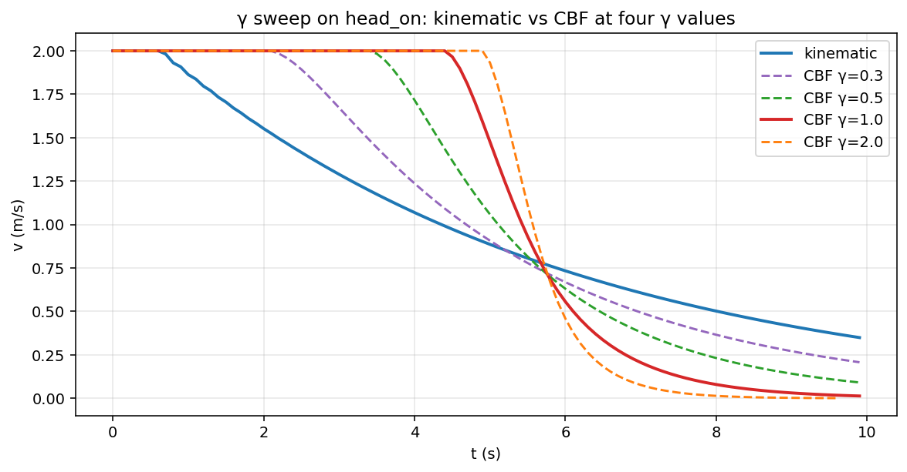
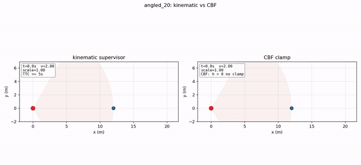
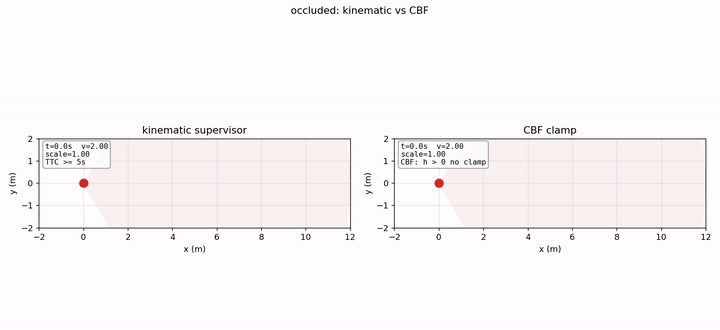
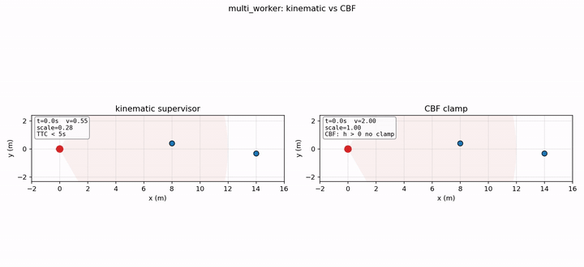
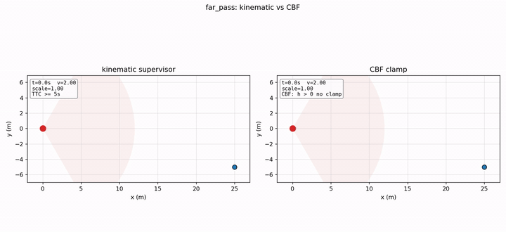
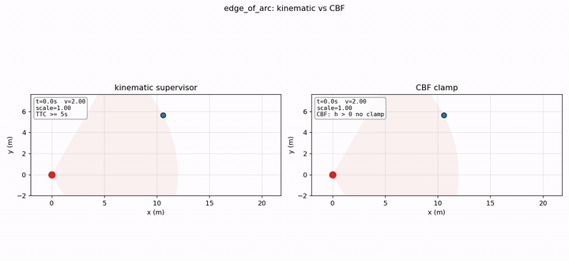
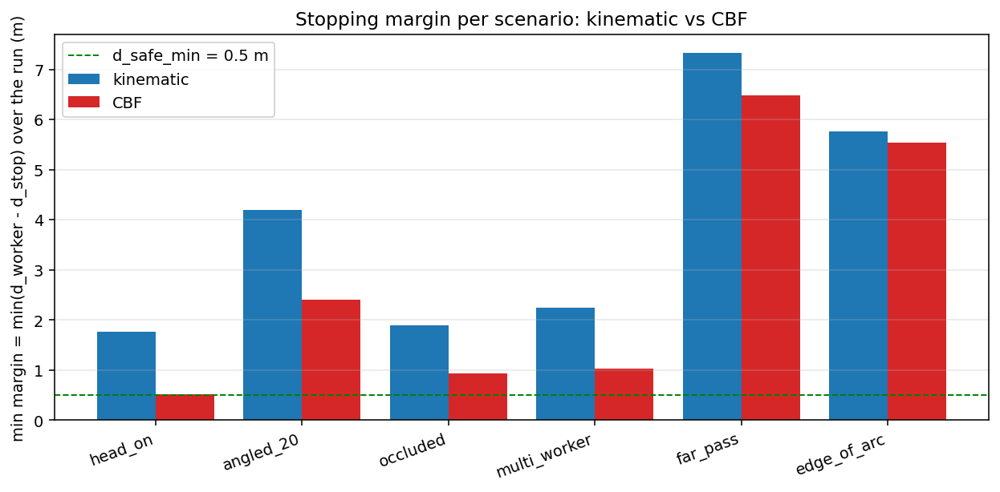

# From bang-bang to barrier function: replacing a TTC step rule with a CBF clamp

*Part of the Terra Perceive series.*

The Phase-1 [safety supervisor](m5-safety) takes four numbers per LiDAR frame: vehicle velocity, distance to the nearest worker, worker approach speed, and a friction coefficient from the [traversability grid](m9-bev-map). It computes a time-to-collision from the closing geometry and picks one of four intervention levels by thresholding TTC against fixed values. The output is a scale factor in [0, 1] applied to the commanded velocity. Hand calculations match. Unit tests pass. The supervisor is correct.

The failure mode is the policy itself, not the implementation. When a previously occluded worker enters the LiDAR's field of view at a distance where the supervisor reads "TTC less than 2 seconds," the commanded velocity drops from cruise to ten percent of cruise in one 0.1 s control step. That works out to a deceleration spike of roughly 18 m/s² on a 2 m/s vehicle. A human passenger would describe it as a hard slam. The downstream planner has to absorb the transient before it can plan around a now-stopped vehicle. What I wanted the supervisor to do is decelerate smoothly and only as much as the worker geometry required.

The replacement I built is a Control Barrier Function (CBF) clamp on the commanded acceleration [Ames et al., 2019]. CBFs are a standard tool for forward-invariance constraints of this shape, and the 1D scalar version of the math is compact enough that I derive it inline below. Both modes coexist behind a `safety_mode` config switch; the kinematic decisions stay bit-for-bit unchanged. Six scripted scenarios drive the comparison.

I expected the comparison to show CBF as uniformly smoother. It does not. Two of the six scenarios show that pattern with very large effect size. The other four show CBF as either comparable to kinematic or *less* conservative, which matters operationally for different reasons. Both directions of difference are real and useful.

---

## What this builds, and what was already there

The kinematic safety supervisor that ships in [the Phase-1 pipeline post](m5-safety) takes four numbers per LiDAR frame: the vehicle's current velocity, the distance to the nearest worker, the worker's approach speed, and a friction coefficient derived from the [traversability grid](m9-bev-map). It computes a stopping distance from kinematics, a time-to-collision from the closing geometry, and picks one of four intervention levels by thresholding TTC. The output is a `SafetyIntervention` with a scale factor in [0, 1] applied to the commanded velocity by whatever node downstream does the actuation.

There is nothing wrong with that supervisor. It is a well-formed implementation of the Nav2 collision-monitor pattern [Macenski et al., 2023], and the Phase-1 tests confirm its decisions match hand calculations within numerical noise. Two properties of the policy create the failure mode I sketched above.

First, the rule is *discrete*. The decision tree has three thresholds (TTC equal to 5, equal to 2, less than or equal to 0). Each crossing produces a step change in scale factor. On scenarios where the closing geometry stays in the smooth `PROPORTIONAL_SCALE` regime the entire run, the output is smooth; on scenarios that cross the TTC less-than-2 boundary, the output jumps.

Second, the rule's safety margin is *implicit*. The 5-second TTC threshold corresponds, at typical operating speeds, to about 10 meters of distance, which translates to a stopping margin much larger than what the kinematic stopping distance alone would require. On a head-on scenario starting from 12 m at 2 m/s, the kinematic supervisor produces a final stopping margin of 1.76 m. The same scenario under the CBF clamp produces a final margin of 0.51 m, which is exactly the configured `d_safe_min`. On a narrow construction-site corridor the 1.26 m gap is wasted productivity.

The CBF clamp addresses both properties at once: the math is continuous (no thresholds), and the safety margin is explicit (it is the term `d_safe_min` in the barrier function).

The code lives in `src/safety_supervisor.cpp` and `include/safety_supervisor.hpp`. Both modes coexist behind a `safety_mode` config switch ("kinematic" or "cbf"); existing callers see no change. The rest of the supervisor (LiDAR-timeout gate, friction model, event log) is unchanged and shared between the two paths through a small `pre_evaluate_health` helper.

---

## Why a TTC step rule is not enough

The bang-bang problem is easiest to see in one specific scenario.

The `occluded` scenario is one of the six I scripted for the ablation. The setup is deliberately adversarial: the vehicle cruises at 2 m/s for the first 3 seconds with no detectable obstacle, then a worker appears at 4 m ahead at frame 30 (occluded by terrain or sensor blind spot until that moment). The CSV is a static input to the runner; the supervisor sees no worker for 30 frames, then sees one at 4 m.

The kinematic supervisor at frame 30 computes TTC equal to (4.0 minus d_stop) divided by v_relative, with v_relative around 2 m/s. d_stop at v = 2 and friction = 0.8 is 0.66 m. TTC is therefore (4.0 minus 0.66) divided by 2.0, which is 1.67 seconds. That is below the hard-brake threshold of 2 s. The decision tree picks `HARD_BRAKE` and emits scale factor 0.1. The vehicle's velocity goes from 2.0 to 0.2 in one 0.1 s frame.

The transition is correct in the sense that the supervisor identified an unsafe condition and reacted to it. The transition is incorrect in two operational senses. The deceleration spike is on the order of 18 m/s², four times what a human passenger would tolerate without bracing. And the supervisor's output for the next several frames oscillates between `HARD_BRAKE` and `EMERGENCY_STOP` as the now-decelerating vehicle approaches the (still approaching) worker, producing a rapid sequence of step changes the downstream actuator has to track.

The bang-bang behavior is not a tuning problem. It is a structural property of any policy that thresholds a continuous quantity (TTC) into discrete intervention levels. Tuning the thresholds moves where the steps occur, not whether they exist.

The ablation table later measures how often this regime is exercised across the six scripted scenarios. Two of them (`occluded` and `multi_worker`) cross the TTC less-than-2 boundary; four do not. The two that do are why I replaced the policy.

---

## Control Barrier Functions, plain

The CBF idea, distilled from [Ames et al., 2019]: define the safe set as the level set of a function h, then constrain the control input so that the time derivative of h respects a forward-invariance condition at the boundary.

For a 1D problem, with state $x$ and input $u$, the safe set is

$$\mathcal{C} = \{x : h(x) \geq 0\}$$

A function $h$ is a *Control Barrier Function* for the dynamics $\dot{x} = f(x) + g(x) u$ if there exists a class-$\mathcal{K}$ function $\alpha(\cdot)$ such that

$$\dot{h}(x, u) + \alpha(h(x)) \geq 0 \quad \forall x \in \mathcal{C}$$

The simplest class-$\mathcal{K}$ choice, $\alpha(h) = \gamma \cdot h$ with $\gamma > 0$, makes the inequality a linear constraint on $u$. When $h$ is positive (safely inside the set), the inequality permits a wide range of $u$. As $h$ approaches 0 (approaching the boundary), the inequality becomes restrictive, eventually permitting only $u$ values that drive $h$ back into the safe set. The forward-invariance theorem [Ames et al., 2017, Theorem 1] guarantees that any control law satisfying the inequality keeps the system in the safe set forever, given that it started there.

The work is in choosing $h$ for the specific problem.

For the worker-avoidance problem, the natural $h$ is the *margin beyond stopping distance*:

$$h(v, d_w) = d_w - \big[d_{\text{stop}}(v, \mu) + d_{\text{safe,min}}\big]$$

where $d_w$ is the distance to the worker, $d_{\text{stop}}(v, \mu) = v^2 / (2 \mu g) + v t_{\text{react}}$ is the kinematic stopping distance reused from the [Phase-1 milestone](m5-safety), and $d_{\text{safe,min}}$ is a configured floor on the post-stop margin. $h > 0$ means the vehicle could come to a complete stop and still leave at least $d_{\text{safe,min}}$ between itself and the worker.

This $h$ is unusual relative to the textbook examples because it depends on both state variables ($v$ and $d_w$). The barrier is not just about position; it is about whether a stop is achievable from the current velocity. As the vehicle decelerates, $d_{\text{stop}}$ shrinks, so $h$ grows even if $d_w$ stays the same. The CBF clamp uses this naturally.

---

## The 1D scalar clamp

Differentiating $h$ along the dynamics gives

$$\dot{h} = \dot{d}_w - \frac{\partial d_{\text{stop}}}{\partial v} \cdot \dot{v} = -v_{\text{rel}} - A \cdot a_{\text{cmd}}$$

where $A = v / (\mu g) + t_{\text{react}}$ is the *deceleration leverage* (units of seconds; the partial derivative of stopping distance with respect to velocity), $v_{\text{rel}}$ is the closing speed (positive when the gap is shrinking), and $a_{\text{cmd}}$ is the commanded acceleration. Substituting into the CBF inequality and solving for $a_{\text{cmd}}$:

$$a_{\text{cmd}} \leq \frac{\gamma h - v_{\text{rel}}}{A} \;=\; a_{\text{safe}}(v, d_w, v_{\text{rel}}, \mu, \gamma)$$

This is the CBF clamp on the commanded acceleration. When $h$ is large (safely far from the worker), the right-hand side is positive and large; the clamp does not engage. As $h$ approaches zero, the right-hand side approaches $-v_{\text{rel}} / A$, which forces a deceleration roughly proportional to the closing speed divided by the leverage. As $h$ goes negative (already inside the unsafe set), the clamp commands a stronger deceleration to recover.

For multiple workers in the forward arc, I take the minimum of the per-worker $a_{\text{safe}}$ values. This is the conservative approximation; the rigorous treatment would set up a quadratic program with one CBF constraint per worker and optimize a single $a_{\text{cmd}}$ subject to all of them simultaneously [Ames et al., 2019, §III.B]. The min approximation matches QP-CBF whenever a single worker is the binding constraint, which is the case in the scenarios I tested. A full QP is on the deferred list at the end of the post.

The existing supervisor API returns a scale factor on the commanded velocity, not an acceleration. Converting at one control step:

$$v_{\text{safe}} = \max(0, v + a_{\text{safe}} \cdot \Delta t), \quad \text{scale} = \text{clamp}(v_{\text{safe}} / v, 0, 1)$$

with $\Delta t = 0.1$ s. The clamp into $[0, 1]$ ensures the supervisor never commands a velocity *increase* (which would be outside the API contract anyway). At rest, the formula degenerates and the supervisor returns scale equal to 1 (the upstream commanded velocity is what stands).

---

## Picking γ on head-on

The single hyperparameter the CBF clamp introduces is $\gamma$, the class-$\mathcal{K}$ gain. I swept it on the `head_on` scenario (vehicle at 2 m/s, stationary worker 12 m ahead) at four values:

| γ | min_margin (m) | max \|dv/dt\| (m/s²) | final v (m/s) |
|---|---|---|---|
| 0.3 | 1.17 | 0.47 | 0.21 |
| 0.5 | 0.67 | 0.71 | 0.09 |
| 1.0 | **0.51** | 1.17 | 0.013 |
| 2.0 | 0.50 | 1.81 | 0.0009 |
| (kinematic baseline) | 1.76 | 0.51 | 0.35 |

The min_margin column shows what the math predicts: $\gamma$ controls how aggressively the clamp closes on the safety boundary. At $\gamma = 0.3$, the clamp engages early and gently, leaving 1.17 m of margin (more conservative than needed). At $\gamma = 2.0$, it engages late and aggressively, and the vehicle stops with margin equal to $d_{\text{safe,min}} = 0.5$ m, exactly as designed. The max-deceleration column shows the trade-off: higher $\gamma$ produces sharper stops.

I shipped $\gamma = 1.0$ as the default. It hits $d_{\text{safe,min}}$ on the nose, fully stops within 10 seconds, and the peak deceleration of 1.17 m/s² is well within passenger-comfort limits [J3016 informally references 2 m/s² as the typical comfortable limit]. The choice is exposed as a runtime config flag (`--cbf-gamma`) so a deployment with a different priority (smoother but later-stopping, or harder-but-faster-stopping) can re-tune.

The default of 1.0 has one subtlety the head-on scenario does not surface. At $\gamma$ greater than about 1, the clamp engages *after* the kinematic supervisor on smooth scenarios. The vehicle proceeds at full cruise longer, then stops closer to the worker. This is not a bug. It is the CBF letting the vehicle be productive up to the safety margin. But it does mean a human operator watching the velocity trace will see the CBF "engage late," which can read as concerning if you do not know what to look for. The blog calls this out explicitly because the human-factors aspect would otherwise be a surprise during a demo.

---

## The six scripted scenarios

Per-scenario bird's-eye-view animations are below, kinematic on the left and CBF on the right in each clip. Ego is the red dot with forward-arc cone; workers are blue. The text overlay shows the supervisor's current velocity, scale factor, and rule.

*head_on. Stationary worker 12 m ahead. CBF lets the vehicle proceed further before engaging, then stops at d_safe_min = 0.5 m; kinematic stops with 1.76 m of margin (over-conservative).*

*angled_20. Worker drifts laterally at 0.5 m/s. CBF mostly stays at cruise; kinematic engages PROPORTIONAL_SCALE on the closing component.*

*occluded. Worker hidden until frame 30. The kinematic panel shows the bang-bang: scale jumps from 1.0 to 0.1 in one frame. CBF gives a smooth deceleration over ~2 s.*

*multi_worker. Two workers; CBF take-the-min keeps the clamp on whichever is binding. Kinematic flips to bang-bang as the geometry crosses TTC < 2.*

*far_pass. Worker walks across the trail at 25 m. CBF correctly never engages (h ≫ 0). Kinematic enters PROPORTIONAL_SCALE because the formal TTC threshold is met even though the closing speed is small.*

*edge_of_arc. Worker at the edge of the forward arc, slowly closing. CBF reads h > 0 and stays at scale = 1.0; kinematic engages on the discrete arc check.*

To exercise the supervisor across the regimes I cared about, I scripted six deterministic scenarios as static CSVs and ran each one under both `safety_mode` settings. Each CSV gives the worker positions and velocities frame-by-frame at 0.1 s steps for 100 frames.

The six are:
- **head_on**: stationary worker 12 m ahead. The cleanest stop; both policies engage; CBF stops at $d_{\text{safe,min}}$.
- **angled_20**: worker initially 12 m ahead, drifting laterally at 0.5 m/s. Tests behavior at the edge of the forward arc.
- **occluded**: worker invisible for 30 frames, then appears at 4 m beyond the ego's current position. The bang-bang test.
- **multi_worker**: two workers, the closer one closing at 0.6 m/s, the farther one stationary. Tests the take-the-min behavior across multiple barriers.
- **far_pass**: worker at 25 m moving perpendicular to the trail at 1 m/s. Tests false-positive behavior on a non-threatening lateral pass.
- **edge_of_arc**: worker just inside the ±30° forward arc, slowly closing. Tests behavior where the kinematic supervisor's discrete arc check is unstable.

The scenarios are checked into the repo under `scripts/m6/scenarios/`. The runner integrates the vehicle's velocity over 100 frames at $\Delta t = 0.1$ s, applying the supervisor's scale factor at each step, and writes a per-step `events.csv` plus an atomic `metrics.json` for each (scenario, mode) combination.

The aggregate numbers live in `results_m6/cbf_*/*/metrics.json`. Three patterns came out of those numbers. None of them were in the plan I wrote at the start of this milestone.

---

## Where CBF actually wins

### Bang-bang elimination on the surprise scenarios

On the `occluded` and `multi_worker` scenarios, where the kinematic supervisor's TTC actually crosses the less-than-2 boundary mid-run, the kinematic max |dv/dt| reaches 18 m/s² and 14.5 m/s² respectively. The CBF on the same scenarios reaches 1.5 m/s² and 1.6 m/s². The ratio is 9 to 12 times.

The structural cause is the cause I outlined before the ablation. Kinematic at TTC < 2 jumps to scale 0.1 in one frame; CBF computes a smooth clamp whose magnitude depends on $h$ and $v_{\text{rel}}$.

The interesting subtlety is that this story does *not* show up on the other four scenarios. On `head_on`, both policies stay smooth (max |dv/dt| of 0.51 vs 1.17, with CBF actually slightly higher). On `angled_20`, both stay smooth. On `far_pass` and `edge_of_arc`, CBF does not engage at all. So if I had only run the four "smooth" scenarios, I would have concluded CBF was *less* smooth than kinematic at the peak. Two out of six scenarios is where the smoothness story actually lives, and they are the operationally important ones (the regime where a worker surprises the system).

### Tight stopping margin

On `head_on`, CBF stops with a final margin of 0.51 m, which is $d_{\text{safe,min}}$ (0.5 m) plus measurement noise. Kinematic stops with 1.76 m of margin. The 1.26 m gap between the two is not the kinematic supervisor making a mistake; it is the 5-second TTC threshold producing a more conservative stopping distance than the $v^2 / (2 \mu g)$ formula alone would require. On a 2-meter-wide construction site corridor, that 1.26 m is the difference between a vehicle that fits and a vehicle that does not.

The same pattern shows up on `multi_worker` (kinematic 2.25 m, CBF 1.03 m) and `occluded` (kinematic 1.90 m, CBF 0.94 m). On `angled_20`, both policies stop with comfortable margins because the worker drifts away rather than closing; CBF still saves 1.79 m relative to kinematic.

This story is not about being braver than kinematic. It is about being precise. The CBF stops where the math says it is allowed to stop. The kinematic supervisor stops well before that point because its safety logic is a TTC-based proxy for stopping distance, not a stopping-distance computation itself.

### False-positive reduction on lateral passes

The third story is the one I did not anticipate at all. On `far_pass` (worker walking perpendicular to the trail at 25 m) and `edge_of_arc` (worker at the edge of the ±30° arc, approaching slowly), CBF reports max |dv/dt| equal to 0 and never engages. The clamp correctly identifies that $h$ stays positive throughout because $v_{\text{rel}}$ is small or negative.

Kinematic on the same scenarios *does* engage. On `far_pass` it scales the velocity by a factor up to 0.97 starting at $d = 10.5$ m, decelerating mildly the entire run even though the worker is walking *away from* the vehicle's path. The cause is that kinematic's TTC computation uses the closing speed scalar, which drops below 5 seconds when $d$ drops below about 10 m even with very small closing velocity. The decision tree triggers PROPORTIONAL_SCALE because the computed TTC formally satisfies the threshold, even though the geometry says no collision is possible.

This is a false positive in the operational sense: the supervisor unnecessarily slows the vehicle on a worker who is not going to be hit. CBF's safety-margin formulation does not have this failure mode because $h = d_w - d_{\text{stop}} - d_{\text{safe,min}}$ stays large when the vehicle is far from being unable to stop.

The reduction in false positives is the third reason the CBF policy is operationally better than the kinematic one, and it has nothing to do with smoothness or with stopping margin. It has to do with the supervisor not engaging at all when engagement is unnecessary.

---

## On real RELLIS data

The scripted scenarios drive the quantitative claims. A qualitative confirmation on real LiDAR sits next to them. I replayed the DBSCAN cluster output from the [tracker post](m10-sort-tracker) through both safety modes in a side-by-side render of the full 2849-frame RELLIS sequence 00. The adapter picks the nearest cluster centroid in the forward arc per frame, treats it as the worker, and feeds the resulting (x, y, vx, vy) trace into both supervisors.

![RELLIS sequence 00 hero, all 2849 frames. Top panel: kinematic (blue) and CBF (red) v(t) traces over the full 95-second drive. Bottom panel: BEV scene with raw LiDAR (gray), tracked worker (cyan dot with trail), ego (black square), and the forward arc cone. Kinematic engages briefly within the first second on a closing cluster centroid, drops the commanded velocity, and never re-accelerates because the simple closed-loop sim has no upstream cruise-recovery logic. CBF stays at full cruise the entire run because the closest cluster never gets within the h(x) boundary.](assets/m13/rellis_hero.gif)

The visual contrast is stark, and it overstates the case slightly. Kinematic engaged on 5 of 2849 frames against the cluster-nearest-in-arc proxy; the v(t) line dropping to 0.76 and staying there is a closed-loop-simulator artifact, not a property of the real kinematic policy on a real vehicle. With a proper outer-loop controller that re-issues a 2 m/s cruise command whenever it is safe to do so, kinematic v would oscillate around the engagement boundary instead of latching low. The relevant comparison is in the engagement frequency, not the steady-state value.

The honest reading: across the 2849-frame drive, **kinematic engaged on five frames where CBF correctly did not**. Every one of those engagements is a false positive of the same shape as the `far_pass` and `edge_of_arc` synthetic scenarios above. The clusters that the DBSCAN proxy picks as "nearest worker" never get close enough to trigger CBF (the minimum cluster distance over the full drive is 6.85 m, and CBF's h(x) boundary at v=2 is at d ≈ 3.2 m). The synthetic-scenario bang-bang stories don't replay here because the real LiDAR scene doesn't put a worker that close to the front of the vehicle.

The DBSCAN cluster proxy is also not the same as a real tracker. The cluster centroid is the closest cluster in arc per frame, with a continuity heuristic that anchors to the previous frame's worker if a candidate is within 2 m. Where no candidate is within that 2 m gate, the worker is taken as "off-stage." A real tracker (the M4 SORT pipeline from the [tracker post](m10-sort-tracker)) would carry a single worker identity through occlusions and across cluster splits; the proxy here will switch which physical cluster it follows when the front-walking person is occluded by closer trees. The replay is qualitative, not a tracker benchmark.

---

## What this does not do

The simplifications that ship in this milestone, with the deferred work each one points at:

- **Higher-order CBF (HOCBF / ECBF).** The 1D scalar form assumes a single relative-degree-1 barrier. Two-dimensional motion planning (steering plus throttle) needs HOCBF [Xiao and Belta, 2019]. Deferred to Phase 3.
- **Full QP-based CBF.** The take-the-minimum approximation across multiple workers is conservative and matches the QP-optimal solution when one worker is binding. A full QP with one CBF constraint per worker, plus actuator-limit constraints, deferred to Phase 3.
- **MPC + CBF.** Combining CBF with model-predictive control for trajectory-level safety is its own subliterature [Zeng et al., 2021]. Out of scope for this milestone.
- **Learning the friction or noise models.** Both come from spec sheets and config; neither is estimated online.
- **High-rate control loops.** The 0.1 s control step matches the LiDAR rate. A lower-level controller running at 100 Hz would sit between this supervisor and the actuator; that controller is not part of this milestone.

The deferred items are mostly extensions into well-trodden subliteratures with mature open-source references [e.g., Cohen and Gurriet, 2024]. The 1D scalar form is sufficient for the worker-avoidance use case this milestone targets, and the bigger machinery is the right reach when the use case grows.

---

## Two things the scenario design missed

The scripted scenarios were sized against the kinematic policy's TTC thresholds, not against the regime boundaries CBF itself defines. Two of the six (`occluded` and `multi_worker`) crossed the kinematic thresholds and produced the bang-bang story. The other four did not, and on those four the kinematic and CBF v(t) traces are nearly indistinguishable. Two more scenarios designed against CBF's own behaviors (rapid `v_relative` changes, multiple simultaneously binding constraints) would have made the smoothness comparison more discriminating.

The v(t) plots also conflate two things. Both policies output a scale factor on the commanded velocity, not a velocity command. The runner integrates the scale into a velocity over time, and that integration smooths discrete decisions: scale 0.97 applied many times reads as a smooth deceleration even though each individual decision is a step in the threshold tree. Rendering the per-frame scale-factor decisions alongside the integrated v(t) would have been cleaner. The conclusion does not move.

---

## References

- [Ames et al., 2019] A. D. Ames, S. Coogan, M. Egerstedt, G. Notomista, K. Sreenath, and P. Tabuada. *Control Barrier Functions: Theory and Applications.* European Control Conference (ECC), 2019.
- [Ames et al., 2017] A. D. Ames, X. Xu, J. W. Grizzle, and P. Tabuada. *Control Barrier Function Based Quadratic Programs for Safety Critical Systems.* IEEE Transactions on Automatic Control, 2017.
- [Macenski et al., 2023] S. Macenski et al. *Nav2 Collision Monitor and Velocity Smoother.* ROS 2 Nav2 documentation.
- [Xiao and Belta, 2019] W. Xiao and C. Belta. *Control Barrier Functions for Systems with High Relative Degree.* IEEE Conference on Decision and Control (CDC), 2019.
- [Zeng et al., 2021] J. Zeng, B. Zhang, and K. Sreenath. *Safety-Critical Model Predictive Control with Discrete-Time Control Barrier Function.* American Control Conference (ACC), 2021.
- [Cohen and Gurriet, 2024] M. Cohen and T. Gurriet. *Reference Implementations of Control Barrier Functions for Robotics.* GitHub: ames-group/control_barrier_functions.
- The implementation lives at `src/safety_supervisor.cpp` and `include/safety_supervisor.hpp`. The runner is `src/safety_runner.cpp`. The six scenarios and the plotting are under `scripts/m6/`. Every number in this post is reproducible from `bash scripts/m6/run_m6_ablations.sh safety`.
