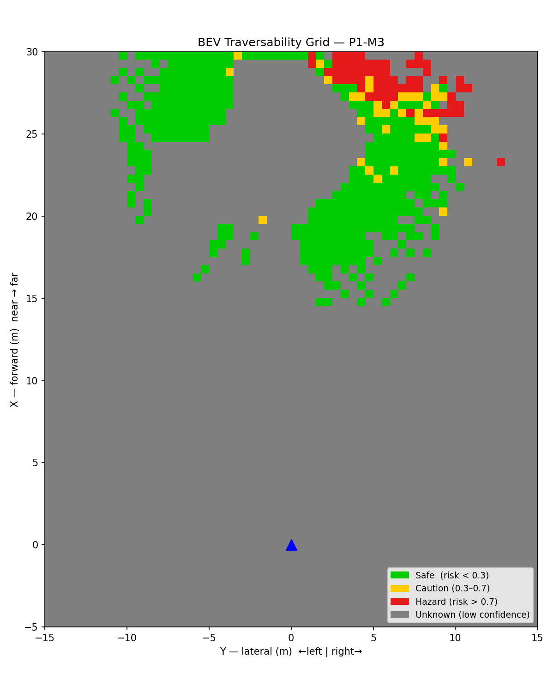
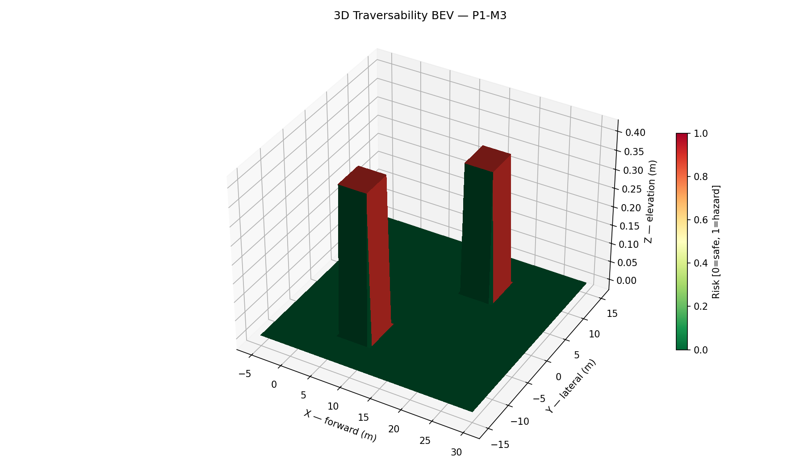
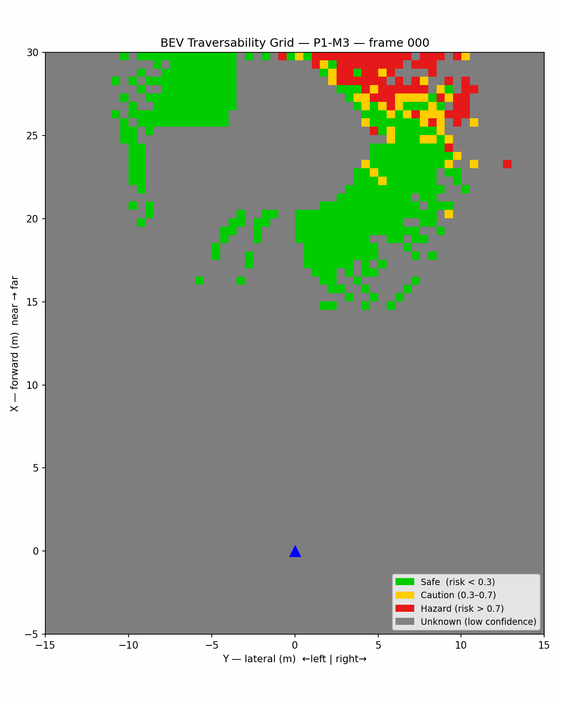
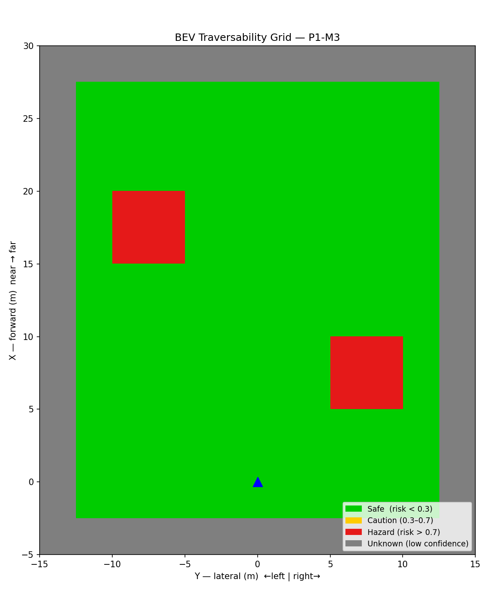

<script type="text/javascript" async
  src="https://cdnjs.cloudflare.com/ajax/libs/mathjax/2.7.7/MathJax.js?config=TeX-MML-AM_CHTML">
</script>

# Physics-Grounded Traversability Grid

*Part of the Terra Perceive series.*

Ground segmentation (M2) tells us what is terrain — it does not tell us whether the terrain is safe to drive on. A 30-degree slope is ground. So is a boulder field. The traversability grid answers the question that matters for a real autonomous robot: *can my vehicle physically cross this patch of ground?*

This milestone builds a 2.5D grid over the field of view, computes three terrain features per cell using PCA, and fuses them into a single risk score tuned to the Warthog robot's physical limits.

---

## The Problem: From Points to a Driveable Map

After RANSAC ground segmentation, we have a set of 3D points classified as ground. The challenge is converting an unstructured point cloud into a structured representation that a path planner can query: *"Is cell (ix, iy) safe?"*

A **Bird's Eye View (BEV) traversability grid** is the standard solution in off-road robotics (Chilian & Hirschmüller, IROS 2009; Wermelinger et al., IROS 2016). We discretize the forward-left area into cells of fixed size and extract terrain statistics per cell. The result is a 2D grid where each cell carries a risk value in $$[0, 1]$$.

**Grid parameters used in this project:**

| Parameter | Value |
|-----------|-------|
| X range (forward) | -5 m to +30 m |
| Y range (lateral) | -15 m to +15 m |
| Cell resolution | 0.5 m × 0.5 m |
| Grid size | 70 × 60 cells |
| Min points per cell | 3 |

Grid binning is O(N) — each point maps to a cell in one arithmetic step:

$$i_x = \left\lfloor \frac{p_x - x_{min}}{r} \right\rfloor, \quad i_y = \left\lfloor \frac{p_y - y_{min}}{r} \right\rfloor$$

---

## Surface Normal Estimation via PCA

The core geometric primitive is the **surface normal**. Given a cell with $$N$$ ground points $$\{p_i\}$$, the normal encodes slope direction and magnitude. We estimate it via Principal Component Analysis (PCA), following Weinmann et al. (2015) and the standard 3D structure tensor approach (Pauly et al., 2003).

### Step 1: Centroid and Centering

$$\bar{p} = \frac{1}{N} \sum_{i=1}^{N} p_i, \qquad q_i = p_i - \bar{p}$$

### Step 2: 3D Covariance Matrix

$$C = \frac{1}{N} \sum_{i=1}^{N} q_i q_i^T = \frac{1}{N} \sum_{i=1}^{N}
\begin{bmatrix} q_{ix} \\ q_{iy} \\ q_{iz} \end{bmatrix}
\begin{bmatrix} q_{ix} & q_{iy} & q_{iz} \end{bmatrix}$$

This 3×3 symmetric positive-semidefinite matrix encodes the shape of the local neighborhood. The diagonal elements are the variances in X, Y, Z. The off-diagonal elements capture correlations — a positive $$C_{xz}$$ means "as you move forward, the surface also rises", i.e., an uphill slope.

### Step 3: Eigendecomposition

$$C \, v_k = \lambda_k \, v_k, \qquad \lambda_0 \leq \lambda_1 \leq \lambda_2$$

The eigenvector $$v_0$$ corresponding to the **smallest eigenvalue** $$\lambda_0$$ is the direction of minimum variance — perpendicular to the surface, i.e., the surface normal. This is computed via `Eigen::SelfAdjointEigenSolver`, which returns eigenvalues in ascending order.

**Concrete example**: For perfectly flat ground at z=0, $$\lambda_0 \approx 0$$ (no spread perpendicular to the plane), and $$v_0 \approx (0, 0, 1)^T$$.

**Sign ambiguity**: The eigenvector sign is arbitrary. We enforce that the normal points upward by checking $$v_0 \cdot \hat{z} < 0$$ and flipping if needed, consistent with the "orient toward viewpoint" strategy described in the PCL normal estimation tutorial.

### Step 4: Slope Angle

The slope of the cell is the angle between the estimated normal and the world vertical:

$$\theta_{slope} = \arccos\!\left( \left| v_0 \cdot \hat{z} \right| \right) \cdot \frac{180}{\pi}$$

A flat surface gives $$\theta_{slope} = 0°$$. A vertical wall gives $$\theta_{slope} = 90°$$.

---

## Roughness: The Eigenvalue Ratio (Pauly et al., 2003)

Slope alone is not enough. A 5-degree slope of hard-packed dirt is easy to cross. A 5-degree slope of loose rock is dangerous. **Roughness** captures the out-of-plane scatter that slope misses.

Following Pauly et al. (2003) and Weinmann et al. (2015), roughness is defined as the ratio of the smallest eigenvalue to the total eigenvalue sum — the fraction of variance that the plane model cannot explain:

$$r = \frac{\lambda_0}{\lambda_0 + \lambda_1 + \lambda_2}$$

For a perfectly planar surface, $$\lambda_0 = 0$$ and $$r = 0$$. For an isotropically scattered cloud (e.g., rocks), all three eigenvalues are equal and $$r = 1/3 \approx 0.33$$. Values near 0 mean the cell is planar; values above 0.1 indicate meaningful surface irregularity.

This metric has a pleasing property: it is **scale-invariant**. Multiplying all coordinates by a constant does not change the eigenvalue ratio.

---

## Step Height

Step height captures discontinuities that slope and roughness cannot detect — a sharp edge, a curb, or a drop-off.

$$h_{step} = z_{max} - z_{min}$$

This is the simplest of the three metrics but often the most safety-critical. A shallow-sloped ramp ending in a 20cm drop is flat on average but impassable.

---

## Vehicle-Aware Risk Scoring (Wermelinger et al., IROS 2016)

Three raw terrain metrics need to become one actionable risk score. The key design insight from Wermelinger et al. is that risk should be **multiplicative in penalty terms**: any single hazard that exceeds a vehicle limit should dominate the risk, regardless of how good the other features are.

For each feature, we compute a **penalty** (0 = no cost, 1 = at the limit):

$$\text{slope\_penalty} = \left(\frac{\theta_{slope}}{\theta_{max}}\right)^2$$

$$\text{rough\_penalty} = \frac{r}{r_{max}}$$

$$\text{step\_penalty} = \frac{h_{step}}{h_{max}}$$

Each penalty is clamped to $$[0, 1]$$. The combined traversability score is:

$$s = (1 - \text{slope\_penalty}) \cdot (1 - \text{rough\_penalty}) \cdot (1 - \text{step\_penalty})$$

And risk is:

$$\text{risk} = 1 - s$$

**Vehicle parameters (Warthog UGV defaults):**

| Parameter | Value |
|-----------|-------|
| Max climbable grade | 30° |
| Max roughness tolerance | 0.275 |
| Max step height | 0.20 m |
| Vehicle mass | 590 kg |
| Max speed | 5.0 m/s |

**Why quadratic for slope?** A linear penalty would treat 5° and 15° symmetrically relative to a 20° max. In practice, slopes near the limit carry disproportionately more risk (energy cost, traction loss, tip-over probability all increase nonlinearly). The quadratic term captures this physical reality without adding free parameters.

---

## Confidence Tracking

Not all cells are equally trustworthy. A cell at 25m range with 4 points is geometrically valid but statistically fragile — the PCA normal could be far from the true surface normal. We track confidence explicitly:

$$\text{confidence} = \underbrace{\min\!\left(1,\, \frac{N_{pts}}{N_{ref}}\right)}_{\text{count factor}} \times \underbrace{\max\!\left(0,\, 1 - \frac{d_{range}}{d_{max}}\right)}_{\text{range factor}}$$

with $$N_{ref} = 20$$ and $$d_{max} = 30\text{ m}$$.

- **Count factor**: degrades smoothly for sparse cells. With `min_points_per_cell = 3`, we need at least 3 non-collinear points to define a plane. With exactly 3, the count factor is 3/20 = 0.15 — the PCA still runs, but confidence is low.
- **Range factor**: degrades linearly beyond 30m. LiDAR point density falls as $$1/r^2$$ with range, so distant cells become sparse regardless of scene content.

Cells with `confidence ≤ 0.5` are shown as **gray (unknown)** in the visualization — the path planner should treat these as unobserved territory, not as safe or hazardous.

---

## Bird's Eye View Visualization

The BEV grid provides an intuitive top-down view of traversability. Each cell is color-coded by risk with confidence gating:

| Color | Meaning |
|-------|---------|
| Green | Safe — risk < 0.3 and confidence > 0.5 |
| Yellow | Caution — 0.3 ≤ risk ≤ 0.7 and confidence > 0.5 |
| Red | Hazard — risk > 0.7 and confidence > 0.5 |
| Gray | Unknown — confidence ≤ 0.5 |

The blue triangle marks the vehicle position at the origin.

### Real RELLIS-3D Frame (Single Scan)


*Figure 1: BEV traversability grid on a real RELLIS-3D LiDAR scan. Green = safe, yellow = caution, red = hazard, gray = unknown (low confidence or no data). The sparse coverage reflects single-frame LiDAR density at 0.5m resolution; accumulated frames or coarser resolution would fill the grid.*


*Figure 2: Per-cell feature heatmaps. Elevation (terrain colormap), risk (RdYlGn reversed), slope in degrees, roughness (eigenvalue ratio), step height, and confidence. Low-confidence cells show at 0 for all features.*


*Figure 3: 3D surface visualization colored by risk. Elevation (Z) reflects the per-cell mean height; color follows risk (green = safe, red = hazard).*

### Animated BEV — 100 RELLIS-3D Frames


*Figure 4: Animated 2D BEV grid over 100 consecutive LiDAR scans from a RELLIS-3D sequence. Each frame is independently processed through the full pipeline: bag extraction → RANSAC ground segmentation → traversability grid. The gray (unknown) region shifts as the sensor moves; hazard patches appear consistently on rough or sloped terrain patches.*

### Synthetic Validation

To validate the pipeline independently of real data, we also tested with a synthetic grid containing two hazard patches on a safe background:


*Figure 5: Synthetic traversability grid — two high-risk patches (red) with low-confidence border region (gray).*

---

## The Full Pipeline: `pipeline_runner`

The C++ executable `build/construction_perception/pipeline_runner` ties together all three milestones:

```
LiDAR .bin  →  load_bin()  →  sector_segment_ground()  →  TraversabilityGrid::compute()  →  grid .bin
```

1. **Load**: `point_cloud_loader` reads the KITTI binary into `vector<Eigen::Vector3f>` in O(N).
2. **Segment**: sector RANSAC separates ground from obstacles; only ground points enter the grid.
3. **Compute**: for each non-empty cell, run PCA → extract slope/roughness/step → score risk → compute confidence.
4. **Export**: write 6 float32 values per cell (risk, confidence, slope_deg, roughness, step_height, mean_z) row-major to a binary file. Total size: 70 × 60 × 6 × 4 = 100,800 bytes.

The Python visualization script `scripts/visualize_bev.py` reads this binary and renders the 2D, 6-panel, and 3D plots.

---

## Test Results

All 6 traversability unit tests pass:

| Test | What it verifies | Result |
|------|-----------------|--------|
| `FlatGround` | slope ≈ 0°, roughness ≈ 0, step ≈ 0, risk ≈ 0 | PASS |
| `SlopedSurface` | 30° slope detected, slope_deg ≈ 30, risk > 0.7 | PASS |
| `VehicleAwareScoring` | risk scales quadratically with slope/max ratio | PASS |
| `RoughSurface` | rough cell: roughness > max_roughness_tolerance | PASS |
| `UnknownCells` | empty and sparse cells: confidence = 0, risk = 0 | PASS |
| `ConfidenceNearFar` | near cell (2m, 20 pts) confidence > 0.8; far cell (25m, 5 pts) confidence < 0.5 | PASS |

Total test suite: **39/39 tests passing** across all Phase 1 modules.

Key implementation subtlety in the test helpers: generating non-collinear point sets for PCA requires care. Points at `x = x_start + i*Δ, y = y_start + i*Δ` are collinear — the covariance matrix is rank 1 and the normal is horizontal. The fix: use a 2D grid layout inside each cell (`row = i / cols_per_row, col = i % cols_per_row`), ensuring spread in both x and y. Additionally, the z-noise period must be coprime with the grid period to avoid correlation between y-index and z-value, which would introduce a spurious slope.

---

## What I'd Do Differently

- **Accumulate frames**: A single LiDAR scan at 0.5m resolution gives a sparse grid at distance. In practice, accumulating 5–10 consecutive scans (with ego-motion compensation) fills the grid and produces coverage comparable to the paper's stereo DEM results.
- **Adaptive resolution**: Near range (< 5m) deserves finer cells (0.25m) for precision; far range (> 20m) can use coarser cells (1.0m) to maintain density. A multi-resolution grid would be a natural extension.
- **Temporal smoothing**: Risk values jump between frames due to LiDAR sparsity. A simple exponential moving average per cell (`risk_t = α * risk_new + (1-α) * risk_prev`) stabilizes the visualization and helps path planning.
- **Semantic integration**: The grid is purely geometric. Adding class labels from a semantic segmentation model (water, mud, vegetation) would allow rule-based overrides — e.g., any cell labeled "water" gets risk = 1.0 regardless of slope.

---

## Connection to Future Steps

The traversability grid is the output of Phase 1. In Phase 2, it feeds directly into:

1. **Path planning (costmap)**: The risk grid maps to a nav2 cost layer. The `traversability_costmap_layer` plugin (P2) converts risk values to nav2 cost (0–254) and publishes them as a local costmap layer.
2. **Semantic fusion (P3)**: A semantic segmentation head on the camera image produces per-pixel class labels. Projecting camera pixels onto LiDAR points (the `cam_lidar_projection` module built in M3.5) allows semantic labels to override geometric risk scores for terrain types the geometry-only pipeline cannot distinguish (e.g., wet grass vs. dry grass look identical in a point cloud).
3. **Multi-object tracking (P2-M4)**: The obstacle points discarded by RANSAC enter a SORT tracker, producing obstacle trajectories. The traversability grid and obstacle tracks are both inputs to the safety supervisor.

The fundamental insight from this milestone: **risk is a function of both terrain geometry and vehicle kinematics**. The same slope that is safe for a Warthog (max grade 30°) is impassable for a humanoid robot (max grade 15°). By parametrizing the scoring on `VehicleKinematics`, the grid generalizes across platforms without algorithmic changes.

---

**Next Step**: [Milestone 4: Multi-Object Tracking with SORT](m4-tracking)
