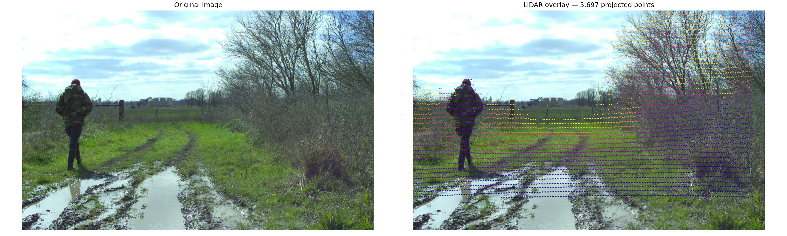
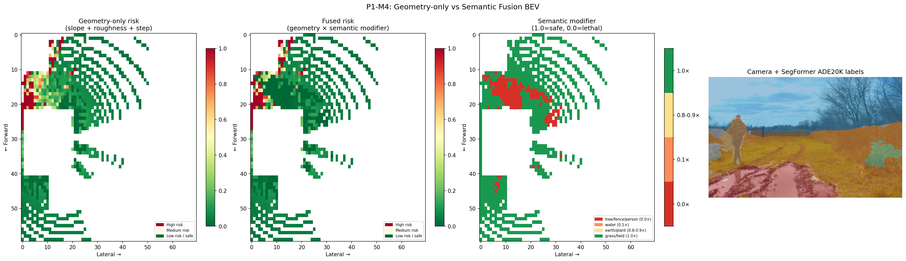

<script type="text/javascript" async
  src="https://cdnjs.cloudflare.com/ajax/libs/mathjax/2.7.7/MathJax.js?config=TeX-MML-AM_CHTML">
</script>

# Camera-LiDAR Projection + Semantic Fusion

*Part of the Terra Perceive series.*

After M3, the traversability pipeline can tell you whether a patch of ground is steep, rough, or stepped. It cannot tell you whether that flat patch in front of the robot is grass or a mud puddle. Both look identical to LiDAR — near-zero slope, near-zero roughness, near-zero step height. The RANSAC + traversability pipeline assigns both a low risk score and moves on.

That failure mode is what M4 is about. The fix is semantic: bring in the camera, run a segmentation model, label every pixel as "water," "tree," "person," "grass," and use those labels to override the geometry-only risk where geometry is blind. The hard part is not the segmentation — it's building the mathematical bridge between two sensors that observe the same scene in completely different coordinate frames.

---

## The Bridge: Three Coordinate Frames

Before writing a single line of code, I had to get clear on the coordinate systems in play. There are three, and confusing them is the source of most bugs in camera-LiDAR fusion:

| Frame | Convention | Used for |
|-------|-----------|----------|
| **LiDAR frame** | X-forward, Y-left, Z-up (Ouster OS1) | Raw point cloud `[x, y, z]` |
| **Camera frame** | Z-forward (depth), X-right, Y-down (OpenCV) | Projection math |
| **Image plane** | u=column, v=row, origin top-left | Pixel lookup |

The flow is:

```
LiDAR [x,y,z]  →(T_cam_lidar)→  Camera [Xc,Yc,Zc]  →(K)→  Image [u,v]
```

$$T_{cam \leftarrow lidar}$$ is a 4×4 SE(3) rigid body transform — one matrix encodes both the rotation between the two frames *and* the physical offset between the sensors. The intrinsic matrix $$K$$ is a 3×3 that encodes focal length and principal point. The pipeline is a matrix multiply, a depth check, a division (the perspective divide), and a bounds check. Simple in principle. The calibration is where it gets interesting.

Once we had the calibrated $$T_{cam \leftarrow lidar}$$, its rotation block revealed the physical mounting of the Basler camera on the Warthog — roughly a 90° roll relative to the LiDAR's horizontal plane:

```
   LiDAR axis          maps to       Camera axis
   ─────────────────────────────────────────────
   +X  (Forward)    ──────────►    +Y  (Down)
   +Z  (Up)         ──────────►    -X  (Left)
   -Y  (Right)      ──────────►    +Z  (Forward / Depth)
```

This matters for intuition when debugging: "forward" in LiDAR is *downward* on the camera sensor. A tree at LiDAR coordinates (x=10, z=5) appears in the upper portion of the image precisely because LiDAR's +Z (up) maps to Camera −X (top in portrait orientation).

---

## Getting the Calibration Right

The RELLIS-3D dataset (Jiang et al., RA-L 2021) provides extrinsic calibration between the Ouster OS1 LiDAR and Basler camera, obtained by placing a flat checkerboard simultaneously visible to both sensors and minimising the mean line re-projection error (MLRE). The result lives in `transforms.yaml`:

```yaml
os1_cloud_node-pylon_camera_node:
  q: {w: -0.50507811, x: 0.51206185, y: 0.49024953, z: -0.49228464}
  t: {x: -0.13165462, y: 0.03870398, z: -0.17253834}
```

Two things need to happen: convert the quaternion to a rotation matrix, and figure out which direction the transform goes.

**The ROS TF naming convention.** `A-B` in ROS TF stores the transform that maps points *from B's frame into A's frame*. So `os1_cloud_node-pylon_camera_node` = $$T_{lidar \leftarrow cam}$$. But we need $$T_{cam \leftarrow lidar}$$ — the inverse. Getting the direction wrong here silently produces a matrix that passes all your sanity checks (det = 1, orthonormal) but projects every point into the wrong half of space.

**Quaternion to rotation matrix — the convention minefield.** I read through [Wikipedia's Hamilton-convention formula](https://en.wikipedia.org/wiki/Quaternions_and_spatial_rotation#Conversion_to_and_from_the_matrix_representation) and Diebel's *"Representing Attitude: Euler Angles, Unit Quaternions, and Rotation Vectors"* (2006, Eq. 125). They look nearly identical. The difference is a sign flip on the cross-terms — Diebel's formula produces $$R_{cam \leftarrow lidar}$$ (active rotation convention), while Wikipedia/scipy produce $$R_{lidar \leftarrow cam}$$ (passive). They are transposes of each other.

The bug this caused: I used Diebel's $$R$$ (= $$R_{cam \leftarrow lidar}$$) but assembled it into the rotation slot of $$T_{lidar \leftarrow cam}$$, which expects $$R_{lidar \leftarrow cam}$$. The matrix looked fine — det = 1.0, orthonormal, T·T⁻¹ ≈ I — but it had the wrong rotation baked in. No amount of inversion would have fixed it.

**The fix:** use scipy's convention consistently. `Rotation.from_quat([x,y,z,w])` gives $$R_{lidar \leftarrow cam}$$. Assemble:

$$T_{lidar \leftarrow cam} = \begin{bmatrix} R & t \\ 0 & 1 \end{bmatrix}, \qquad
T_{cam \leftarrow lidar} = T_{lidar \leftarrow cam}^{-1} = \begin{bmatrix} R^T & -R^T t \\ 0 & 1 \end{bmatrix}$$

One thing worth internalising: the translation in the inverse is $$-R^T t$$, not $$-t$$. The original translation $$t$$ was expressed in the LiDAR frame. When you invert, you're moving to the camera frame, so you have to rotate $$t$$ before negating it.

The resulting rotation block is physically interpretable: LiDAR X-forward maps to Camera +Y (down), LiDAR Z-up maps to Camera −X (left). The camera is mounted with a ~90° roll relative to the LiDAR's horizontal plane — consistent with what you'd expect from a portrait-mounted sensor on the Warthog.

**Intrinsics** from `Rellis_3D_cam_intrinsic/camera_info.txt`:

| Parameter | Value |
|-----------|-------|
| $$f_x$$ | 2813.643 px |
| $$f_y$$ | 2808.326 px |
| $$c_x$$ | 969.286 px |
| $$c_y$$ | 624.050 px |
| Image size | 1853 × 1025 |

---

## Projection: The Four-Step Pipeline

Following the standard pinhole camera model (Nayar, *First Principles of Computer Vision: Camera Calibration*, Columbia University), a LiDAR point $$p_L = [x, y, z]^T$$ maps to a pixel through four steps:

**1. Homogeneous transform to camera frame:**

$$P_{cam} = T_{cam \leftarrow lidar} \begin{bmatrix} x \\ y \\ z \\ 1 \end{bmatrix} = \begin{bmatrix} X_c \\ Y_c \\ Z_c \\ 1 \end{bmatrix}$$

**2. Depth check — reject points behind the camera:**

$$Z_c > 0$$

**3. Perspective projection through K:**

$$u = f_x \frac{X_c}{Z_c} + c_x, \qquad v = f_y \frac{Y_c}{Z_c} + c_y$$

**4. Bounds check — reject points outside the camera FOV:**

$$0 \leq u < W \;\text{ and }\; 0 \leq v < H$$

The LiDAR scans 360° around the robot. Only ~7% of the 77,708 points in this scan survive both filters — the rest are behind the robot or outside the camera's narrow ~36° horizontal FOV. This is expected: a telephoto-style camera (focal length ~2800 px on an 1853 px sensor) sees a small cone of the scene.

---

## Visual Verification — Did We Get the Calibration Right?

Before touching fusion code, I verified the projection visually. Every point that survived both filters was overlaid on the camera image, coloured by depth.



5,697 points land in the image. Tree trunks land on tree trunks. The person's silhouette aligns with their LiDAR returns. Ground-plane points trace the muddy path. No manual axis swap applied — the calibrated $$T_{cam \leftarrow lidar}$$ handles the frame rotation automatically.

Getting here took one debugging round. The first overlay attempt showed vertical stripe patterns spread uniformly across the image — every column had points but they weren't following the scene at all. That's the signature of a wrong rotation matrix: you're projecting into the right ballpark (points are on-screen) but the rotation is wrong so nothing aligns geometrically. Fixing the Diebel/scipy sign convention issue immediately resolved the stripes.

The lesson: always verify visually before proceeding. A projection that looks plausible numerically (det = 1, matrix is invertible) can still be completely wrong geometrically.

---

## Semantic Segmentation

With projection working, the next piece is semantic labels. I used **SegFormer-B0** (Xie et al., NeurIPS 2021), pre-trained on ADE20K (150 classes), loaded via HuggingFace Transformers ([`nvidia/segformer-b0-finetuned-ade-512-512`](https://huggingface.co/nvidia/segformer-b0-finetuned-ade-512-512)):

```python
model = SegformerForSemanticSegmentation.from_pretrained(
    "nvidia/segformer-b0-finetuned-ade-512-512")
```

Xie et al. designed SegFormer with a hierarchical Transformer encoder using Mix-FFN blocks, producing multi-scale features at 1/4 the input resolution. The decoder is a lightweight MLP that fuses those scales directly — no positional encoding needed, which gives better generalisation across image resolutions than earlier ViT-based segmenters. Output logits have shape `(1, 150, H/4, W/4)`, bilinearly upsampled back to `(H, W)`, then argmax over the class dimension.

The reason to use a pre-trained ADE20K model rather than fine-tuning on RELLIS-3D: the 20 RELLIS-3D terrain classes have different IDs than ADE20K's 150 classes, so fine-tuning requires a remapping step and GPU time. For Phase 1, zero-shot ADE20K predictions are sufficient — the model correctly identifies water, trees, grass, earth, and people in the RELLIS-3D example frame:

*Modifier scale: **1.0 = fully traversable** (geometry score unchanged), **0.0 = lethal** (robot must stop regardless of geometry). Unknown classes default to 1.0 — no penalty if the model is uncertain.*

| ADE20K ID | Label | Semantic Modifier |
|-----------|-------|----------|
| 2 | sky | 1.0× — no LiDAR hits, irrelevant |
| 4 | tree | 0.0× — trunk collision, lethal |
| 9 | grass | 1.0× — nominal terrain |
| 12 | person | 0.0× — dynamic obstacle, stop |
| 13 | earth/dirt | 0.9× — slight traction penalty |
| 17 | plant/bush | 0.8× — light vegetation |
| 21 | water | 0.1× — high hazard, risk of sinking |
| 29 | field | 1.0× — open terrain |
| 32 | fence | 0.0× — hard obstacle, lethal |
| 60 | road | 1.0× — paved, safe |

Fine-tuning on RELLIS-3D's 20 classes is a Phase 3 task — for now, the zero-shot ADE20K labels match the terrain types present in the dataset well enough.

---

## Fusion: Multiplying Geometry by Semantics

The fusion model is **multiplicative semantic hazard**:

$$\text{risk}_{fused}(i,j) = \text{risk}_{geo}(i,j) \times m(i,j)$$

where $$m(i,j) \in [0, 1]$$ is the semantic modifier for BEV cell $$(i, j)$$, derived from the **modal ADE20K label** among all LiDAR points that both project into the camera image and fall inside that BEV cell.

The multiplicative model has two properties I specifically wanted:
1. **Lethal override**: a modifier of 0.0 zeroes the risk regardless of geometry — trees and people stop the robot even on flat terrain.
2. **Conservative by default**: unknown or unseen classes get modifier 1.0. The geometry-only score is kept if the semantic model is uncertain. No false positives from missing labels.

**A coordinate frame gotcha that took a full debug session to find.** The initial run showed 0 of 5,697 camera-visible LiDAR points landing in the BEV grid — the semantic modifier grid was all 1.0 (no effect). I added step-by-step diagnostics:

```
depth_ok:  42,598   (points in front of camera)
in_bounds:  5,697   (project within image — these have LiDAR x ≈ −50 to −5 m)
in_grid:   48,772   (inside BEV x ∈ [−5, 30] — these have LiDAR x ≈ 0 to 30 m)
valid:          0   (intersection is empty)
```

The two sets were completely disjoint. The camera's optical axis points toward **−X in LiDAR frame** — the camera is forward-facing on the Warthog but the LiDAR's X-axis is mounted pointing rearward. The BEV grid from M3 covered $$x \in [-5, 30]$$, which is the area *behind* the camera. Everything the camera could see was at $$x < -5$$ — outside the grid.

The fix: shift the BEV grid to $$x \in [-30, 5]$$. Same 70 cells, same 0.5 m resolution, just covering the direction the camera actually looks at. After the fix: **5,619 of 5,697 camera-visible points land in valid BEV cells**.

---

## Results



**Panel 1 — Geometry-only risk:** high-risk cells (red) clustered near the treeline at rows 5–20. The open ground registers as safe.

**Panel 2 — Fused risk:** same geometry base, but cells where the semantic modifier is below 1.0 are now penalised. The person and water-adjacent cells take a hit even where the geometry looked fine.

**Panel 3 — Semantic modifier map (4 discrete tiers):** red = lethal (person, tree), orange = water/mud puddle, yellow = earth path, green = safe grass and field. The water puddle — geometrically indistinguishable from flat grass — is now unambiguously marked hazardous.

**Panel 4 — Camera + SegFormer overlay:** ADE20K labels overlaid on the RGB image. The model correctly picks out the mud puddle (class 21), person (class 12), trees (class 4), and earth terrain (class 13) without any fine-tuning on this dataset.

~470 of 4,200 BEV cells received a modifier below 1.0 — those are exactly the cells the geometry-only pipeline would have called safe when they aren't.

---

## What I'd Do Differently

- **Fine-tune SegFormer on RELLIS-3D classes.** The zero-shot ADE20K predictions work well for this example frame, but the class mapping is approximate. RELLIS-3D has 20 terrain-specific classes (mud, puddle, rubble, asphalt, etc.) that map onto ADE20K classes only loosely. Fine-tuning with the proper label mapping is a Phase 3 task but would meaningfully improve modifier accuracy.
- **Accumulate frames before fusing.** A single scan projects ~5,700 points into the camera. Many BEV cells only get 1–2 point votes for their modal label, making the modal assignment noisy. Accumulating 5–10 frames (with ego-motion compensation) would give each cell a statistically stable label before fusion.
- **Handle the ADE20K/RELLIS-3D resolution mismatch.** The calibration specifies 1853×1025; the SegFormer image processor resizes to a slightly different resolution internally. The label map dimensions and the projection bounds need to be kept in sync explicitly — a future hardening task.

---

## What's Next: Kinematic Safety Supervisor

The fused risk grid answers *"is this terrain traversable?"* The next milestone adds a kinematic safety layer: given the robot's current velocity, heading, and the fused risk map, what is the maximum safe speed? This requires modelling the Warthog's stopping distance and lateral slip margin as a function of terrain risk — turning the static grid into a real-time speed constraint for the motion planner.

---

*Code: `src/cam_lidar_projection.cpp`, `python/segmentation_node.py`, `scripts/compare_bev_fusion.py`, `config/camera_lidar_calib.yaml`*
