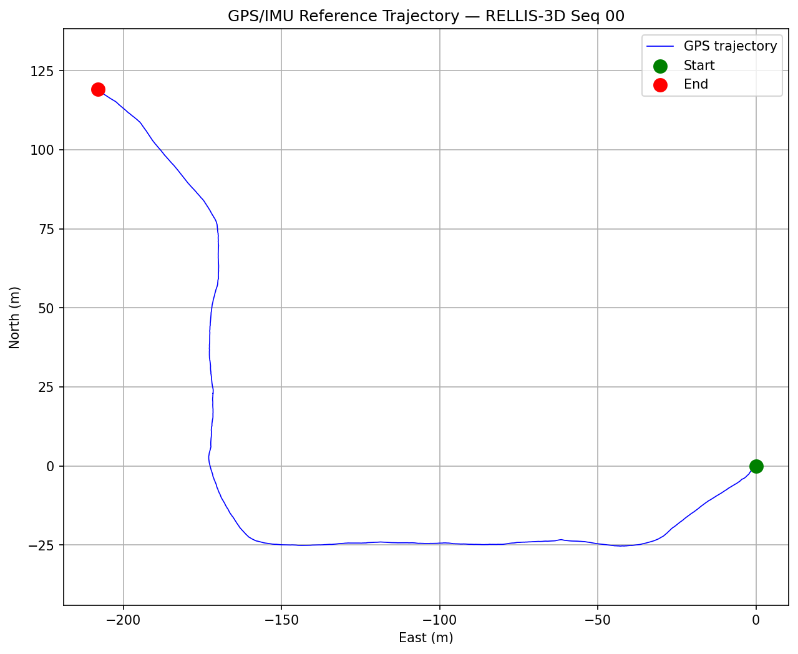
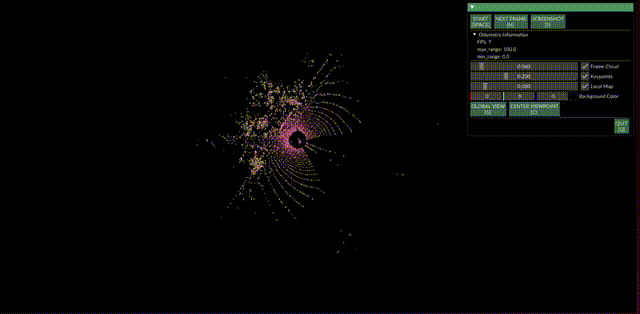
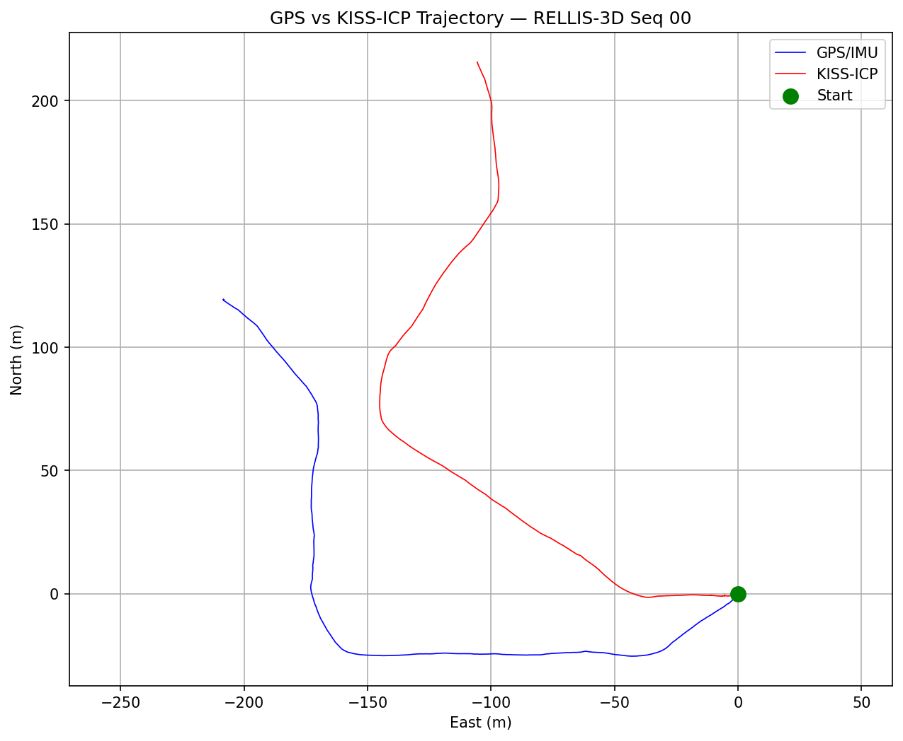
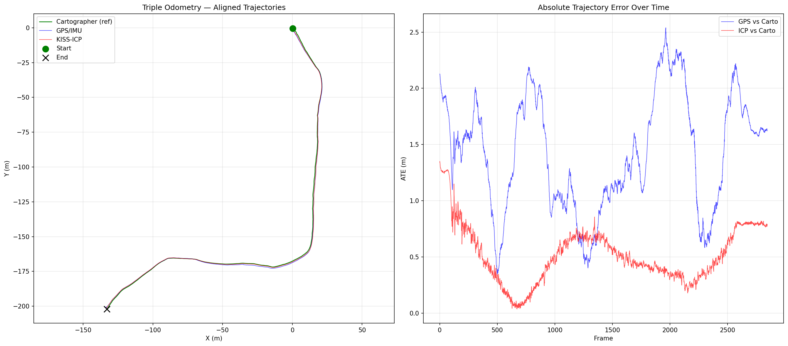
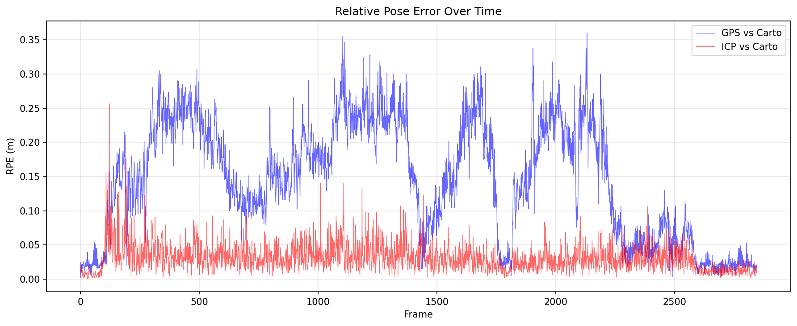
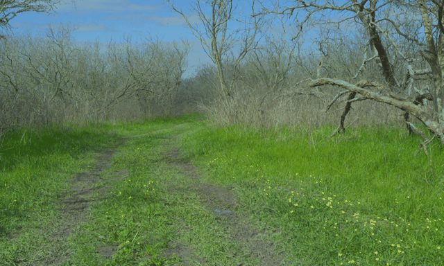
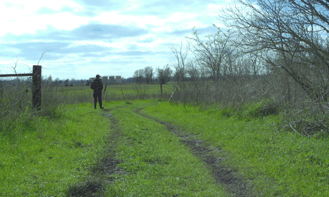
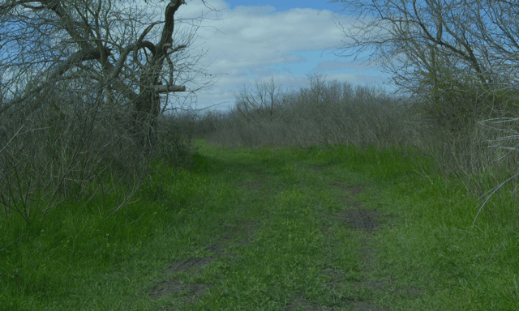

# Triple Odometry on Off-Road Data

*Part of the Terra Perceive series — Phase 2, Milestone 1.*

Phase 1 built a perception pipeline that processes a single LiDAR frame: ground segmentation, traversability mapping, cam-LiDAR fusion, safety supervisor. Phase 2 asks: *where is the robot?* Before you can accumulate a world map or track objects over time, you need ego-pose — and you need to understand how different pose sources fail in the real world.

This milestone extracts ego-pose from three independent sources on the same RELLIS-3D off-road sequence, compares them quantitatively using ATE and RPE metrics, and documents exactly where and why each source fails.

---

## The Three Sources

| Source | Method | Loop Closure | Module |
|--------|--------|-------------|--------|
| **GPS/IMU** | VectorNav VN-300 lat/lon → ENU conversion | N/A | `scripts/extract_poses_gps.py` |
| **KISS-ICP** | Point-to-point ICP scan matching [1] | No | `scripts/run_kiss_icp.py` |
| **Cartographer** | Submap-based SLAM with loop closure [3] | Yes | `docker/Dockerfile.cartographer` + official RELLIS-3D poses |

### Why three?

Each source has a fundamentally different failure mode. GPS gives absolute position but degrades under tree canopy. ICP gives precise frame-to-frame motion but drifts without loop closure. Cartographer corrects drift via pose graph optimization but is computationally expensive. Understanding *when* each fails is the prerequisite for building a robust SLAM system in P2-M2.

---

## M1.1: GPS/IMU Reference Trajectory

The RELLIS-3D rosbags contain VectorNav VN-300 data: `/vectornav/GPS` (NavSatFix, 150 Hz) and `/vectornav/IMU` (Imu, 50 Hz). I extracted these from all 5 split bags (29 GB total) and converted GPS lat/lon/alt to a local East-North-Up (ENU) metric frame.

### ENU Conversion

GPS gives degrees on a sphere. The pipeline needs meters. The conversion uses the first GPS fix as origin and computes local Cartesian coordinates:

$$x_{\text{east}} = (\text{lon} - \text{lon}_0) \cdot \cos(\text{lat}_0) \cdot 111320$$

$$y_{\text{north}} = (\text{lat} - \text{lat}_0) \cdot 111320$$

$$z_{\text{up}} = \text{alt} - \text{alt}_0$$

The $$\cos(\text{lat}_0)$$ factor accounts for meridian convergence — 1 degree of longitude is shorter at higher latitudes because meridians converge toward the poles. For the Rellis Campus at ~30.6°N, this correction is significant (~14%).

In practice, I used `pyproj` with an azimuthal equidistant projection (`+proj=aeqd`) for proper WGS84 ellipsoid accuracy rather than the flat-earth approximation above.

### Timestamp Association

LiDAR runs at 10 Hz, GPS at 150 Hz, IMU at 50 Hz. For each LiDAR frame timestamp, I find the nearest GPS and IMU reading using `np.searchsorted` with boundary clamping. A 5ms tolerance check flags any frame where the nearest GPS reading is too far away; a 25ms tolerance is used for the 50 Hz IMU (worst-case gap of ~20ms between IMU readings).

The bags are sequential with ~85ms gaps between them — verified by printing the first and last LiDAR timestamps from each bag.

### Result

2849 frames, smooth continuous path covering ~208m west and ~120m north on the Rellis Campus trails. No GPS jumps visible at this scale — the multipath issues become apparent only when compared against ICP and Cartographer.

---

## M1.2: KISS-ICP LiDAR Odometry

KISS-ICP [1] argues that "good old point-to-point ICP" is surprisingly powerful when combined with three key ingredients:

1. **Adaptive thresholding** — the correspondence distance threshold shrinks as the scans converge, preventing false matches from corrupting the pose estimate. On featureless terrain (flat grass), the threshold tightens automatically.

2. **Voxel-based local map** — instead of matching scan-to-scan (which accumulates error), KISS-ICP matches each scan against a voxelized local map built from recent frames. This acts as a temporal filter.

3. **Robust kernel (Geman-McClure)** — outlier correspondences (moving objects, sensor noise) are down-weighted rather than rejected. This prevents hard thresholding artifacts.

### Implementation

I wrote a custom RELLIS-3D data loader that reads the KITTI-format `.bin` files (4 floats per point: x, y, z, intensity — drop intensity, use first 3) and feeds them to KISS-ICP's `OdometryPipeline`. 2847 sequential scans from an Ouster OS1-64 at 10 Hz.

### Accumulated Point Cloud Map

*Real-time KISS-ICP visualization in Polyscope (10x speed). Green: current scan frame cloud. Pink: local map keypoints. The map grows as the robot traverses the trail, with the voxel-based local map retaining structure while discarding distant points.*

*Camera view (left) and accumulated BEV point cloud map (right) growing as the robot drives through the trail. Trajectory shown in red. Points colored by height — the shift from blue to yellow reflects the ~9m elevation gain over the sequence.*

### GPS vs ICP — Before Alignment

*Raw GPS (blue) and KISS-ICP (red) trajectories before Umeyama alignment. Both show the same L-shaped path but in different coordinate frames — GPS is in ENU (geographic north), ICP is in the sensor's startup frame. The shape agreement confirms both are valid; the frame offset is removed during alignment in M1.5.*

---

## M1.3: Google Cartographer

Cartographer [3] takes a fundamentally different approach from KISS-ICP. Instead of one continuous map, it builds many small **submaps** — each locally consistent over a few seconds of data. A background thread continuously matches new scans against all finished submaps. When it finds a match (a **loop closure**), it adds a constraint to a pose graph and runs Sparse Pose Adjustment (SPA) to globally optimize all poses.

### Docker Build

The `unmannedlab/cartographer` fork provides pre-tuned configurations for the Warthog + Ouster OS1-64 setup used in RELLIS-3D. I Dockerized the build on ROS Kinetic (Ubuntu 16.04) — the environment the fork was designed for. Key challenges:

- **GCC version compatibility**: The fork's test files use C++ patterns that break on GCC 9+ (Ubuntu 20.04). Switching to ROS Kinetic (GCC 5) resolved this without patching.
- **Proto3 dependency**: Ubuntu 16.04 ships protobuf 2.6, but Cartographer requires proto3. The fork's `install_proto3.sh` handles this.
- **Headless operation**: The default launch file requires RViz (`required="true"`). I created `offline_headless.launch` that removes the RViz dependency for Docker.
- **Read-only mount**: The `.pbstream` serialization failed when `/data` was mounted read-only — a subtle Docker volume permissions issue.

The offline SLAM processed all 5 bags (~285 seconds of data) in approximately 2 hours, producing a 237 MB `.pbstream` file.

### Reference Poses

The RELLIS-3D paper [5] states: *"we first register and loop close the sequences using a SLAM system [Cartographer] and output each scan's position based on the SLAM results."* The dataset ships these as `poses.txt` in KITTI format — 2847 poses, one per LiDAR frame. I verified my Cartographer run by extracting 576 poses from bag 00 and confirming they match the overall trajectory shape.

For the full-sequence comparison, I use the dataset's official Cartographer poses as the reference trajectory.

---

## M1.5: Triple Odometry Comparison

### Umeyama Alignment

GPS, ICP, and Cartographer each produce trajectories in different coordinate frames (ENU, sensor-local, SLAM-local). Before computing error metrics, the trajectories need to be aligned. I implemented Umeyama's closed-form least-squares alignment [4]:

1. Center both point sets: $$\mathbf{p}_c = \mathbf{p} - \boldsymbol{\mu}_p$$, $$\mathbf{q}_c = \mathbf{q} - \boldsymbol{\mu}_q$$
2. Source variance: $$\sigma^2_p = \frac{1}{N} \sum \|\mathbf{p}_{c,i}\|^2$$
3. Cross-covariance: $$\mathbf{H} = \frac{1}{N} \mathbf{q}_c^\top \mathbf{p}_c$$
4. SVD: $$\mathbf{H} = \mathbf{U} \boldsymbol{\Sigma} \mathbf{V}^\top$$
5. Handle reflection: $$\mathbf{S} = \text{diag}(1, 1, \text{sign}(\det(\mathbf{U}) \cdot \det(\mathbf{V}^\top)))$$
6. Rotation: $$\mathbf{R} = \mathbf{U} \mathbf{S} \mathbf{V}^\top$$
7. Scale: $$s = \frac{1}{\sigma^2_p} \text{tr}(\boldsymbol{\Sigma} \mathbf{S})$$
8. Translation: $$\mathbf{t} = \boldsymbol{\mu}_q - s \mathbf{R} \boldsymbol{\mu}_p$$

This is the same SVD-based alignment as RANSAC ground plane refinement in P1-M2 — applied to trajectory positions instead of inlier points.

### ATE and RPE

Following the definitions in [2]:

**Absolute Trajectory Error (ATE)**: After Umeyama alignment, compute the per-frame error:

$$\mathbf{F}_i = \mathbf{Q}_i^{-1} \mathbf{S} \mathbf{P}_i$$

$$\text{ATE RMSE} = \sqrt{\frac{1}{N} \sum_{i=1}^{N} \|\text{trans}(\mathbf{F}_i)\|^2}$$

**Relative Pose Error (RPE)**: Measures per-frame drift without global alignment:

$$\mathbf{E}_i = (\mathbf{Q}_i^{-1} \mathbf{Q}_{i+1})^{-1} (\mathbf{P}_i^{-1} \mathbf{P}_{i+1})$$

$$\text{RPE RMSE} = \sqrt{\frac{1}{N-1} \sum_{i=1}^{N-1} \|\text{trans}(\mathbf{E}_i)\|^2}$$

### Results

*Left: All three trajectories aligned to the Cartographer reference using Umeyama. Right: Per-frame ATE over the 2847-frame sequence.*

| Pair | ATE RMSE (m) | RPE RMSE (m) |
|------|-------------|-------------|
| GPS vs Cartographer | 1.51 | 0.168 |
| ICP vs Cartographer | 0.58 | 0.037 |
| GPS vs ICP | 1.35 | 0.171 |

| Source | Type | Loop Closure | ATE vs Carto | RPE vs Carto |
|--------|------|-------------|-------------|-------------|
| GPS/IMU | Raw sensor | N/A | 1.51 m | 0.168 m |
| KISS-ICP | Scan-to-scan | No | 0.58 m | 0.037 m |
| Cartographer | Full SLAM | Yes | (reference) | (reference) |

**Key observations**:
- ICP and Cartographer agree closely (0.58m ATE, 0.037m RPE) — both use LiDAR geometry for scan matching.
- GPS is the noisiest source with ~17cm frame-to-frame jitter and 1.51m global drift.
- On this open-loop trajectory (no revisits), Cartographer's loop closure has limited opportunity to correct ICP drift — the two are nearly identical.

---

## Failure Mode Analysis

### GPS Under Tree Canopy (Frames 1800–2200)

ATE spikes to 2.0–2.5m in this section. The camera images show the trail narrowing with dense bare tree canopy closing in from both sides. GPS signals reflect off branches (**multipath**), degrading the position fix. This is the classic GPS failure mode in off-road environments.

### GPS Transient Jump (Frames 300–500)

A transient ~2.2m ATE spike during a terrain transition zone. The likely cause is a spike in HDOP (Horizontal Dilution of Precision) — a measure of how spread out the visible GPS satellites are in the sky. When satellites cluster together (poor geometry), the position fix degrades. Terrain transitions between open field and tree cover can cause satellites to drop in and out of view, momentarily worsening the geometry. The ATE plot shows the spike is sharp and recovers within ~200 frames, consistent with a transient satellite visibility change rather than sustained multipath.

### ICP Drift on Featureless Terrain (Frames 2400–2847)

ATE grows from 0.3m to 0.8m in the final section. The camera shows wide-open grass fields with sparse vegetation — **featureless terrain**. KISS-ICP's scan-to-scan matching relies on geometric structure (trees, slopes, rocks). Flat grass provides no distinctive features, so each scan looks nearly identical to the next. Small registration errors accumulate without loop closure to correct them.

| Source | Frames | ATE | Environment | Root Cause |
|--------|--------|-----|-------------|------------|
| GPS/IMU | 1800–2200 | 2.0–2.5m | Dense tree canopy | Satellite multipath |
| GPS/IMU | 300–500 | ~2.2m | Transition zone | Transient HDOP spike |
| KISS-ICP | 2400–2847 | 0.5–0.8m | Open flat grass | Featureless terrain, no loop closure |

---

## Source Code

| File | Purpose |
|------|---------|
| `scripts/extract_poses_gps.py` | GPS/IMU extraction from ROS1 bags, ENU conversion, timestamp association |
| `scripts/run_kiss_icp.py` | Custom RELLIS-3D data loader + KISS-ICP pipeline runner |
| `scripts/compare_odometry.py` | Umeyama alignment, ATE/RPE computation, trajectory plots |
| `scripts/extract_poses_cartographer.py` | KITTI/pbstream pose extraction to CSV |
| `scripts/generate_bev_gif.py` | Camera + BEV accumulation GIF generator |
| `scripts/run_cartographer_offline.sh` | Cartographer Docker SLAM runner |
| `docker/Dockerfile.cartographer` | ROS Kinetic + unmannedlab/cartographer build |
| `docker/offline_headless.launch` | Headless launch file for Docker (no RViz) |
| `tests/python/test_odometry.py` | 15 tests: ENU, Umeyama, ATE, RPE, CSV format, timestamps |

---

## What I'd Do Differently

**Use the merged rosbag for Cartographer.** The 5 split bags have inconsistent TF frame names between bags (bag 00 uses `os1_cloud_node`, bag 01 uses `ouster1/os1_lidar`). This caused the `cartographer_output_pose` tool to crash when replaying TFs across bag boundaries. The RELLIS-3D dataset provides a 23 GB merged bag with a single consistent TF tree — using that from the start would have avoided hours of debugging the pose extraction. The SLAM itself ran correctly on split bags; only the extraction tool had the TF issue.

**Add per-point timestamps for KISS-ICP deskewing.** The RELLIS-3D `.bin` files don't include per-point timestamps, so KISS-ICP skips motion compensation (deskewing). On a vehicle bouncing on off-road terrain at 5 m/s, the Ouster OS1 travels ~0.5m during a single 100ms scan rotation. Without deskewing, trees appear slightly smeared. KISS-ICP supports deskewing via per-point timestamps [1] — extracting these from the raw rosbag PointCloud2 messages (which do have per-point timing) would improve registration quality, particularly on the rougher trail sections.

**Interpolate between GPS/IMU readings instead of nearest-neighbor.** The current implementation picks the closest GPS reading to each LiDAR timestamp. At 150 Hz GPS and 10 Hz LiDAR, the worst-case mismatch is ~3.3ms — small enough in practice. But linear interpolation between the two nearest GPS readings would produce smoother trajectories and eliminate the ~17cm frame-to-frame jitter visible in the RPE plot, some of which is association noise rather than true GPS error.

---

## What Comes Next

The failure modes documented here motivate P2-M2: a custom LiDAR-Inertial SLAM system. By adding IMU pre-integration (smooths motion between frames), GPS factors (anchors absolute position in open areas), Scan Context loop closure detection (catches revisits), and g2o pose graph optimization (corrects drift globally), we aim to close the gap between raw ICP and full SLAM — and benchmark against the Cartographer result shown here.

---

## References

[1] Vizzo et al., "KISS-ICP: In Defense of Point-to-Point ICP," IEEE RA-L, 2023.

[2] Sturm et al., "A Benchmark for the Evaluation of RGB-D SLAM Systems," IROS, 2012.

[3] Hess et al., "Real-Time Loop Closure in 2D LiDAR SLAM," ICRA, 2016.

[4] Umeyama, "Least-Squares Estimation of Transformation Parameters Between Two Point Patterns," IEEE PAMI, 1991.

[5] Jiang et al., "RELLIS-3D Dataset: Data, Benchmarks and Analysis," IEEE RA-L, 2021.

---

*15 new Python tests passing. Total: 52 C++ + 15 Python = 67 tests.*
