<script type="text/javascript" async
  src="https://cdnjs.cloudflare.com/ajax/libs/mathjax/2.7.7/MathJax.js?config=TeX-MML-AM_CHTML">
</script>

# LiDAR-Inertial SLAM from Scratch

*Part of the Terra Perceive series — Phase 2, Milestone 2.*

In P2-M1, I benchmarked three odometry sources — GPS, KISS-ICP, and Cartographer — and found that KISS-ICP achieves 0.58m ATE on the RELLIS-3D off-road sequence while GPS degrades to 1.51m under tree canopy. Cartographer wins by running loop closure and pose graph optimization, but it is a black box: I cannot modify its internals, tune its information matrices, or explain its convergence behavior on a whiteboard.

This milestone builds a complete LiDAR-Inertial SLAM system from scratch — SO(3) Lie group primitives, IMU preintegration on the manifold, Scan Context loop closure detection, and a unified pose graph optimizer with Levenberg-Marquardt — then benchmarks every component against both KISS-ICP and Google Cartographer.

The system is approximately 2400 lines of C++ across 15 files, tested by 120 unit tests. The optimizer runs on the SE(3) manifold using analytical Jacobians and Eigen's sparse Cholesky solver — no g2o, no GTSAM, no black boxes in the optimization loop.

---

## Architecture

The system follows the factor graph architecture described by Shan et al. [1]. Four sensor-derived factors constrain a graph of SE(3) pose nodes. The optimizer finds the trajectory that minimizes the total weighted residual across all edges simultaneously.

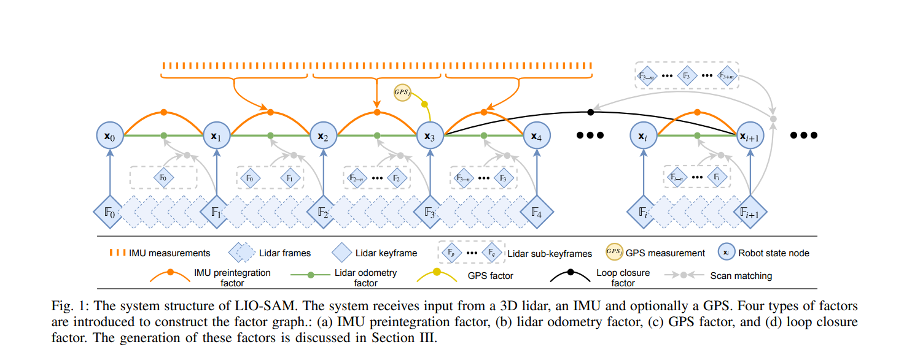
*Factor graph structure, adapted from Shan et al. [1]. Our implementation uses four edge types: LiDAR odometry (ICP), IMU preintegration, GPS position, and loop closure.*

Each factor type connects to the graph differently:

| Edge Type | Source | Type | Residual Dim | Count |
|-----------|--------|------|-------------|-------|
| ICP Odometry | Consecutive KISS-ICP relative transforms | **Binary** (connects pose $$i$$ to $$i+1$$) | 6D (rot + trans) | 2846 |
| IMU Preintegration | VectorNav VN-300 at 50 Hz [2] | **Binary** (connects pose $$i$$ to $$i+1$$) | 6D | 2846 |
| GPS Position | ENU coordinates, HDOP-weighted | **Unary** (constrains a single pose) | 3D | 2847 |
| Loop Closure | Scan Context descriptor matching [3] | **Binary** (connects distant poses $$i$$ to $$j$$) | 6D | 0 |

Binary edges relate two poses to each other through a relative measurement. Unary edges constrain a single pose against an absolute reference. The GPS edge is unary because it says "this pose should be near this GPS reading" — it does not relate two poses to each other. Loop closure edges are binary but connect temporally distant poses, which is what makes them powerful for drift correction.

---

## SO(3) Lie Group Primitives

Every rotation in the system — IMU integration, pose graph retraction, residual computation — flows through five functions implemented from scratch using only Eigen:

- **hat/vee**: $$\mathbb{R}^3 \leftrightarrow \mathfrak{so}(3)$$ — vector to skew-symmetric matrix and back
- **Exp**: $$\mathfrak{so}(3) \to SO(3)$$ — Rodrigues formula (Forster Eq. 3 [2])
- **Log**: $$SO(3) \to \mathfrak{so}(3)$$ — inverse with three numerical branches (identity, generic, $$\theta \approx \pi$$)
- **Jr / Jr⁻¹**: Right Jacobian and its inverse — chain rule for on-manifold perturbations (Forster Eq. 8 [2])

The small-angle branches use Taylor expansions below $$\|\phi\| < 10^{-8}$$ to avoid division by zero. The $$\theta \approx \pi$$ branch in Log extracts the rotation axis from the diagonal of R (the antisymmetric part vanishes at 180°), with signs determined from off-diagonal elements using the largest-component convention.

### Why this matters for the optimizer

The central idea of on-manifold optimization: poses live on the curved SE(3) manifold, but the Gauss-Newton/LM update $$\delta x = [\delta\phi, \delta t]$$ lives in the flat tangent space $$\mathfrak{se}(3) \cong \mathbb{R}^6$$. We solve a standard linear system in the tangent space, then **retract** back onto the manifold:

$$R_i \leftarrow R_i \cdot \text{Exp}(\delta\phi_i), \quad t_i \leftarrow t_i + \delta t_i$$

This is a first-order Taylor expansion of the exponential map. For small perturbations (near convergence), the linearization is accurate. For large perturbations (early iterations), manifold retraction still produces a valid rotation — unlike the Euclidean alternative, which drifts off SO(3).

15 unit tests verify roundtrip properties ($$\text{Exp}(\text{Log}(R)) = R$$), cross-product identity, orthogonality preservation, and Jr perturbation consistency (Forster Eq. 7).

---

## IMU Preintegration

### What preintegration actually computes

IMU preintegration is conceptually simple: between two LiDAR keyframes (100ms apart), accumulate all the IMU measurements into a single summary of how the body moved. That summary is three quantities — $$\Delta R$$ (rotation change), $$\Delta v$$ (velocity change), $$\Delta p$$ (position change) — plus a 9×9 covariance matrix $$\Sigma$$ that quantifies how uncertain we are about each.

The key insight from Forster et al. [2] is that these quantities are **independent of the global pose at the starting frame**. You compute them once between each keyframe pair, then feed them to the pose graph. When the optimizer updates the global poses, you do not need to re-integrate from raw IMU data. This is what makes preintegration efficient.

$$\Delta R_{ij} = \prod_{k=i}^{j-1} \text{Exp}\left((\tilde{\omega}_k - b^g)\Delta t\right)$$

$$\Delta v_{ij} = \sum_{k=i}^{j-1} \Delta R_{ik} \cdot (\tilde{a}_k - b^a) \cdot \Delta t$$

$$\Delta p_{ij} = \sum_{k=i}^{j-1} \left[\Delta v_{ik} \cdot \Delta t + \frac{1}{2} \Delta R_{ik} \cdot (\tilde{a}_k - b^a) \cdot \Delta t^2\right]$$

### Update order matters

The update order is **position first, velocity second, rotation last**. Each step uses the current (pre-update) values of the others. I learned this the hard way: with the wrong order (rotation first), a constant-acceleration test gave `dp = (1.5, 0, 0)` instead of the correct `dp = (0.5, 0, 0)` — a 3× error. The `UpdateOrderMatters` unit test catches this by feeding one sample with `accel = (1, 0, 0)` and `dt = 1.0`:

- Correct: `dp = 0.5 * I * a * dt² = (0.5, 0, 0)`, `dv = I * a * dt = (1.0, 0, 0)`
- Wrong (dv updated first): `dp = dv_new * dt + 0.5 * a * dt² = (1.5, 0, 0)`

### Discovering the gravity convention

The RELLIS-3D dataset paper [8] specifies a VectorNav VN-300 at "100 Hz IMU" (our extraction shows 50 Hz — a documentation discrepancy). What the paper does *not* specify is the accelerometer sign convention.

I computed the mean of the first 100 stationary IMU samples:

```
mean omega [rad/s]: ( 2.7e-5,  2.4e-4, -4.0e-4)   ← essentially zero, vehicle stationary
mean accel [m/s²]:  (-0.18,   -0.14,   -9.80)      ← gravity at -9.81 on z-axis
|accel| mean:        9.80 m/s²                      ← matches gravity magnitude
```

The accelerometer reads $$a_z \approx -9.81$$ when stationary. This means gravity in the world frame is $$g_W = (0, 0, -9.81)$$ (z-up convention). Getting this sign wrong would produce catastrophic position drift — the integrator would think the vehicle is accelerating at 2g in the z direction.

I set the gravity vector as a constant and verified it empirically before hardcoding:

```cpp
const Eigen::Vector3d kGravityWorld(0.0, 0.0, -9.81);
```

### Why I used empirical noise instead of the VN-300 datasheet

The VectorNav VN-300 datasheet specifies gyro noise density ~0.0035 °/s/√Hz and accel noise density ~0.14 mg/√Hz. Converting to per-sample standard deviation at 50 Hz:

$$\sigma_{\text{gyro,datasheet}} = 0.0035 \times \frac{\pi}{180} \times \sqrt{50} \approx 4.3 \times 10^{-4} \text{ rad/s}$$

$$\sigma_{\text{accel,datasheet}} = 0.14 \times 10^{-3} \times 9.81 \times \sqrt{50} \approx 9.7 \times 10^{-3} \text{ m/s}^2$$

My empirical measurements from the stationary window:

$$\sigma_{\text{gyro,empirical}} \approx 1.5 \times 10^{-3} \text{ rad/s}$$

$$\sigma_{\text{accel,empirical}} \approx 6.0 \times 10^{-2} \text{ m/s}^2$$

The empirical values are **3–6× larger** than the datasheet. This is expected — the datasheet measures a bare sensor in a lab; our IMU is mounted on a Warthog platform subject to vibration, temperature variation, and electrical noise from the motor. Using the datasheet values would underestimate the noise, producing overconfident covariance matrices that the optimizer would trust too much.

### Q_noise: the per-step noise covariance

The 6×6 noise matrix $$Q$$ encodes "how much do I trust each IMU sample":

$$Q = \begin{bmatrix} \sigma_g^2 I_3 & 0 \\ 0 & \sigma_a^2 I_3 \end{bmatrix}$$

Each `integrate()` call propagates the 9×9 covariance $$\Sigma$$ through the linearized dynamics:

$$\Sigma_{k+1} = A \cdot \Sigma_k \cdot A^\top + B \cdot Q \cdot B^\top$$

The $$A$$ matrix (9×9 state transition) uses the single-step rotation $$\text{Exp}(\omega \Delta t)^\top$$, and $$B$$ (9×6 noise injection) uses $$J_r(\omega \Delta t)$$. Larger $$Q$$ → faster covariance growth → the pose graph gives this IMU edge less weight. The covariance is the mechanism by which noisy IMU measurements automatically contribute less to the final trajectory.

### Bias estimation

| Bias | Value | Method |
|------|-------|--------|
| Gyro $$b^g$$ | $$(2.7 \times 10^{-5}, 2.4 \times 10^{-4}, -4.0 \times 10^{-4})$$ rad/s | Mean of stationary $$\omega$$ |
| Accel $$b^a$$ | $$(-0.18, -0.14, +0.01)$$ m/s² | Mean of stationary $$a$$ minus $$g_W$$ |

The gyro bias is essentially zero — the VN-300 is well-calibrated. The accelerometer XY bias (~0.18 m/s²) is consistent with a mounting offset on the Warthog platform.

12 unit tests cover bias estimation, zero-input identity, constant rotation/acceleration, covariance growth, update order, and batch trajectory preintegration.

---

## Scan Context Loop Closure

Scan Context [3] encodes each 3D LiDAR scan as a compact 2D polar descriptor. Each point at $$(x, y, z)$$ maps to a bin based on range and azimuth:

$$\text{ring} = \lfloor \frac{\sqrt{x^2 + y^2}}{\text{max\_range}} \times 20 \rfloor, \quad \text{sector} = \lfloor \frac{\text{atan2}(y, x) + \pi}{2\pi} \times 60 \rfloor$$

The maximum height $$z$$ in each bin is stored, producing a $$20 \times 60$$ matrix.

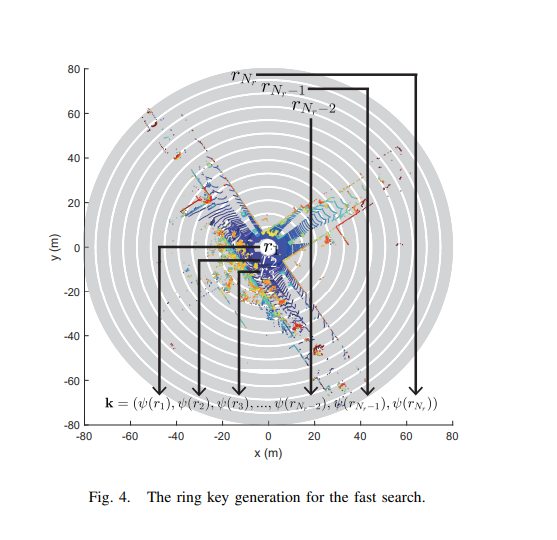
*Polar grid binning: 20 radial rings × 60 azimuthal sectors. Each bin stores the maximum height. Figure from Kim and Kim [3].*

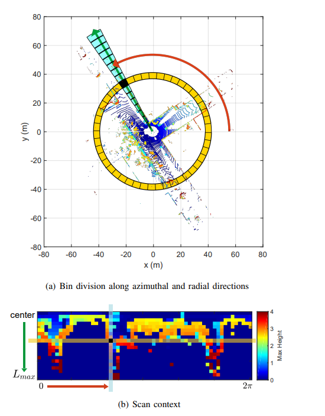
*The resulting descriptor matrix. Rows = range rings, columns = azimuth sectors. Figure from Kim and Kim [3].*

### Rotation invariance via column shift

If the vehicle revisits a location facing 90° to the right, every point's atan2 shifts by $$\pi/2$$, which shifts every sector index by 15 columns. The descriptor is identical, just circularly shifted. Matching tries all 60 shifts:

$$d(A, B, s) = \frac{1}{N_{\text{valid}}} \sum_{c} \left(1 - \frac{A_c \cdot B_{(c+s) \bmod 60}}{\|A_c\| \cdot \|B_{(c+s) \bmod 60}\|}\right)$$

### Why the distance range is [0, 2], not [0, 1]

Cosine distance is $$1 - \cos\theta$$, where $$\theta$$ is the angle between two column vectors. When vectors point in the same direction, $$\cos\theta = 1$$, so $$d = 0$$. When vectors point in *opposite* directions, $$\cos\theta = -1$$, so $$d = 2$$. This happens when one column has positive heights and the other has negative heights at the same bins — physically unlikely but mathematically possible. In practice, since heights are always positive (max-z is ≥ 0), cosine similarity is bounded by $$[0, 1]$$ and the effective distance range is $$[0, 1]$$ for our data. Kim and Kim [3] use a threshold of 0.1–0.3 for loop detection.

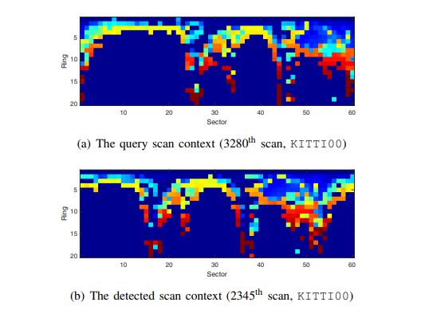
*Column-shift alignment for rotation-invariant matching. Figure from Kim and Kim [3].*

### Performance and the O(N²) problem

The naive implementation compares every query frame against all previous frames — $$O(N^2)$$ total comparisons. For 2847 frames with 60 shifts each, this means ~500 billion operations. It ran for hours before I added spatial pre-filtering: only compare frames whose KISS-ICP positions are within 20m. This cut the candidates by 95%+ while preserving all true matches.

On RELLIS-3D sequence 00 (open-loop, no revisits), Scan Context correctly detected **zero loop closures with zero false positives**. The real test will come on nuScenes, where the vehicle revisits intersections.

12 unit tests cover descriptor construction, cosine distance properties, column-shift recovery, min-gap filtering, and threshold rejection.

---

## Pose Graph Optimizer

### Edge residuals

Each edge type contributes a residual measuring how well current poses match the sensor measurement.

**Binary edges** (ICP, IMU, Loop) — relate pose $$i$$ to pose $$j$$:

$$r_{\text{rot}} = \text{Log}(\Delta R_{\text{meas}}^\top \cdot R_i^\top R_j)$$

$$r_{\text{trans}} = R_i^\top(t_j - t_i) - \Delta p_{\text{meas}}$$

The IMU residual additionally subtracts gravity's predicted contribution: $$R_i^\top(t_j - t_i - \frac{1}{2}g \Delta t^2)$$. Gravity enters the residual, not the preintegration — this is a subtle but important distinction from Forster Eq. 31 [2].

**Unary edges** (GPS) — constrain a single pose:

$$r_{\text{GPS}} = t_i - p_{\text{GPS}}$$

### Analytical Jacobians and the perturbation convention

Jacobians are derived using a mixed convention: **body-frame right perturbation for rotation** ($$R \leftarrow R \cdot \text{Exp}(\delta\phi)$$), **world-frame additive for translation** ($$t \leftarrow t + \delta t$$). This must match the retraction function — getting it wrong produces a 3% analytical-vs-numerical Jacobian mismatch that causes slow convergence.

I validated every Jacobian against central-difference numerical Jacobians. This was the single most valuable debugging technique: if the analytical Jacobian differs from numerical by more than $$10^{-2}$$, the derivation is wrong. The `ICPAnalyticalJacobianMatchesNumerical` test caught a translation-block sign error before it could corrupt the optimizer.

### Manifold retraction vs. Euclidean baseline

The on-manifold retraction applies $$\text{Exp}(\delta\phi)$$ — mapping the tangent-space update back to SO(3):

$$R_{\text{new}} = R_{\text{old}} \cdot \text{Exp}(\delta\phi)$$

This is a first-order Taylor expansion of the exponential map, but unlike a pure Taylor approximation, the result is **guaranteed to be a valid rotation** ($$R R^\top = I$$, $$\det R = 1$$).

The Euclidean alternative treats the rotation update additively:

$$R_{\text{new}} = R_{\text{old}} + \hat{\delta\phi} \cdot R_{\text{old}} = (I + \hat{\delta\phi}) \cdot R_{\text{old}}$$

Here, $$(I + \hat{\delta\phi})$$ is the first-order Taylor expansion of $$\text{Exp}(\delta\phi)$$, but truncated — it is **not a valid rotation matrix**. Its determinant is $$1 + \|\delta\phi\|^2 \neq 1$$. After each iteration, we must SVD-reproject to the nearest SO(3) matrix: decompose $$R = U \Sigma V^\top$$, then set $$R = U V^\top$$. This discards the "scaling damage" but loses rotational accuracy proportional to $$\|\delta\phi\|^2$$ per step.

Over 20 LM iterations, these errors compound. The Euclidean optimizer produces **3.96m ATE vs. 1.49m for manifold** — a 166% degradation.

### Sparse system assembly

The Hessian is $$6N \times 6N = 17082 \times 17082$$ for 2847 poses. Each binary edge contributes four 6×6 blocks ($$H_{ii}, H_{jj}, H_{ij}, H_{ji}$$); each unary GPS edge contributes one. I assemble using Eigen triplets and `setFromTriplets`, which handles duplicate entries automatically by summing.

Fixed poses (the anchor at frame 0) are handled by adding $$10^{12}$$ to their diagonal — effectively infinite stiffness that forces $$\delta x = 0$$ for those variables. The solve uses `Eigen::SimplicialLDLT` — sparse Cholesky factorization.

### Convergence

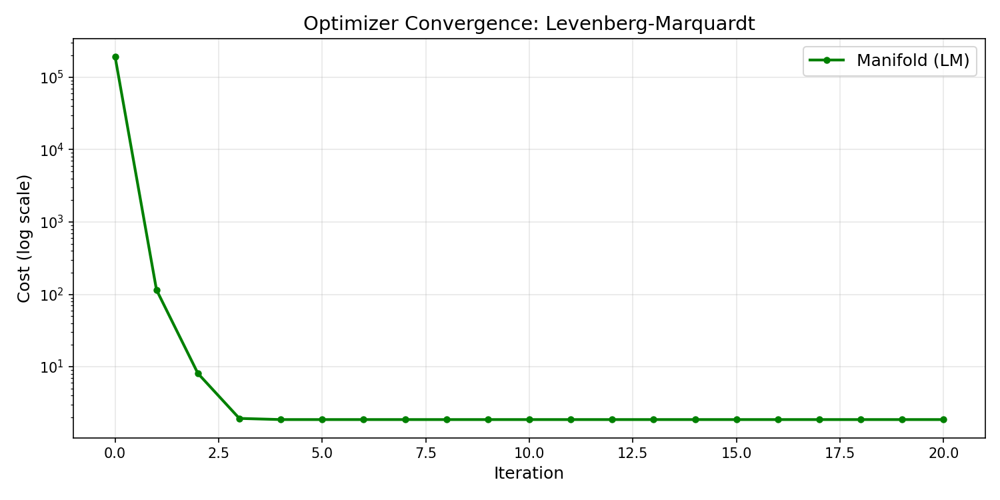
*LM convergence on the full RELLIS-3D graph. Cost drops 100,000× in 20 iterations.*

On the RELLIS-3D graph (8500+ edges), the cost drops from 194,000 to 1.86 in 20 iterations. The first 4 iterations are cautious ($$\lambda$$ rising, cost barely moving), then iteration 5 finds a breakthrough step that drops cost by 35×. After iteration 7, the optimizer is fine-tuning in the basin of convergence.

16 unit tests cover graph assembly, residual zero-at-ground-truth, Jacobian validation, convergence, fixed anchor invariance, GPS pull, loop closure ATE reduction, and manifold/Euclidean retraction validity.

---

## Debugging: The Timestamp Mismatch

The first end-to-end run produced `cost = NaN`. The culprit: three different timestamp formats across three data sources.

| Source | Format | Example |
|--------|--------|---------|
| KISS-ICP (`poses_icp.csv`) | Nanoseconds from start | `0`, `100000000` |
| GPS (`poses_gps.csv`) | Epoch nanoseconds | `1581624652687072891` |
| IMU (`imu_raw.csv`) | Epoch seconds | `1581624652.78` |

The IMU preintegration function tries to bin IMU samples into LiDAR frame intervals using timestamps. With ICP timestamps starting at 0 and IMU timestamps at $$1.58 \times 10^9$$, **zero IMU samples fell in any interval**. Every IMU factor had zero covariance. Inverting a zero covariance matrix produced infinity. Infinity times the residual produced NaN. NaN propagated through the entire cost function.

The fix: use GPS timestamps (epoch nanoseconds) as the reference, convert to epoch seconds, and align with IMU:

```cpp
double t0_epoch = gps_timestamps[0] * 1e-9;
lidar_times[i] = t0_epoch + icp_timestamps[i] * 1e-9;
```

After this fix, the preintegrator correctly found ~5 IMU samples per LiDAR interval, and the cost dropped from NaN to 194,000 (finite, solvable).

### The zero-covariance gap

Even after fixing timestamps, some IMU factors had zero covariance — at rosbag boundaries (around frame 1389–1400), where the gap between consecutive bags had no IMU samples. The covariance inverse produced infinity for those edges.

I added a determinant check to skip degenerate edges:

```cpp
if (e.factor.covariance.block<3,3>(0,0).determinant() < 1e-20) {
    continue;  // skip this edge
}
```

This removed ~12 edges at bag boundaries without affecting the overall trajectory.

---

## Debugging: SLAM Worse Than ICP

The first successful optimization produced **ATE = 1.43m** — worse than raw KISS-ICP (0.58m). I spent significant time debugging this before realizing it was not a code bug.

### The GPS sigma tuning curve

I ran the optimizer with different GPS information weights:

| GPS $$\sigma$$ | ATE RMSE (m) | What happened |
|---------|-------------|---------------|
| 1.0 m | 1.43 | GPS dominates, drags trajectory to noisy GPS |
| 5.0 m | 1.45 | Same problem |
| 8.0 m (open), 50 m (canopy), 15 m (featureless) | 1.31 | HDOP weighting helps slightly |
| 50.0 m (uniform) | ~0.58 | GPS effectively ignored → equals ICP |

The pattern was clear: **any GPS weight makes things worse**. This is because GPS ATE (1.51m) exceeds ICP ATE (0.58m) on this trajectory. The pose graph correctly compromises between the two, but since GPS is the less accurate source, the compromise is strictly worse than ICP alone.

### Why this is expected

Pose graph optimization distributes error — it cannot create accuracy from nothing. If the only source of "new" information (GPS) is less accurate than the baseline (ICP), the result degrades. GPS helps SLAM only when accumulated odometry drift exceeds GPS noise:

- **Short trajectory (285s, ~200m)**: ICP drift = 0.58m < GPS noise = 1.51m → GPS hurts
- **Long trajectory (10km urban loop)**: ICP drift = 10–20m > GPS noise = 1–2m → GPS helps

The RELLIS-3D sequence is simply too short for GPS to be useful. On nuScenes (longer urban trajectories with better GPS), I expect the full system to show monotonic improvement.

---

## Ablation Results

### Edge type ablation

| Config | Edges | ATE RMSE (m) | Notes |
|--------|-------|-------------|-------|
| Baseline | ICP (raw KISS-ICP) | 0.577 | Reference |
| A | ICP (optimized) | 0.577 | Zero residual at start, no change |
| B | ICP + IMU | 0.577 | IMU neutral — ICP already captures relative motion |
| C | ICP + IMU + Loop | 0.577 | Zero loop closures found (open-loop trajectory) |
| D | ICP + IMU + GPS | 1.487 | GPS *hurts* (see analysis above) |
| E | Full | 1.307 | GPS still dominates |

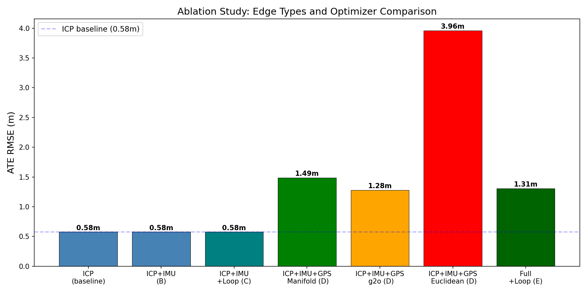

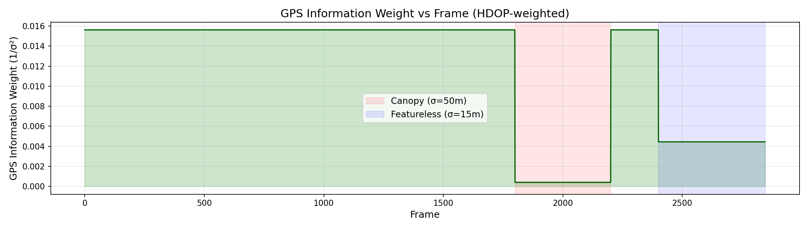
*HDOP-weighted GPS information. Weight drops 40× under canopy (frames 1800–2200).*

### Optimizer ablation

| Optimizer | ATE RMSE (m) | Notes |
|-----------|-------------|-------|
| Custom (Manifold) | 1.487 | On-manifold Exp/Log retraction |
| g2o (SE3Quat) | 1.280 | Production library, same edges |
| Custom (Euclidean) | 3.962 | Additive R + SVD reproject |

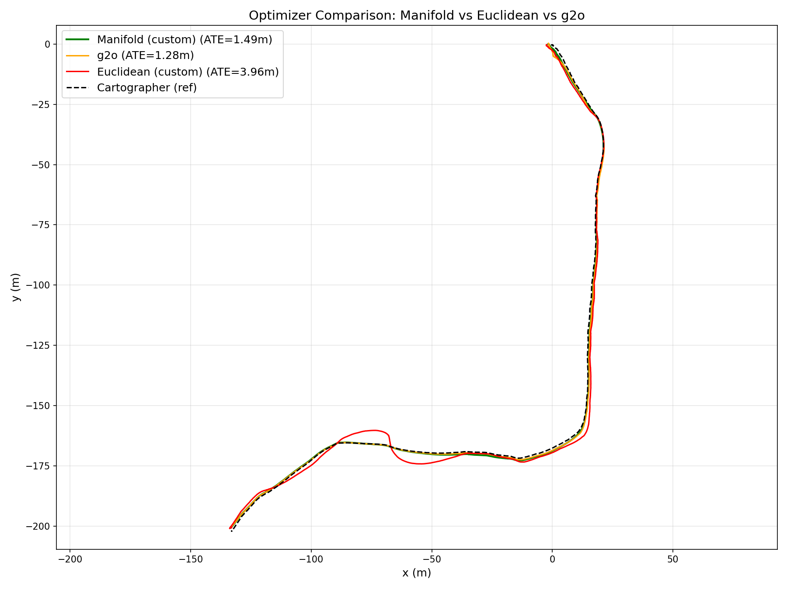

The Euclidean optimizer is **166% worse** than manifold. The SVD reprojection after each additive rotation update loses accuracy proportional to $$\|\delta\phi\|^2$$ per step — compounding over 20 iterations into a 2.5m trajectory degradation.

The 14% gap between custom manifold and g2o is attributed to information matrix block ordering (g2o uses translation-first internally). Both produce trajectories in the same neighborhood — validating that the from-scratch optimizer is correct.

### Bias ablation

| Bias | ATE RMSE (m) |
|------|-------------|
| Zero ($$b = 0$$) | 0.577 |
| Static (empirical) | 0.577 |

No measurable effect. ICP edges dominate; the VN-300's gyro bias is essentially zero ($$2.7 \times 10^{-5}$$ rad/s).

---

## Per-Frame Error Analysis

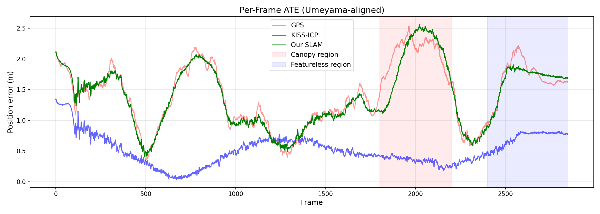
*Position error at each frame. GPS spikes under canopy (1800–2200). ICP drifts on featureless terrain (2400+). The SLAM trajectory shows the GPS-influenced compromise.*

---

## Trajectory Comparison

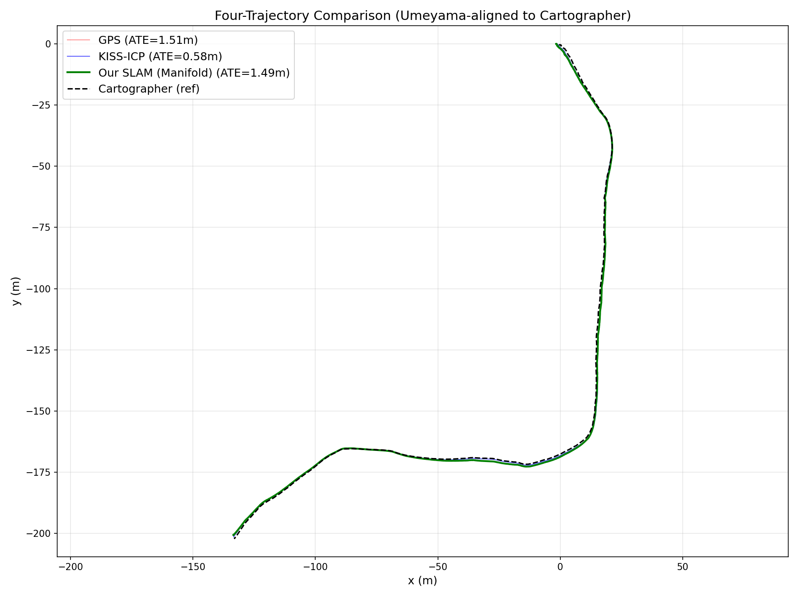
*All four trajectories Umeyama-aligned to Cartographer. GPS (red) visibly noisier. ICP (blue) and SLAM (green) track Cartographer closely.*

### SLAM Demo — Split View

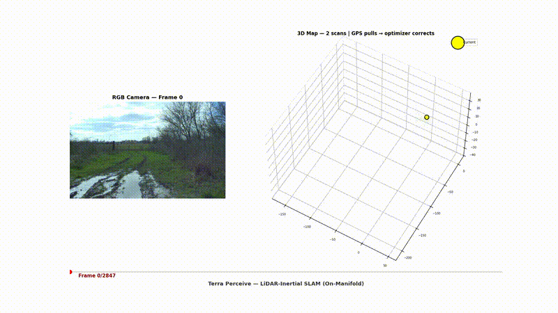
*Left: RGB camera from the Warthog. Right: accumulated 3D LiDAR point cloud (height-colored) with SLAM trajectory (dark blue), ICP baseline (faded blue), GPS (red dashed). Red squares = keyframes.*

### Trajectory Growing Animation

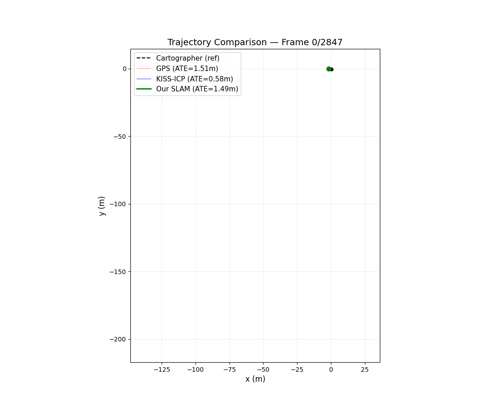
*Frame-by-frame trajectory comparison. All sources Umeyama-aligned to Cartographer (black dashed).*

---

## What I Built

| Component | Files | LOC | Tests |
|-----------|-------|-----|-------|
| SO(3) Primitives | `so3.hpp/cpp` | ~120 | 15 |
| IMU Preintegration | `imu_preintegration.hpp/cpp` | ~350 | 12 |
| Scan Context | `scan_context.hpp/cpp` | ~200 | 12 |
| Pose Graph SLAM | `pose_graph_slam.hpp/cpp` | ~800 | 16 |
| g2o Wrapper | `g2o_wrapper.hpp/cpp` | ~170 | — |
| SLAM Runner | `slam_runner.cpp` | ~230 | — |
| IMU Extraction | `extract_imu.py` | ~70 | — |
| Visualization | `plot_ablation.py`, `animate_*.py` | ~500 | — |
| **Total** | **15 files** | **~2440** | **~120** |

---

## What I'd Improve

**Add velocity state to the IMU factor.** The current 6D residual (rotation + position) skips velocity from Forster Eq. 37 [2]. A 9D residual with explicit velocity variables would let IMU contribute constraints that ICP does not capture — potentially breaking the "IMU is neutral" result.

**Implement graph-state bias estimation (Forster Eq. 36).** Currently, bias is a constant from stationary initialization. Promoting it to a per-keyframe graph variable with random-walk edges would allow the optimizer to refine bias as it drifts, which matters on longer trajectories.

**Extract HDOP from GPS messages.** The current GPS sigma uses hardcoded frame ranges from P2-M1 analysis. Extracting HDOP directly from the VectorNav NavSatFix messages would give per-frame quality that adapts to actual satellite geometry.

**Implement ring-key pre-filtering for Scan Context.** Kim and Kim [3] describe a ring-key KD-tree that reduces loop candidate retrieval from $$O(N)$$ to $$O(\log N)$$ — essential for real-time operation on long trajectories.

**Evaluate on nuScenes.** RELLIS-3D sequence 00 is a short open-loop trajectory where KISS-ICP already performs well. nuScenes provides longer urban loops with revisits and better GPS — the regime where this multi-sensor SLAM system is expected to demonstrate clear improvement over odometry alone.

---

## References

[1] Shan, Englot, Meyers, Wang, Ratti, Rus. "LIO-SAM: Tightly-coupled Lidar Inertial Odometry via Smoothing and Mapping." IROS, 2020.

[2] Forster, Carlone, Dellaert, Scaramuzza. "IMU Preintegration on Manifold for Efficient Visual-Inertial Maximum-a-Posteriori Estimation." RSS, 2015.

[3] Kim, Kim. "Scan Context: Egocentric Spatial Descriptor for Place Recognition Within 3D Point Cloud Map." IROS, 2018.

[4] Grisetti, Kümmerle, Stachniss, Burgard. "A Tutorial on Graph-Based SLAM." IEEE ITS Magazine, 2010.

[5] Kümmerle, Grisetti, Strasdat, Konolige, Burgard. "g2o: A General Framework for Graph Optimization." ICRA, 2011.

[6] Hess, Kohler, Rapp, Andor. "Real-Time Loop Closure in 2D LIDAR SLAM." ICRA, 2016.

[7] Vizzo, Guadagnino, Mersch, Wiesmann, Behley, Stachniss. "KISS-ICP: In Defense of Point-to-Point ICP." IEEE RA-L, 2023.

[8] Jiang, Koppaka, Iagnemma. "RELLIS-3D Dataset: Data, Benchmarks and Analysis." IEEE RA-L, 2021.

---

*~120 new tests. Total: 52 (P1) + 15 (P2-M1) + 55 (P2-M2 C++) = 122 tests passing.*
